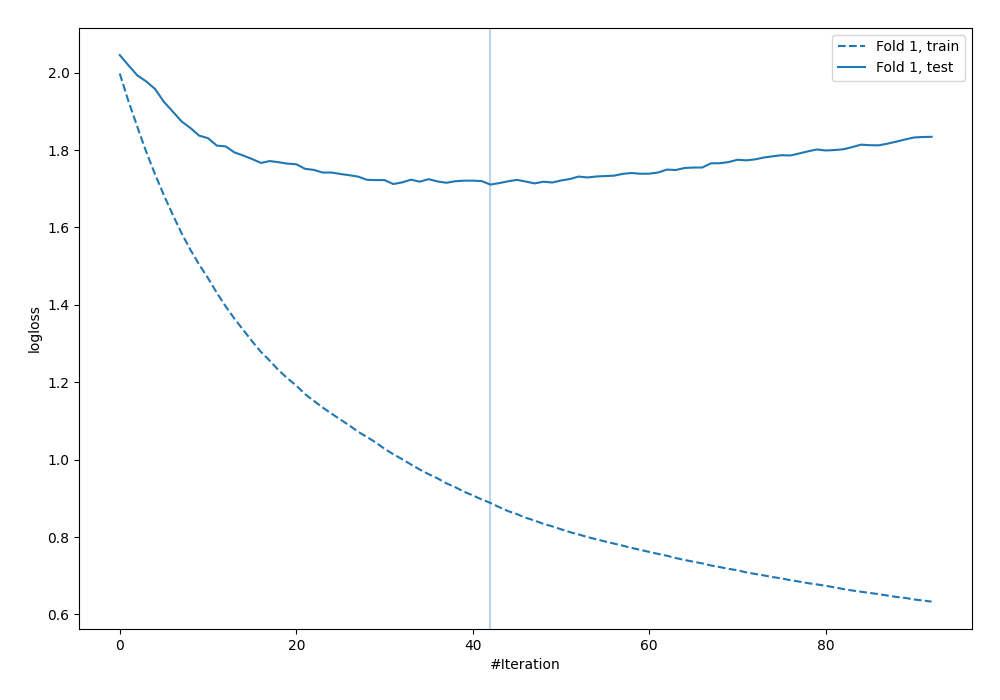
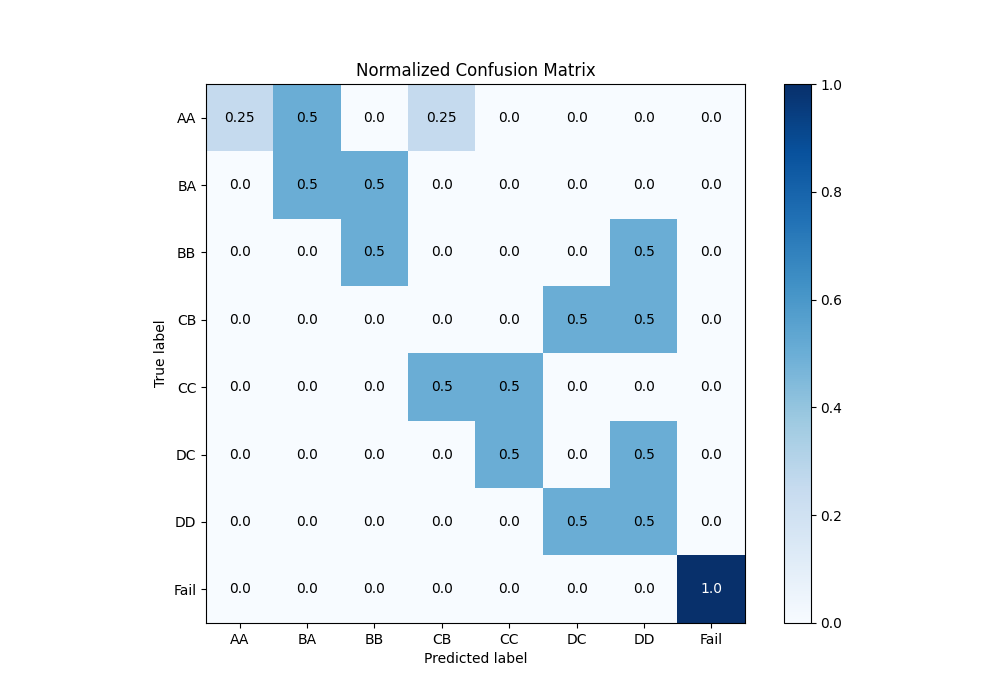
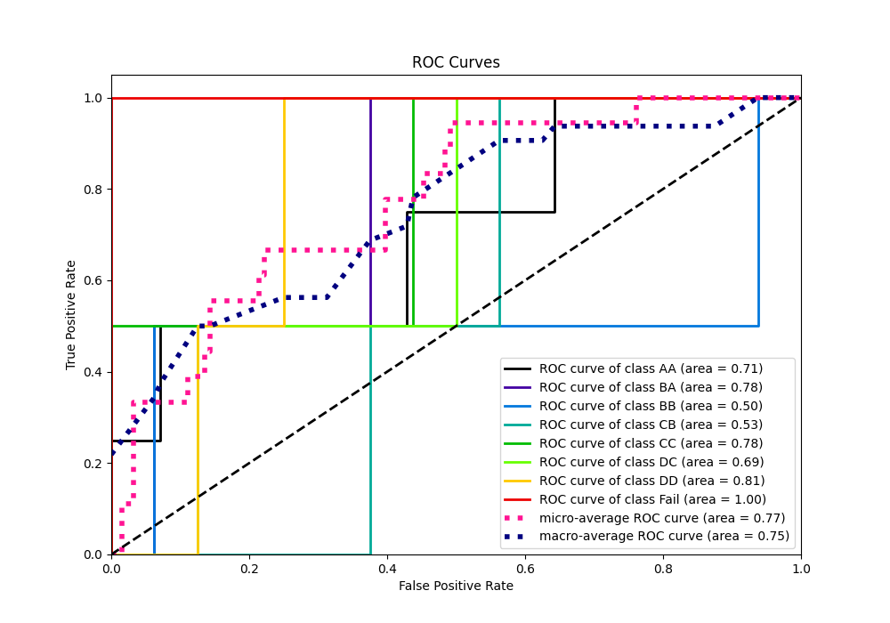
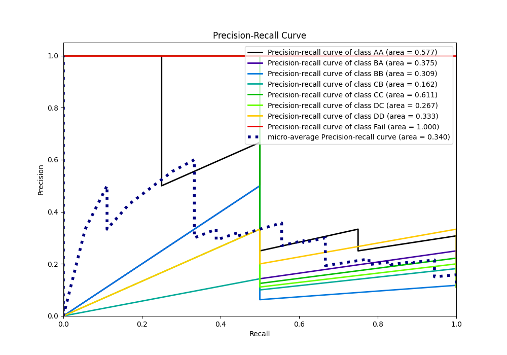

# Summary of 18_Xgboost

[<< Go back](../README.md)

## Extreme Gradient Boosting (Xgboost)
- **n_jobs**: -1
- **objective**: multi:softprob
- **eta**: 0.1
- **max_depth**: 8
- **min_child_weight**: 5
- **subsample**: 1.0
- **colsample_bytree**: 1.0
- **eval_metric**: mlogloss
- **num_class**: 8
- **explain_level**: 0

## Validation
 - **validation_type**: split
 - **train_ratio**: 0.9
 - **shuffle**: True
 - **stratify**: True

## Optimized metric
logloss

## Training time

0.7 seconds

### Metric details
|           |   AA |       BA |   BB |   CB |   CC |   DC |       DD |   Fail |   accuracy |   macro avg |   weighted avg |   logloss |
|:----------|-----:|---------:|-----:|-----:|-----:|-----:|---------:|-------:|-----------:|------------:|---------------:|----------:|
| precision | 1    | 0.333333 |  0.5 |    0 |  0.5 |    0 | 0.25     |      1 |   0.388889 |    0.447917 |       0.509259 |   1.71091 |
| recall    | 0.25 | 0.5      |  0.5 |    0 |  0.5 |    0 | 0.5      |      1 |   0.388889 |    0.40625  |       0.388889 |   1.71091 |
| f1-score  | 0.4  | 0.4      |  0.5 |    0 |  0.5 |    0 | 0.333333 |      1 |   0.388889 |    0.391667 |       0.392593 |   1.71091 |
| support   | 4    | 2        |  2   |    2 |  2   |    2 | 2        |      2 |   0.388889 |   18        |      18        |   1.71091 |

## Confusion matrix
|                 |   Predicted as AA |   Predicted as BA |   Predicted as BB |   Predicted as CB |   Predicted as CC |   Predicted as DC |   Predicted as DD |   Predicted as Fail |
|:----------------|------------------:|------------------:|------------------:|------------------:|------------------:|------------------:|------------------:|--------------------:|
| Labeled as AA   |                 1 |                 2 |                 0 |                 1 |                 0 |                 0 |                 0 |                   0 |
| Labeled as BA   |                 0 |                 1 |                 1 |                 0 |                 0 |                 0 |                 0 |                   0 |
| Labeled as BB   |                 0 |                 0 |                 1 |                 0 |                 0 |                 0 |                 1 |                   0 |
| Labeled as CB   |                 0 |                 0 |                 0 |                 0 |                 0 |                 1 |                 1 |                   0 |
| Labeled as CC   |                 0 |                 0 |                 0 |                 1 |                 1 |                 0 |                 0 |                   0 |
| Labeled as DC   |                 0 |                 0 |                 0 |                 0 |                 1 |                 0 |                 1 |                   0 |
| Labeled as DD   |                 0 |                 0 |                 0 |                 0 |                 0 |                 1 |                 1 |                   0 |
| Labeled as Fail |                 0 |                 0 |                 0 |                 0 |                 0 |                 0 |                 0 |                   2 |

## Learning curves

## Confusion Matrix

## Normalized Confusion Matrix

## ROC Curve

## Precision Recall Curve

[<< Go back](../README.md)
