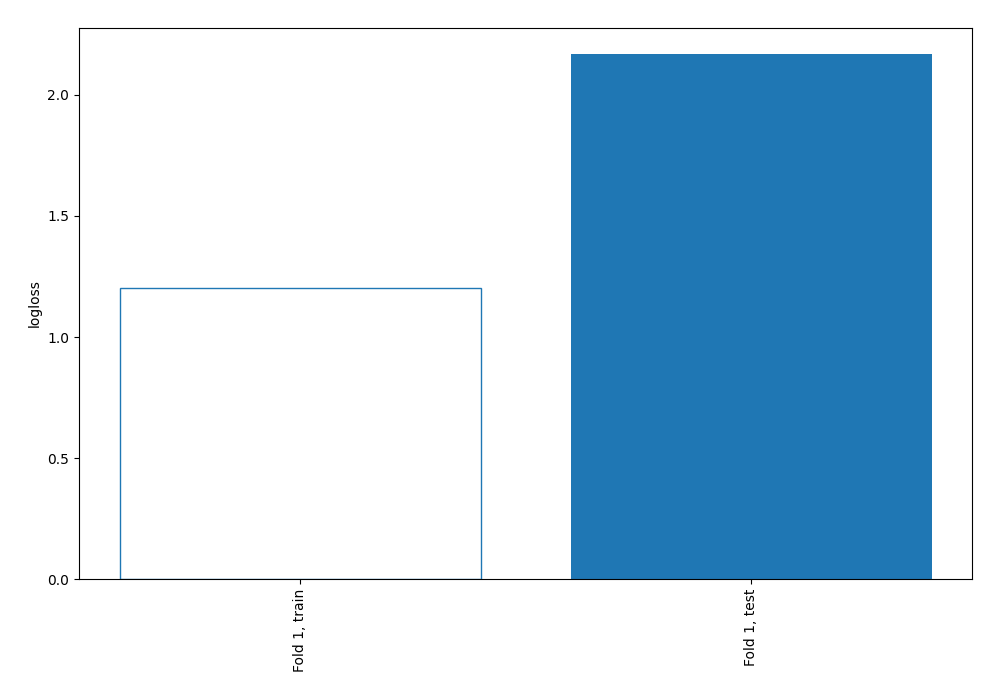
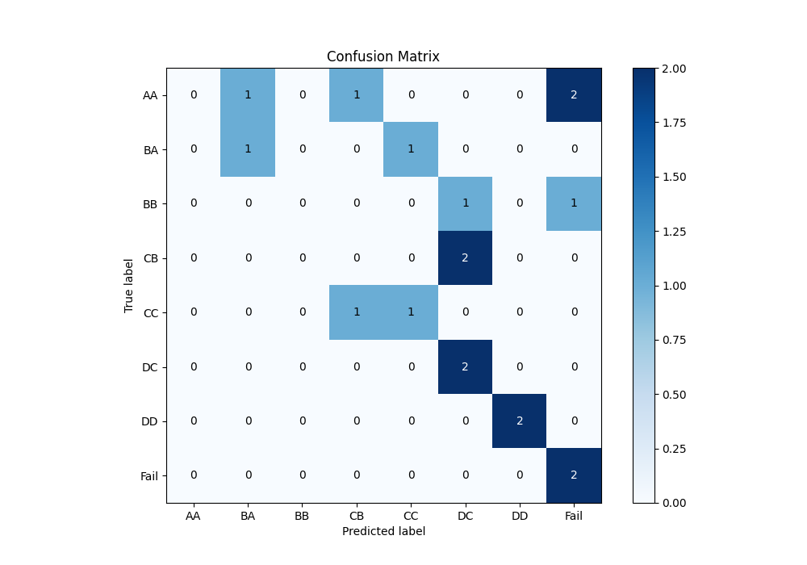
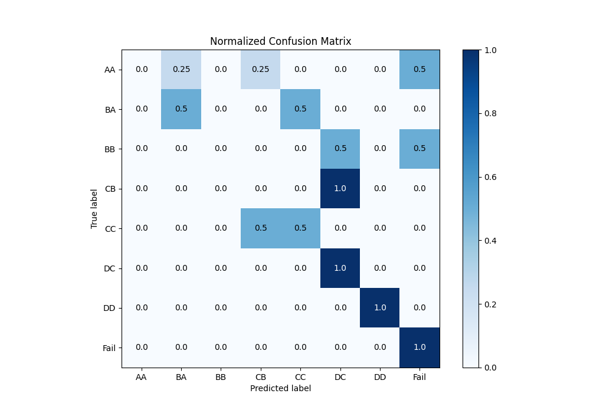
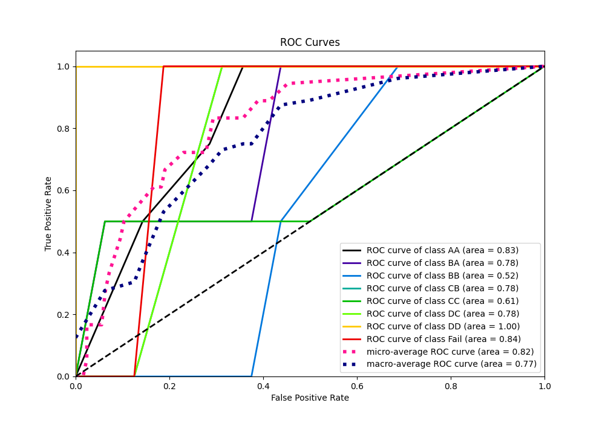
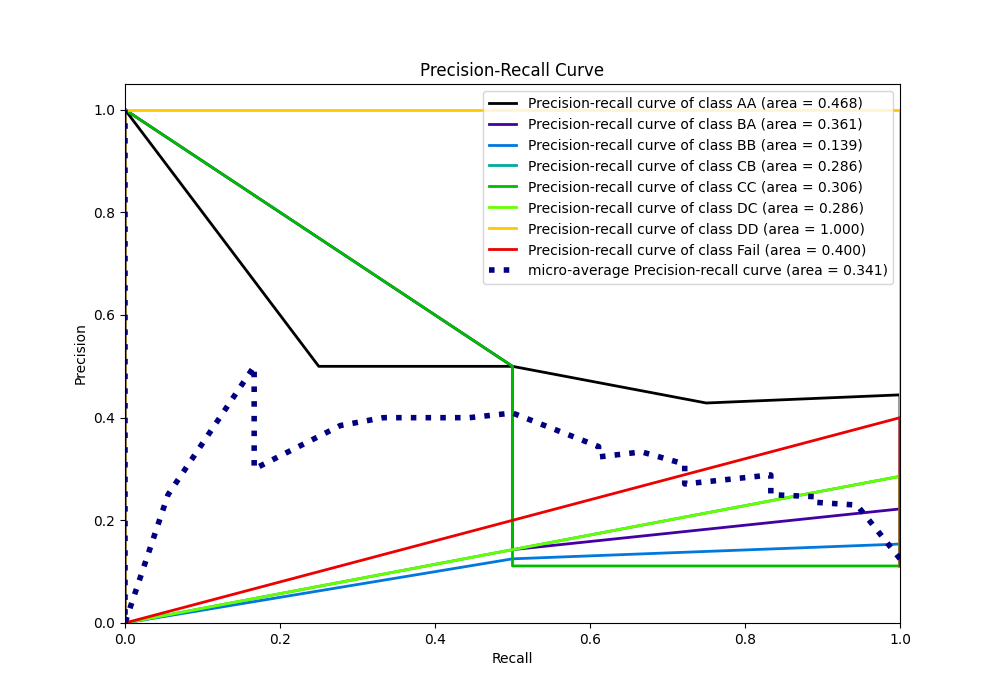

# Summary of 19_DecisionTree

[<< Go back](../README.md)

## Decision Tree
- **n_jobs**: -1
- **criterion**: entropy
- **max_depth**: 3
- **num_class**: 8
- **explain_level**: 0

## Validation
 - **validation_type**: split
 - **train_ratio**: 0.9
 - **shuffle**: True
 - **stratify**: True

## Optimized metric
logloss

## Training time

0.5 seconds

### Metric details
|           |   AA |   BA |   BB |   CB |   CC |       DC |   DD |     Fail |   accuracy |   macro avg |   weighted avg |   logloss |
|:----------|-----:|-----:|-----:|-----:|-----:|---------:|-----:|---------:|-----------:|------------:|---------------:|----------:|
| precision |    0 |  0.5 |    0 |    0 |  0.5 | 0.4      |    1 | 0.4      |   0.444444 |    0.35     |       0.311111 |    2.1686 |
| recall    |    0 |  0.5 |    0 |    0 |  0.5 | 1        |    1 | 1        |   0.444444 |    0.5      |       0.444444 |    2.1686 |
| f1-score  |    0 |  0.5 |    0 |    0 |  0.5 | 0.571429 |    1 | 0.571429 |   0.444444 |    0.392857 |       0.349206 |    2.1686 |
| support   |    4 |  2   |    2 |    2 |  2   | 2        |    2 | 2        |   0.444444 |   18        |      18        |    2.1686 |

## Confusion matrix
|                 |   Predicted as AA |   Predicted as BA |   Predicted as BB |   Predicted as CB |   Predicted as CC |   Predicted as DC |   Predicted as DD |   Predicted as Fail |
|:----------------|------------------:|------------------:|------------------:|------------------:|------------------:|------------------:|------------------:|--------------------:|
| Labeled as AA   |                 0 |                 1 |                 0 |                 1 |                 0 |                 0 |                 0 |                   2 |
| Labeled as BA   |                 0 |                 1 |                 0 |                 0 |                 1 |                 0 |                 0 |                   0 |
| Labeled as BB   |                 0 |                 0 |                 0 |                 0 |                 0 |                 1 |                 0 |                   1 |
| Labeled as CB   |                 0 |                 0 |                 0 |                 0 |                 0 |                 2 |                 0 |                   0 |
| Labeled as CC   |                 0 |                 0 |                 0 |                 1 |                 1 |                 0 |                 0 |                   0 |
| Labeled as DC   |                 0 |                 0 |                 0 |                 0 |                 0 |                 2 |                 0 |                   0 |
| Labeled as DD   |                 0 |                 0 |                 0 |                 0 |                 0 |                 0 |                 2 |                   0 |
| Labeled as Fail |                 0 |                 0 |                 0 |                 0 |                 0 |                 0 |                 0 |                   2 |

## Learning curves

## Confusion Matrix

## Normalized Confusion Matrix

## ROC Curve

## Precision Recall Curve

[<< Go back](../README.md)
