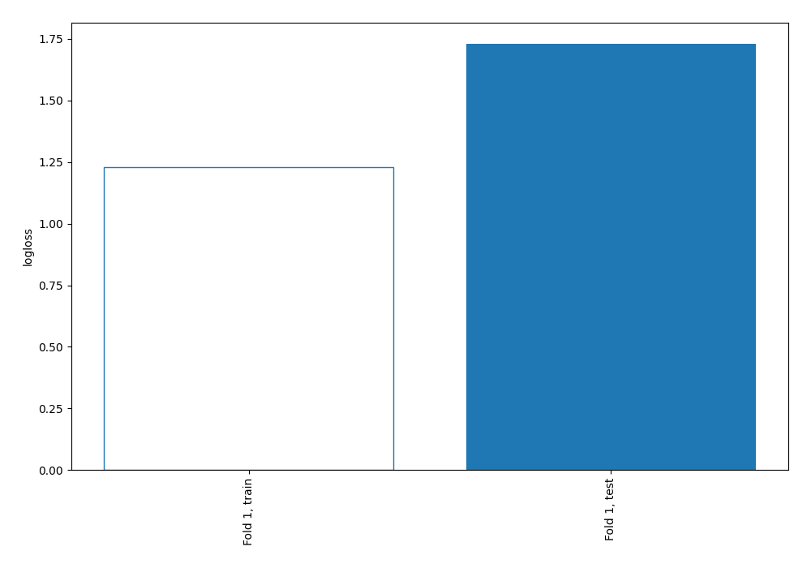
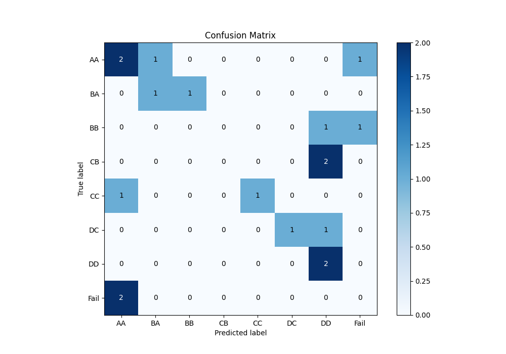
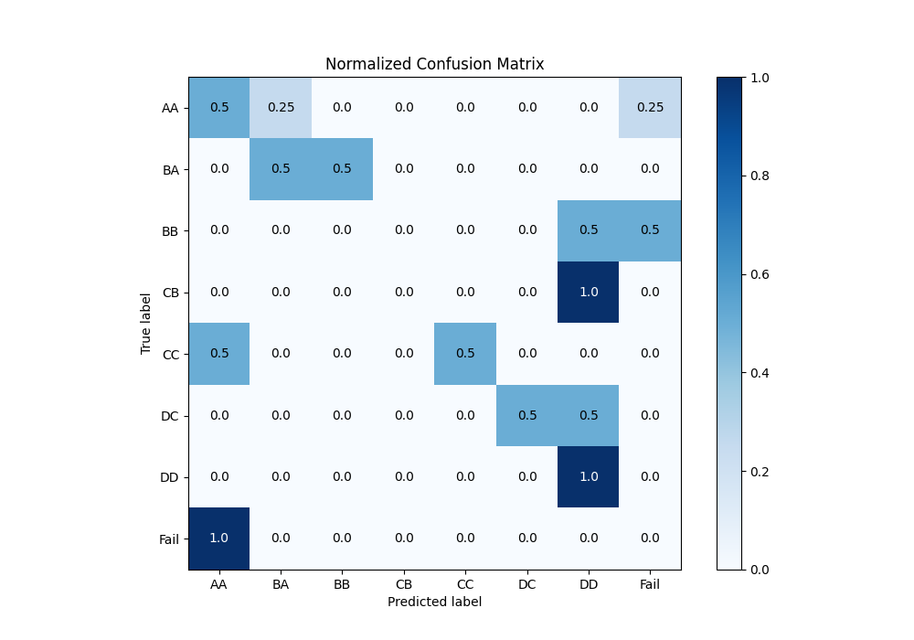
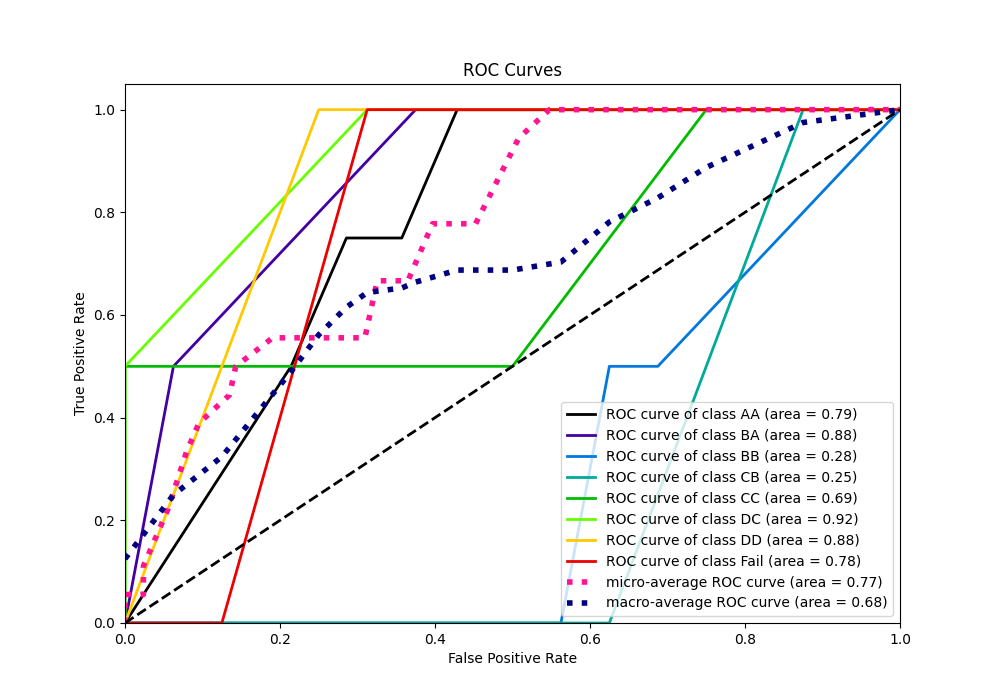
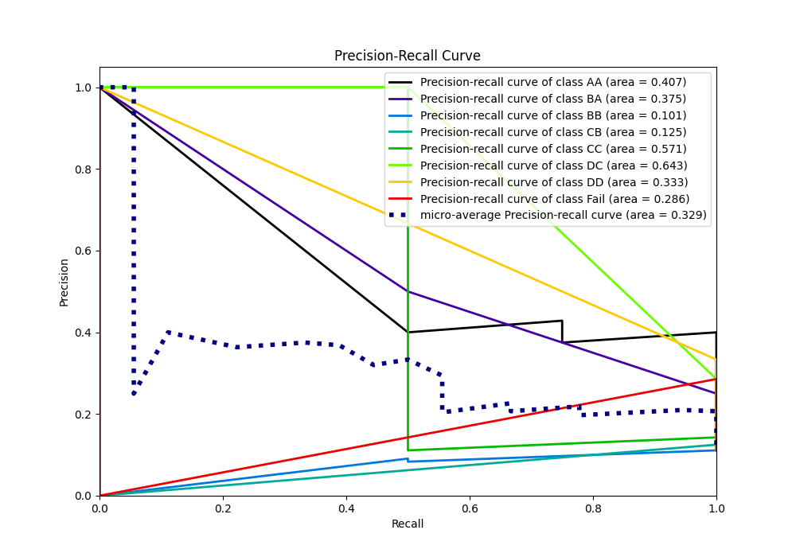

# Summary of 1_DecisionTree

[<< Go back](../README.md)

## Decision Tree
- **n_jobs**: -1
- **criterion**: gini
- **max_depth**: 3
- **num_class**: 8
- **explain_level**: 0

## Validation
 - **validation_type**: split
 - **train_ratio**: 0.9
 - **shuffle**: True
 - **stratify**: True

## Optimized metric
logloss

## Training time

0.8 seconds

### Metric details
|           |       AA |   BA |   BB |   CB |       CC |       DC |       DD |   Fail |   accuracy |   macro avg |   weighted avg |   logloss |
|:----------|---------:|-----:|-----:|-----:|---------:|---------:|---------:|-------:|-----------:|------------:|---------------:|----------:|
| precision | 0.4      |  0.5 |    0 |    0 | 1        | 1        | 0.333333 |      0 |   0.388889 |    0.404167 |       0.403704 |   1.72988 |
| recall    | 0.5      |  0.5 |    0 |    0 | 0.5      | 0.5      | 1        |      0 |   0.388889 |    0.375    |       0.388889 |   1.72988 |
| f1-score  | 0.444444 |  0.5 |    0 |    0 | 0.666667 | 0.666667 | 0.5      |      0 |   0.388889 |    0.347222 |       0.358025 |   1.72988 |
| support   | 4        |  2   |    2 |    2 | 2        | 2        | 2        |      2 |   0.388889 |   18        |      18        |   1.72988 |

## Confusion matrix
|                 |   Predicted as AA |   Predicted as BA |   Predicted as BB |   Predicted as CB |   Predicted as CC |   Predicted as DC |   Predicted as DD |   Predicted as Fail |
|:----------------|------------------:|------------------:|------------------:|------------------:|------------------:|------------------:|------------------:|--------------------:|
| Labeled as AA   |                 2 |                 1 |                 0 |                 0 |                 0 |                 0 |                 0 |                   1 |
| Labeled as BA   |                 0 |                 1 |                 1 |                 0 |                 0 |                 0 |                 0 |                   0 |
| Labeled as BB   |                 0 |                 0 |                 0 |                 0 |                 0 |                 0 |                 1 |                   1 |
| Labeled as CB   |                 0 |                 0 |                 0 |                 0 |                 0 |                 0 |                 2 |                   0 |
| Labeled as CC   |                 1 |                 0 |                 0 |                 0 |                 1 |                 0 |                 0 |                   0 |
| Labeled as DC   |                 0 |                 0 |                 0 |                 0 |                 0 |                 1 |                 1 |                   0 |
| Labeled as DD   |                 0 |                 0 |                 0 |                 0 |                 0 |                 0 |                 2 |                   0 |
| Labeled as Fail |                 2 |                 0 |                 0 |                 0 |                 0 |                 0 |                 0 |                   0 |

## Learning curves

## Confusion Matrix

## Normalized Confusion Matrix

## ROC Curve

## Precision Recall Curve

[<< Go back](../README.md)
