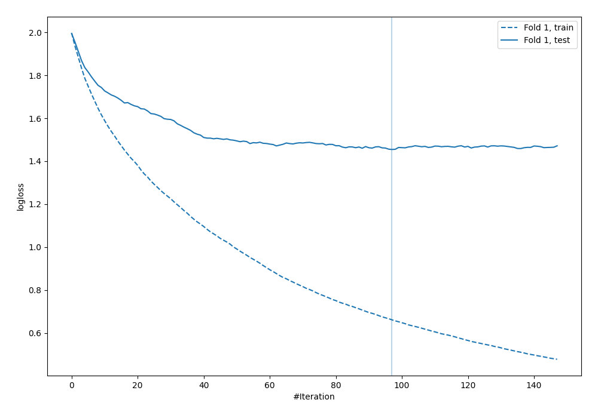
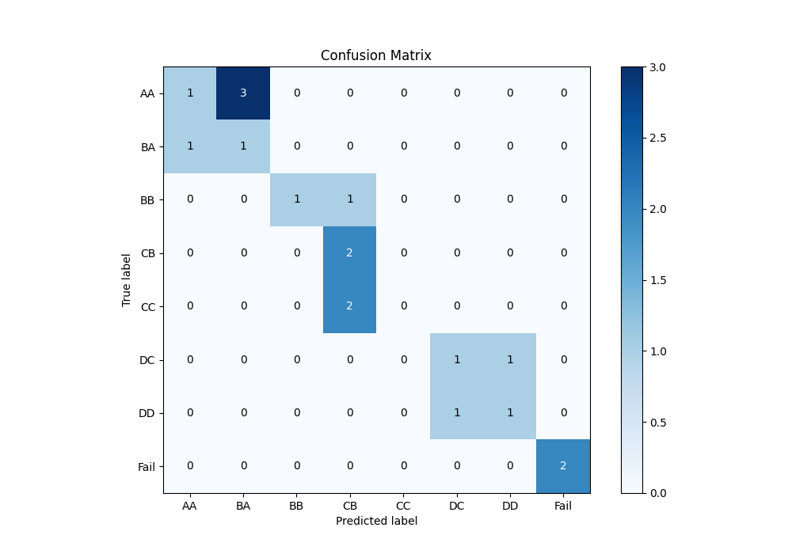
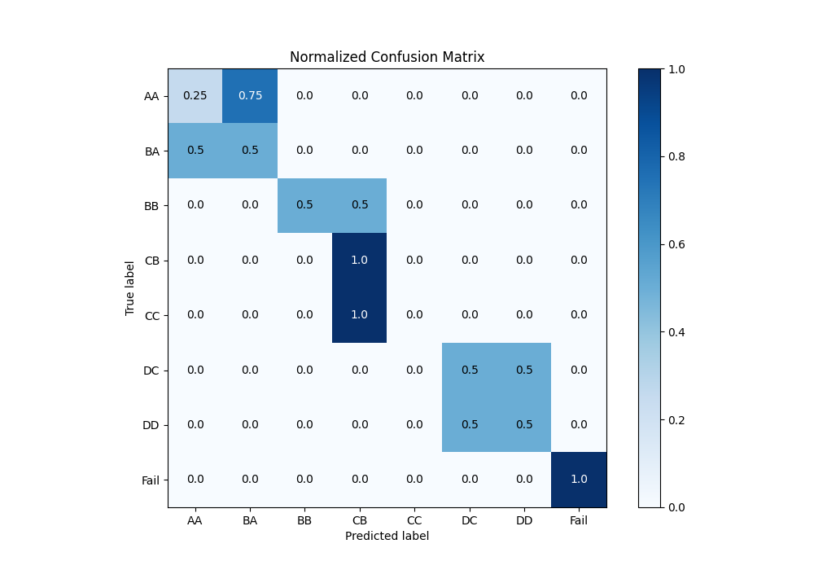
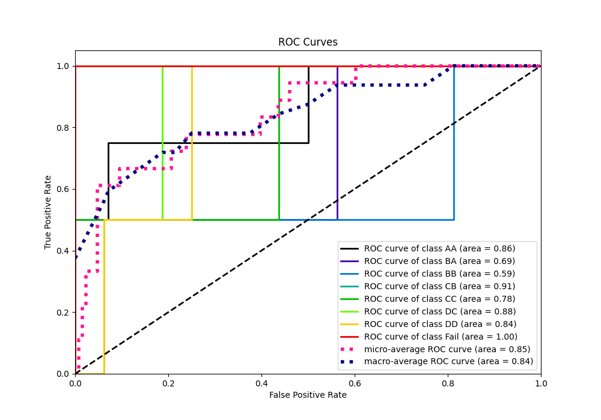
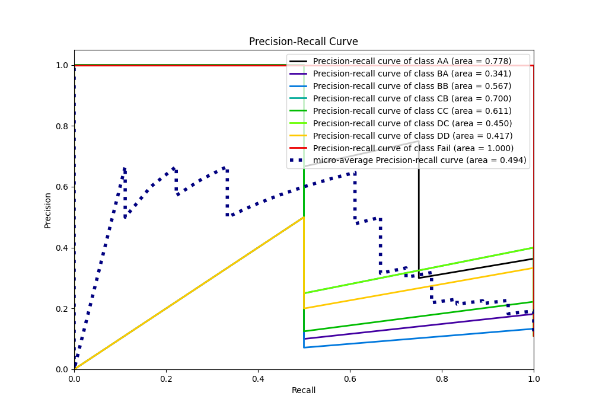

# Summary of 22_LightGBM

[<< Go back](../README.md)

## LightGBM
- **n_jobs**: -1
- **objective**: multiclass
- **num_leaves**: 15
- **learning_rate**: 0.05
- **feature_fraction**: 0.8
- **bagging_fraction**: 0.5
- **min_data_in_leaf**: 30
- **metric**: multi_logloss
- **custom_eval_metric_name**: None
- **num_class**: 8
- **explain_level**: 0

## Validation
 - **validation_type**: split
 - **train_ratio**: 0.9
 - **shuffle**: True
 - **stratify**: True

## Optimized metric
logloss

## Training time

0.8 seconds

### Metric details
|           |       AA |       BA |       BB |       CB |   CC |   DC |   DD |   Fail |   accuracy |   macro avg |   weighted avg |   logloss |
|:----------|---------:|---------:|---------:|---------:|-----:|-----:|-----:|-------:|-----------:|------------:|---------------:|----------:|
| precision | 0.5      | 0.25     | 1        | 0.4      |    0 |  0.5 |  0.5 |      1 |        0.5 |    0.51875  |       0.516667 |    1.4546 |
| recall    | 0.25     | 0.5      | 0.5      | 1        |    0 |  0.5 |  0.5 |      1 |        0.5 |    0.53125  |       0.5      |    1.4546 |
| f1-score  | 0.333333 | 0.333333 | 0.666667 | 0.571429 |    0 |  0.5 |  0.5 |      1 |        0.5 |    0.488095 |       0.470899 |    1.4546 |
| support   | 4        | 2        | 2        | 2        |    2 |  2   |  2   |      2 |        0.5 |   18        |      18        |    1.4546 |

## Confusion matrix
|                 |   Predicted as AA |   Predicted as BA |   Predicted as BB |   Predicted as CB |   Predicted as CC |   Predicted as DC |   Predicted as DD |   Predicted as Fail |
|:----------------|------------------:|------------------:|------------------:|------------------:|------------------:|------------------:|------------------:|--------------------:|
| Labeled as AA   |                 1 |                 3 |                 0 |                 0 |                 0 |                 0 |                 0 |                   0 |
| Labeled as BA   |                 1 |                 1 |                 0 |                 0 |                 0 |                 0 |                 0 |                   0 |
| Labeled as BB   |                 0 |                 0 |                 1 |                 1 |                 0 |                 0 |                 0 |                   0 |
| Labeled as CB   |                 0 |                 0 |                 0 |                 2 |                 0 |                 0 |                 0 |                   0 |
| Labeled as CC   |                 0 |                 0 |                 0 |                 2 |                 0 |                 0 |                 0 |                   0 |
| Labeled as DC   |                 0 |                 0 |                 0 |                 0 |                 0 |                 1 |                 1 |                   0 |
| Labeled as DD   |                 0 |                 0 |                 0 |                 0 |                 0 |                 1 |                 1 |                   0 |
| Labeled as Fail |                 0 |                 0 |                 0 |                 0 |                 0 |                 0 |                 0 |                   2 |

## Learning curves

## Confusion Matrix

## Normalized Confusion Matrix

## ROC Curve

## Precision Recall Curve

[<< Go back](../README.md)
