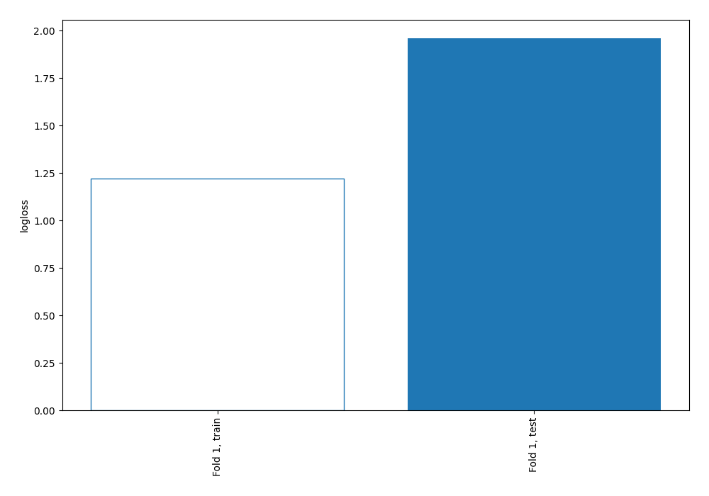
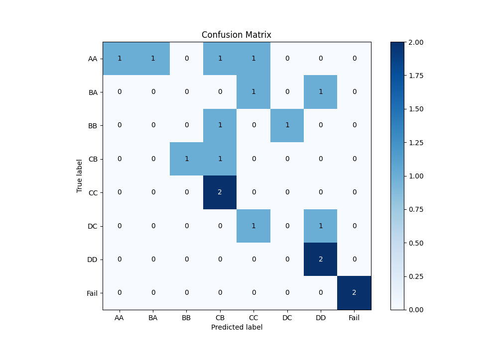
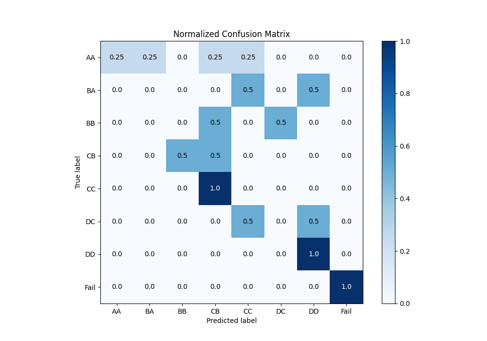
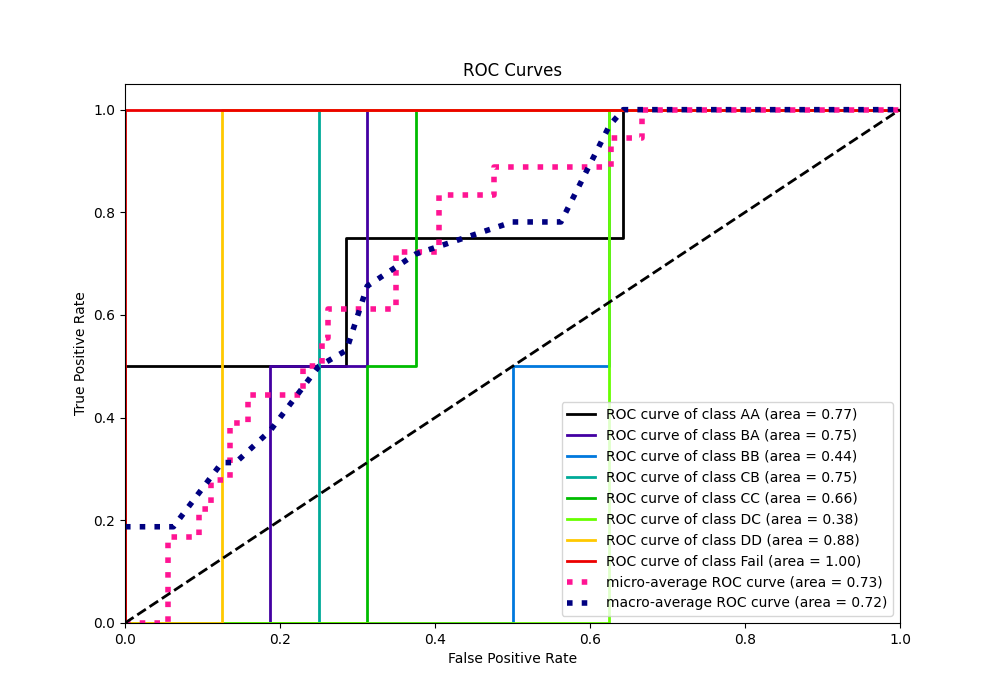
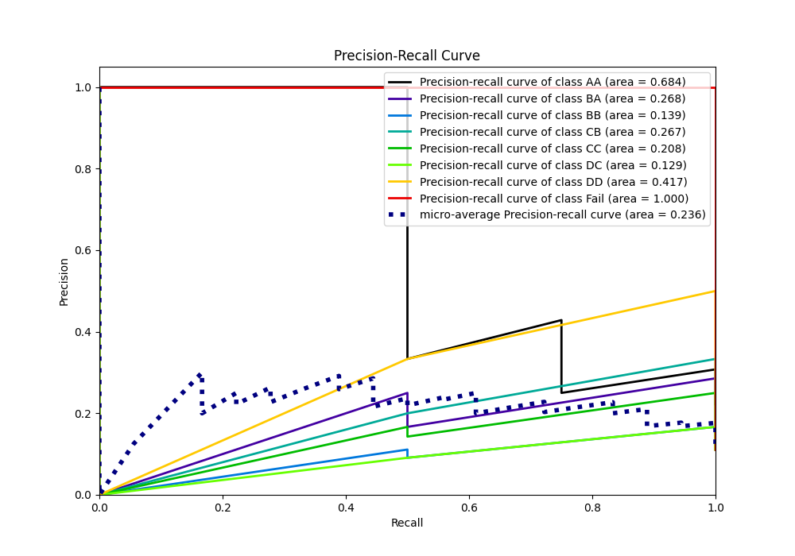

# Summary of 4_Linear

[<< Go back](../README.md)

## Logistic Regression (Linear)
- **n_jobs**: -1
- **num_class**: 8
- **explain_level**: 0

## Validation
 - **validation_type**: split
 - **train_ratio**: 0.9
 - **shuffle**: True
 - **stratify**: True

## Optimized metric
logloss

## Training time

18.4 seconds

### Metric details
|           |   AA |   BA |   BB |       CB |   CC |   DC |       DD |   Fail |   accuracy |   macro avg |   weighted avg |   logloss |
|:----------|-----:|-----:|-----:|---------:|-----:|-----:|---------:|-------:|-----------:|------------:|---------------:|----------:|
| precision | 1    |    0 |    0 | 0.2      |    0 |    0 | 0.5      |      1 |   0.333333 |    0.3375   |       0.411111 |   1.96024 |
| recall    | 0.25 |    0 |    0 | 0.5      |    0 |    0 | 1        |      1 |   0.333333 |    0.34375  |       0.333333 |   1.96024 |
| f1-score  | 0.4  |    0 |    0 | 0.285714 |    0 |    0 | 0.666667 |      1 |   0.333333 |    0.294048 |       0.30582  |   1.96024 |
| support   | 4    |    2 |    2 | 2        |    2 |    2 | 2        |      2 |   0.333333 |   18        |      18        |   1.96024 |

## Confusion matrix
|                 |   Predicted as AA |   Predicted as BA |   Predicted as BB |   Predicted as CB |   Predicted as CC |   Predicted as DC |   Predicted as DD |   Predicted as Fail |
|:----------------|------------------:|------------------:|------------------:|------------------:|------------------:|------------------:|------------------:|--------------------:|
| Labeled as AA   |                 1 |                 1 |                 0 |                 1 |                 1 |                 0 |                 0 |                   0 |
| Labeled as BA   |                 0 |                 0 |                 0 |                 0 |                 1 |                 0 |                 1 |                   0 |
| Labeled as BB   |                 0 |                 0 |                 0 |                 1 |                 0 |                 1 |                 0 |                   0 |
| Labeled as CB   |                 0 |                 0 |                 1 |                 1 |                 0 |                 0 |                 0 |                   0 |
| Labeled as CC   |                 0 |                 0 |                 0 |                 2 |                 0 |                 0 |                 0 |                   0 |
| Labeled as DC   |                 0 |                 0 |                 0 |                 0 |                 1 |                 0 |                 1 |                   0 |
| Labeled as DD   |                 0 |                 0 |                 0 |                 0 |                 0 |                 0 |                 2 |                   0 |
| Labeled as Fail |                 0 |                 0 |                 0 |                 0 |                 0 |                 0 |                 0 |                   2 |

## Learning curves

## Confusion Matrix

## Normalized Confusion Matrix

## ROC Curve

## Precision Recall Curve

[<< Go back](../README.md)
