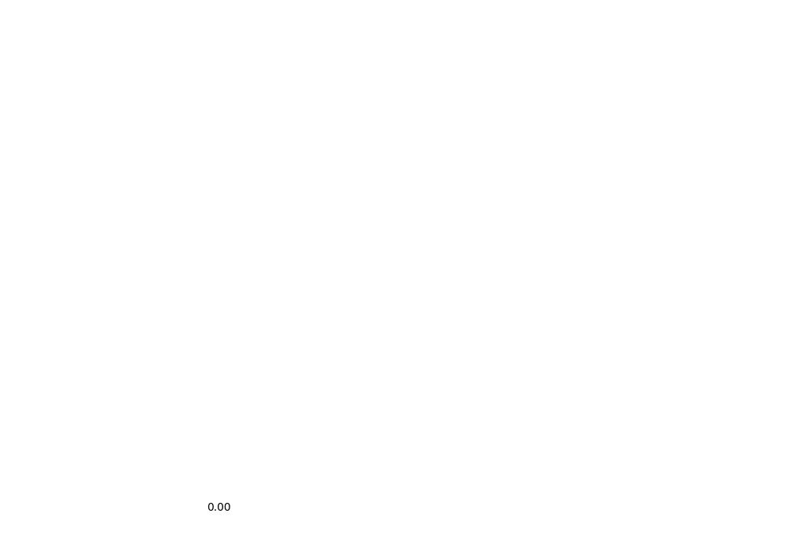
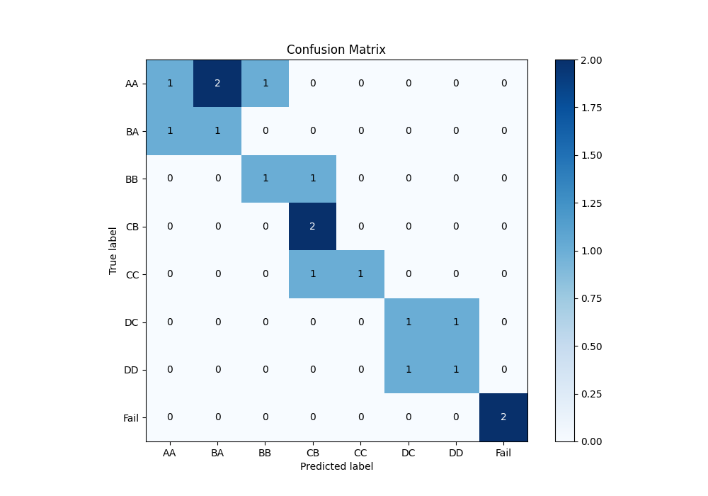
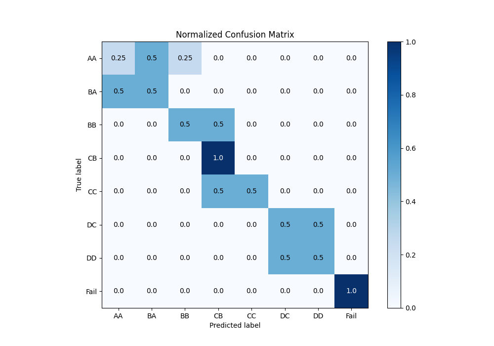
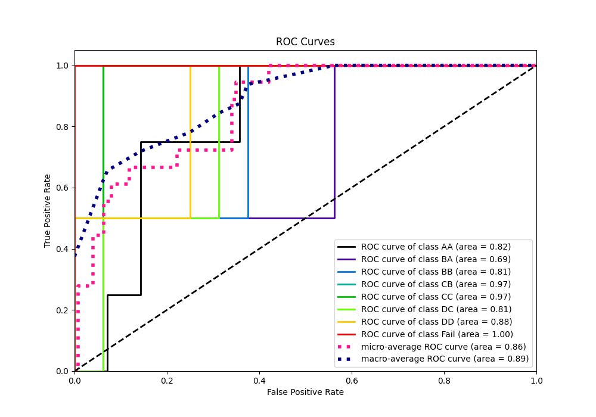
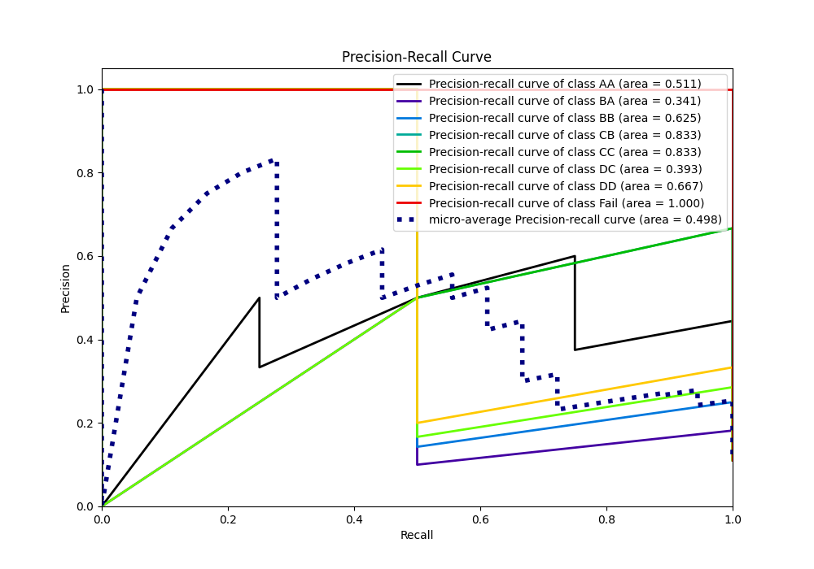

# Summary of 5_Default_LightGBM_KMeansFeatures_RandomFeature

[<< Go back](../README.md)

## LightGBM
- **n_jobs**: -1
- **objective**: multiclass
- **num_leaves**: 63
- **learning_rate**: 0.05
- **feature_fraction**: 0.9
- **bagging_fraction**: 0.9
- **min_data_in_leaf**: 10
- **metric**: multi_logloss
- **custom_eval_metric_name**: None
- **num_class**: 8
- **explain_level**: 1

## Validation
 - **validation_type**: split
 - **train_ratio**: 0.9
 - **shuffle**: True
 - **stratify**: True

## Optimized metric
logloss

## Training time

21.9 seconds

### Metric details
|           |       AA |       BA |   BB |       CB |       CC |   DC |   DD |   Fail |   accuracy |   macro avg |   weighted avg |   logloss |
|:----------|---------:|---------:|-----:|---------:|---------:|-----:|-----:|-------:|-----------:|------------:|---------------:|----------:|
| precision | 0.5      | 0.333333 |  0.5 | 0.5      | 1        |  0.5 |  0.5 |      1 |   0.555556 |    0.604167 |       0.592593 |   1.40926 |
| recall    | 0.25     | 0.5      |  0.5 | 1        | 0.5      |  0.5 |  0.5 |      1 |   0.555556 |    0.59375  |       0.555556 |   1.40926 |
| f1-score  | 0.333333 | 0.4      |  0.5 | 0.666667 | 0.666667 |  0.5 |  0.5 |      1 |   0.555556 |    0.570833 |       0.544444 |   1.40926 |
| support   | 4        | 2        |  2   | 2        | 2        |  2   |  2   |      2 |   0.555556 |   18        |      18        |   1.40926 |

## Confusion matrix
|                 |   Predicted as AA |   Predicted as BA |   Predicted as BB |   Predicted as CB |   Predicted as CC |   Predicted as DC |   Predicted as DD |   Predicted as Fail |
|:----------------|------------------:|------------------:|------------------:|------------------:|------------------:|------------------:|------------------:|--------------------:|
| Labeled as AA   |                 1 |                 2 |                 1 |                 0 |                 0 |                 0 |                 0 |                   0 |
| Labeled as BA   |                 1 |                 1 |                 0 |                 0 |                 0 |                 0 |                 0 |                   0 |
| Labeled as BB   |                 0 |                 0 |                 1 |                 1 |                 0 |                 0 |                 0 |                   0 |
| Labeled as CB   |                 0 |                 0 |                 0 |                 2 |                 0 |                 0 |                 0 |                   0 |
| Labeled as CC   |                 0 |                 0 |                 0 |                 1 |                 1 |                 0 |                 0 |                   0 |
| Labeled as DC   |                 0 |                 0 |                 0 |                 0 |                 0 |                 1 |                 1 |                   0 |
| Labeled as DD   |                 0 |                 0 |                 0 |                 0 |                 0 |                 1 |                 1 |                   0 |
| Labeled as Fail |                 0 |                 0 |                 0 |                 0 |                 0 |                 0 |                 0 |                   2 |

## Learning curves

## Permutation-based Importance

## Confusion Matrix

## Normalized Confusion Matrix

## ROC Curve

## Precision Recall Curve

[<< Go back](../README.md)
