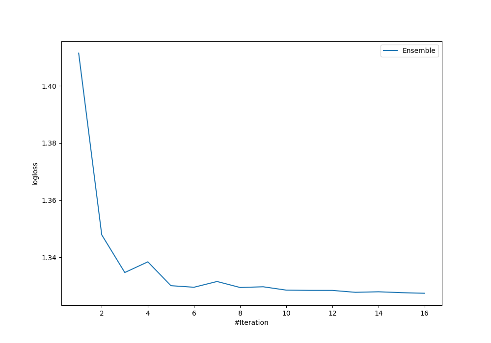
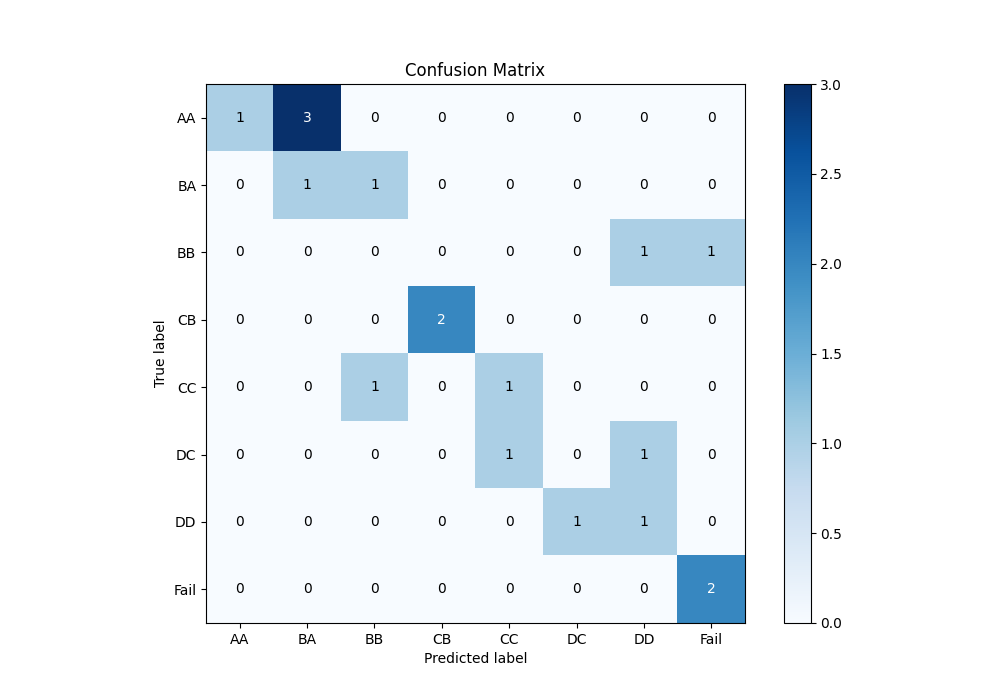
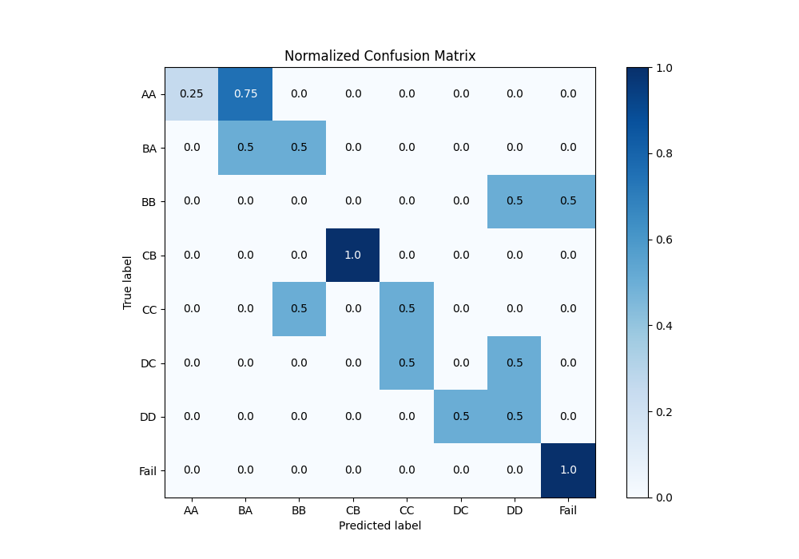
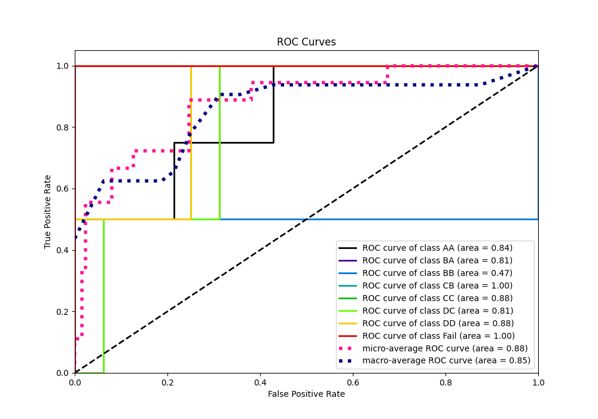
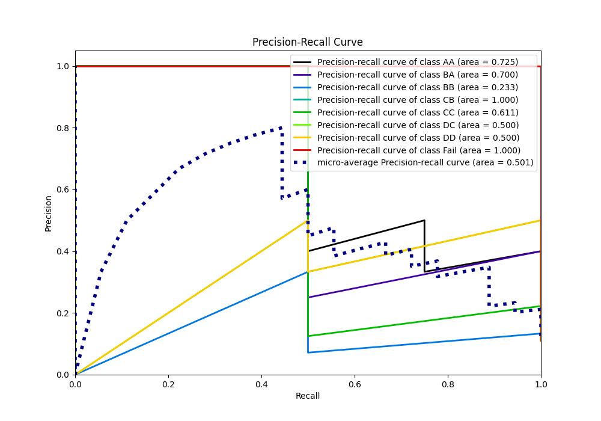

# Summary of Ensemble

[<< Go back](../README.md)

## Ensemble structure
| Model                             |   Weight |
|:----------------------------------|---------:|
| 1_DecisionTree                    |        1 |
| 5_Default_LightGBM_KMeansFeatures |        2 |

### Metric details
|           |   AA |   BA |   BB |   CB |       CC |   DC |       DD |   Fail |   accuracy |   macro avg |   weighted avg |   logloss |
|:----------|-----:|-----:|-----:|-----:|---------:|-----:|---------:|-------:|-----------:|------------:|---------------:|----------:|
| precision | 0.75 |  0.5 |  0.5 |    1 | 1        |  0.5 | 0.333333 |      1 |   0.666667 |    0.697917 |       0.703704 |    1.3177 |
| recall    | 0.75 |  0.5 |  0.5 |    1 | 0.5      |  0.5 | 0.5      |      1 |   0.666667 |    0.65625  |       0.666667 |    1.3177 |
| f1-score  | 0.75 |  0.5 |  0.5 |    1 | 0.666667 |  0.5 | 0.4      |      1 |   0.666667 |    0.664583 |       0.674074 |    1.3177 |
| support   | 4    |  2   |  2   |    2 | 2        |  2   | 2        |      2 |   0.666667 |   18        |      18        |    1.3177 |

## Confusion matrix
|                 |   Predicted as AA |   Predicted as BA |   Predicted as BB |   Predicted as CB |   Predicted as CC |   Predicted as DC |   Predicted as DD |   Predicted as Fail |
|:----------------|------------------:|------------------:|------------------:|------------------:|------------------:|------------------:|------------------:|--------------------:|
| Labeled as AA   |                 3 |                 1 |                 0 |                 0 |                 0 |                 0 |                 0 |                   0 |
| Labeled as BA   |                 0 |                 1 |                 1 |                 0 |                 0 |                 0 |                 0 |                   0 |
| Labeled as BB   |                 0 |                 0 |                 1 |                 0 |                 0 |                 0 |                 1 |                   0 |
| Labeled as CB   |                 0 |                 0 |                 0 |                 2 |                 0 |                 0 |                 0 |                   0 |
| Labeled as CC   |                 1 |                 0 |                 0 |                 0 |                 1 |                 0 |                 0 |                   0 |
| Labeled as DC   |                 0 |                 0 |                 0 |                 0 |                 0 |                 1 |                 1 |                   0 |
| Labeled as DD   |                 0 |                 0 |                 0 |                 0 |                 0 |                 1 |                 1 |                   0 |
| Labeled as Fail |                 0 |                 0 |                 0 |                 0 |                 0 |                 0 |                 0 |                   2 |

## Learning curves

## Confusion Matrix

## Normalized Confusion Matrix

## ROC Curve

## Precision Recall Curve

[<< Go back](../README.md)
