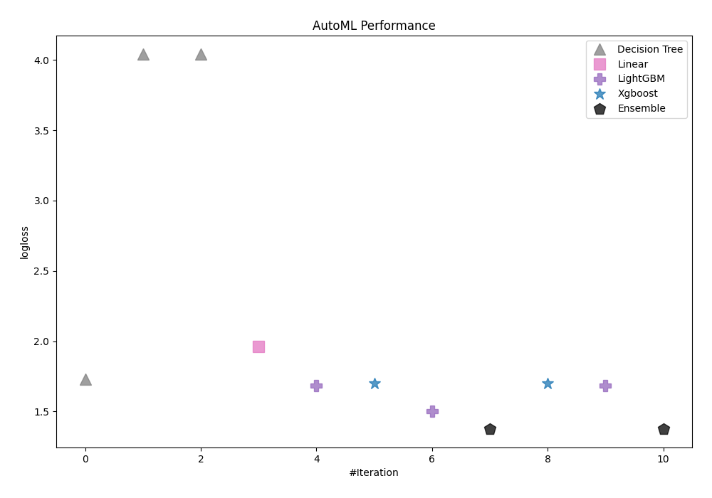
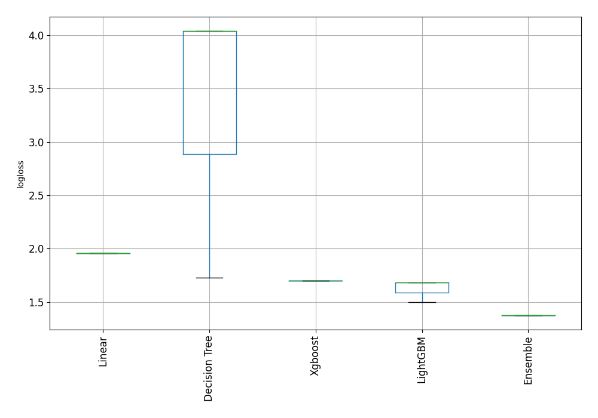
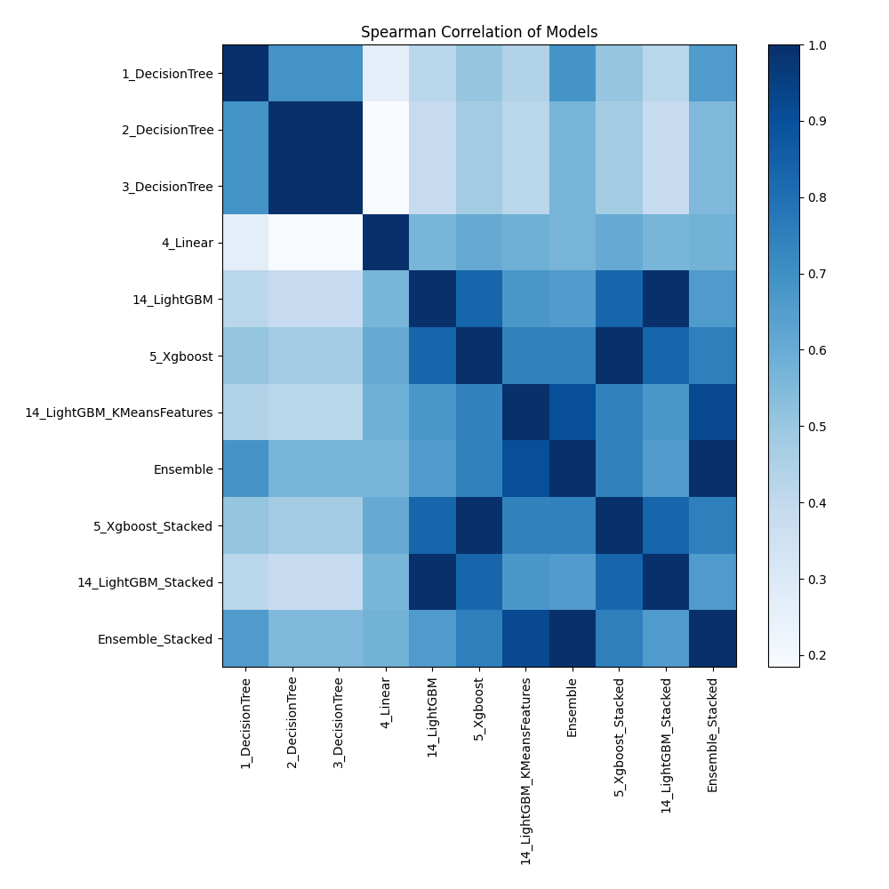

# AutoML Leaderboard

| Best model   | name                                                               | model_type    | metric_type   |   metric_value |   train_time |
|:-------------|:-------------------------------------------------------------------|:--------------|:--------------|---------------:|-------------:|
|              | [1_DecisionTree](1_DecisionTree/README.md)                         | Decision Tree | logloss       |        1.72988 |         1.34 |
|              | [2_DecisionTree](2_DecisionTree/README.md)                         | Decision Tree | logloss       |        4.04011 |         5.3  |
|              | [3_DecisionTree](3_DecisionTree/README.md)                         | Decision Tree | logloss       |        4.04011 |         5.35 |
|              | [4_Linear](4_Linear/README.md)                                     | Linear        | logloss       |        1.96024 |         7.47 |
|              | [14_LightGBM](14_LightGBM/README.md)                               | LightGBM      | logloss       |        1.68199 |         1.91 |
|              | [5_Xgboost](5_Xgboost/README.md)                                   | Xgboost       | logloss       |        1.70127 |         3.74 |
|              | [14_LightGBM_KMeansFeatures](14_LightGBM_KMeansFeatures/README.md) | LightGBM      | logloss       |        1.50112 |        15.37 |
|              | [Ensemble](Ensemble/README.md)                                     | Ensemble      | logloss       |        1.37768 |         0.41 |
|              | [5_Xgboost_Stacked](5_Xgboost_Stacked/README.md)                   | Xgboost       | logloss       |        1.70127 |         2.58 |
|              | [14_LightGBM_Stacked](14_LightGBM_Stacked/README.md)               | LightGBM      | logloss       |        1.68199 |         1.07 |
| **the best** | [Ensemble_Stacked](Ensemble_Stacked/README.md)                     | Ensemble      | logloss       |        1.37765 |         0.52 |

### AutoML Performance

### AutoML Performance Boxplot

### Spearman Correlation of Models

