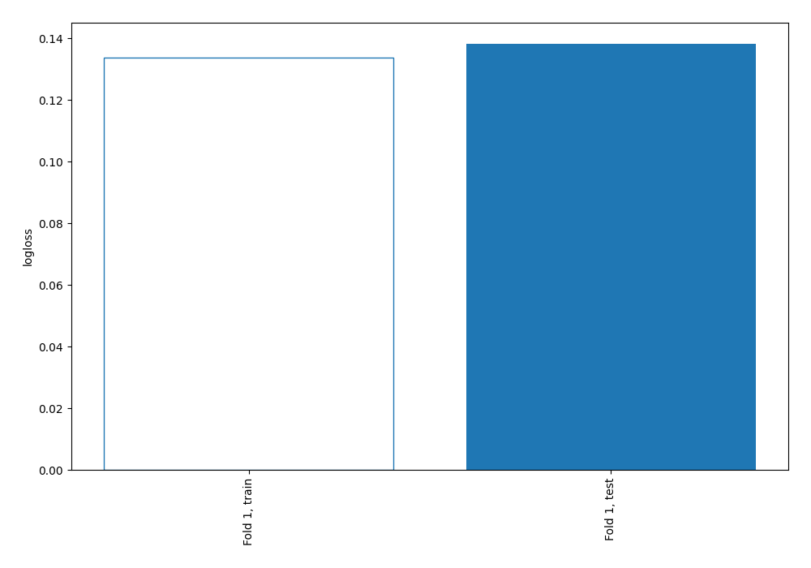
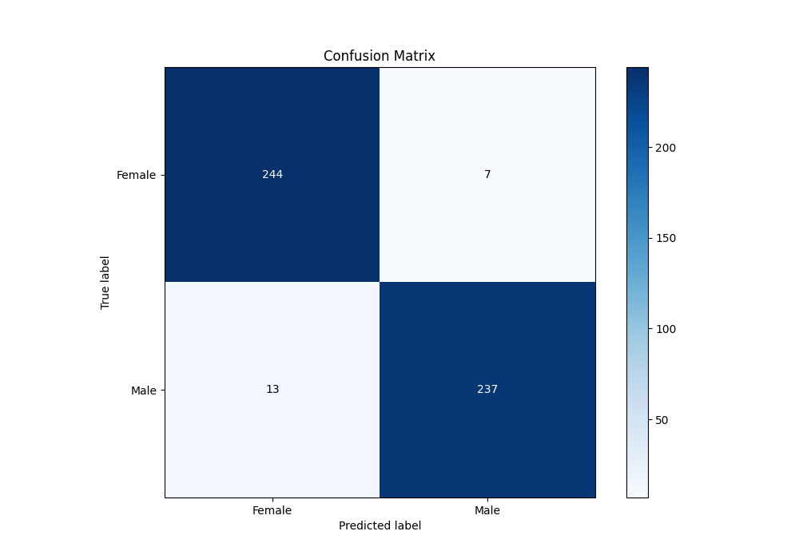
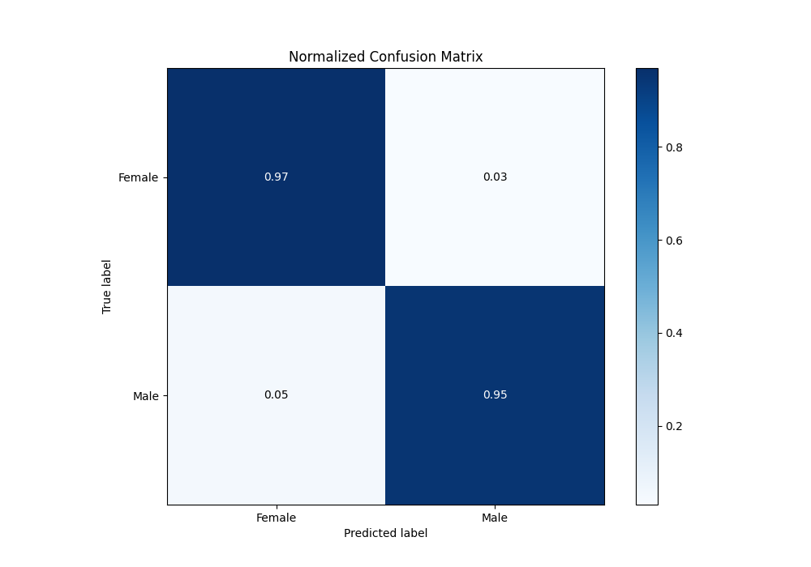
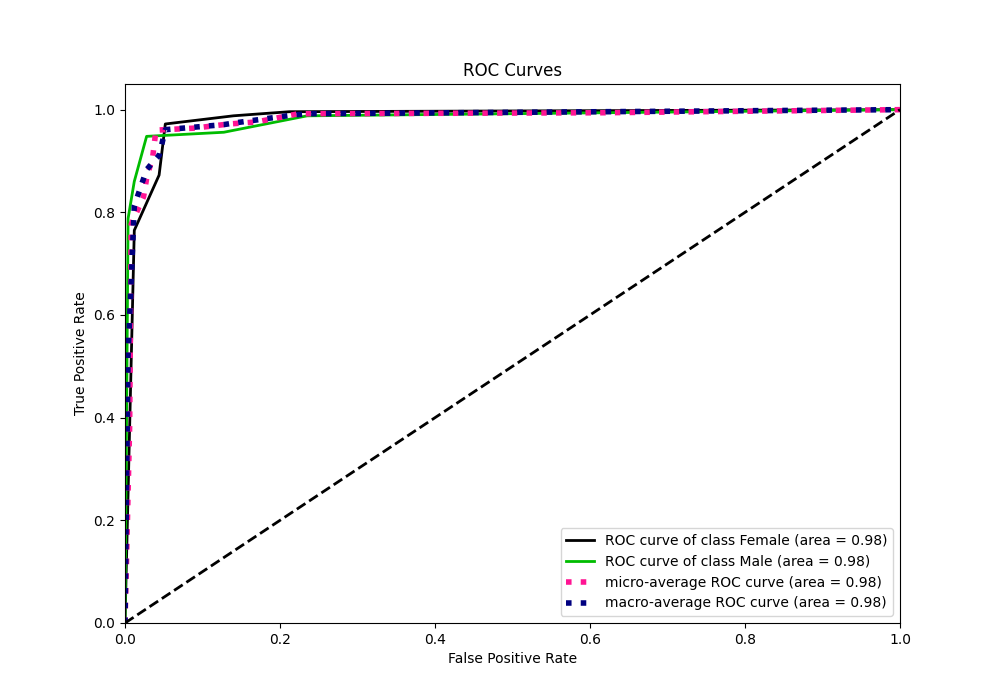
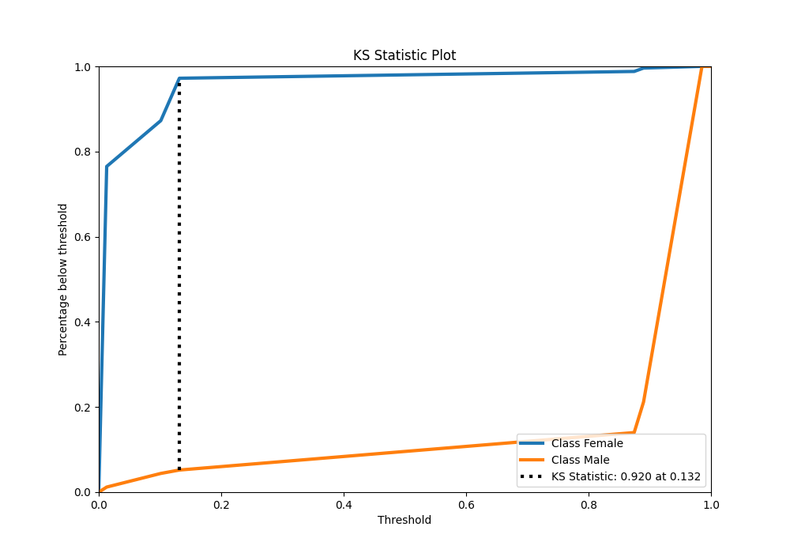
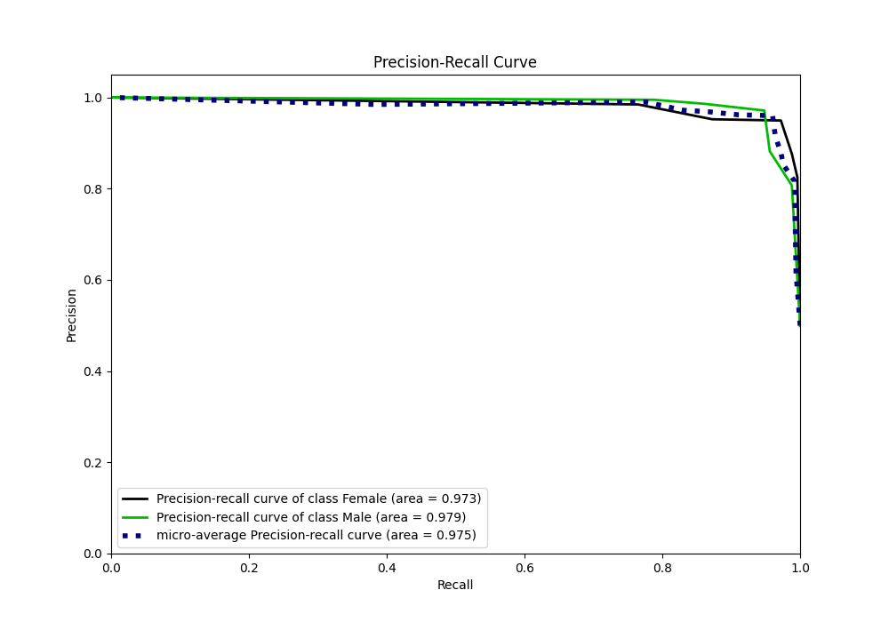
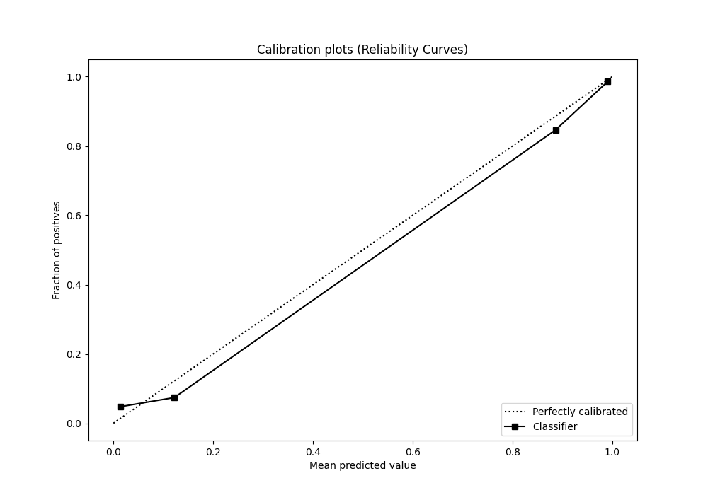
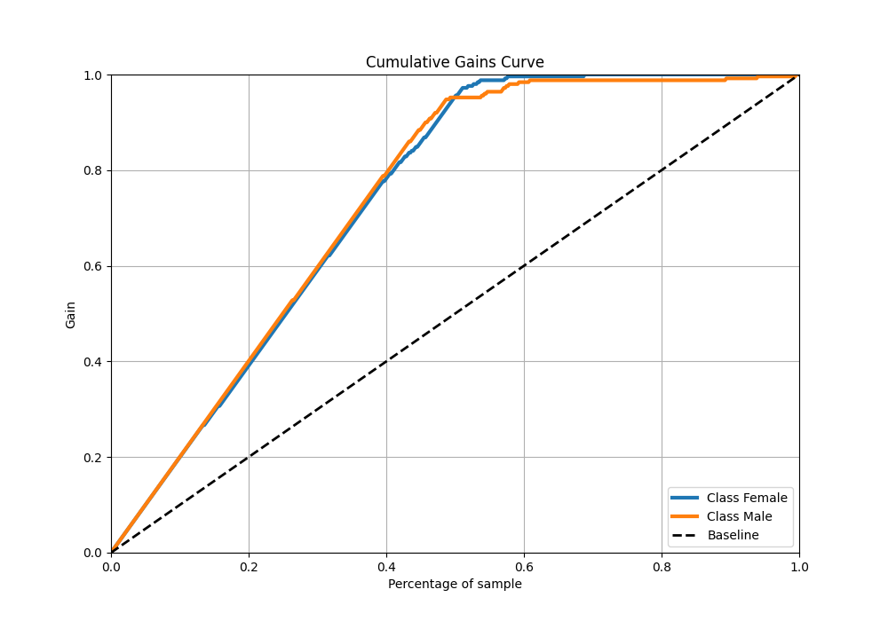
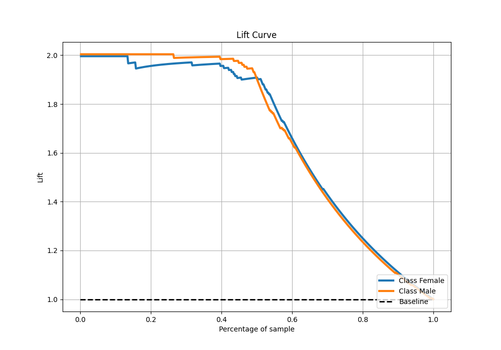

# Summary of 1_DecisionTree

[<< Go back](../README.md)

## Decision Tree
- **n_jobs**: -1
- **criterion**: gini
- **max_depth**: 3
- **explain_level**: 0

## Validation
 - **validation_type**: split
 - **train_ratio**: 0.9
 - **shuffle**: True
 - **stratify**: True

## Optimized metric
logloss

## Training time

1.3 seconds

## Metric details
|           |    score |   threshold |
|:----------|---------:|------------:|
| logloss   | 0.138197 | nan         |
| auc       | 0.982271 | nan         |
| f1        | 0.959514 |   0.131687  |
| accuracy  | 0.96008  |   0.131687  |
| precision | 0.994949 |   0.889868  |
| recall    | 1        |   0.0116751 |
| mcc       | 0.92042  |   0.131687  |

## Metric details with threshold from accuracy metric
|           |    score |   threshold |
|:----------|---------:|------------:|
| logloss   | 0.138197 |  nan        |
| auc       | 0.982271 |  nan        |
| f1        | 0.959514 |    0.131687 |
| accuracy  | 0.96008  |    0.131687 |
| precision | 0.971311 |    0.131687 |
| recall    | 0.948    |    0.131687 |
| mcc       | 0.92042  |    0.131687 |

## Confusion matrix (at threshold=0.131687)
|                   |   Predicted as Female |   Predicted as Male |
|:------------------|----------------------:|--------------------:|
| Labeled as Female |                   244 |                   7 |
| Labeled as Male   |                    13 |                 237 |

## Learning curves

## Confusion Matrix

## Normalized Confusion Matrix

## ROC Curve

## Kolmogorov-Smirnov Statistic

## Precision-Recall Curve

## Calibration Curve

## Cumulative Gains Curve

## Lift Curve

[<< Go back](../README.md)
