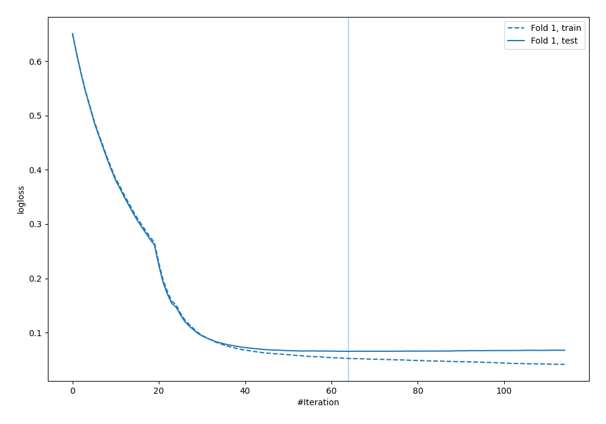
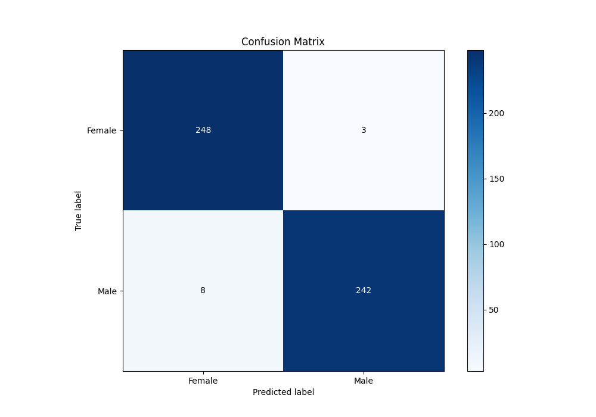
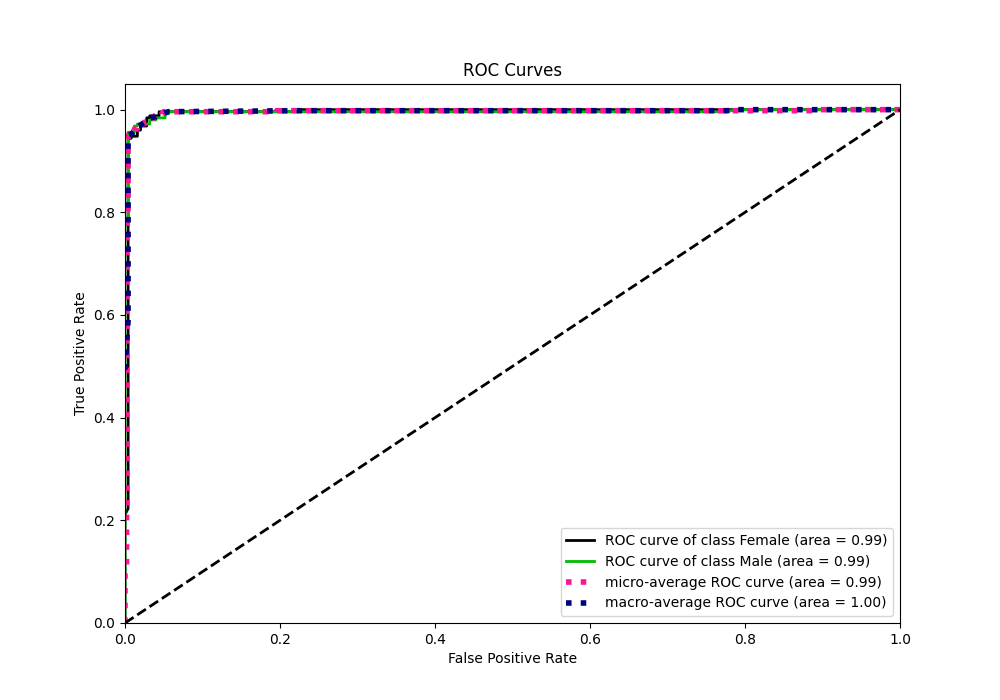
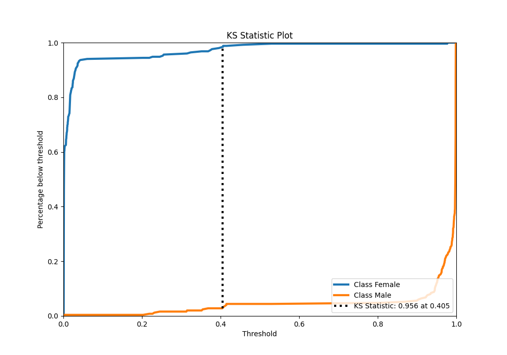
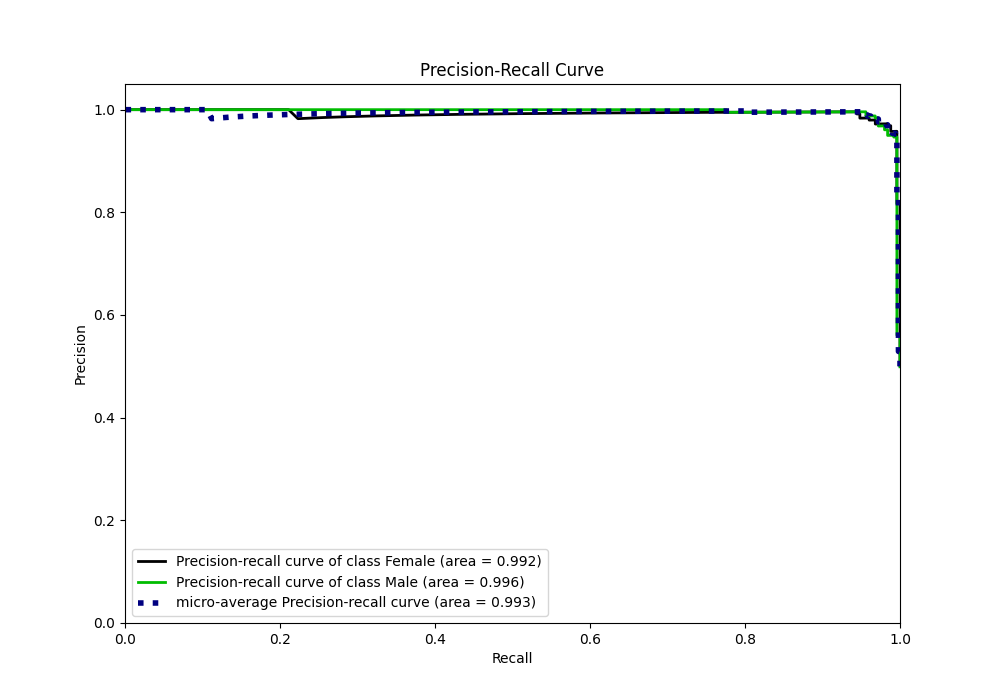
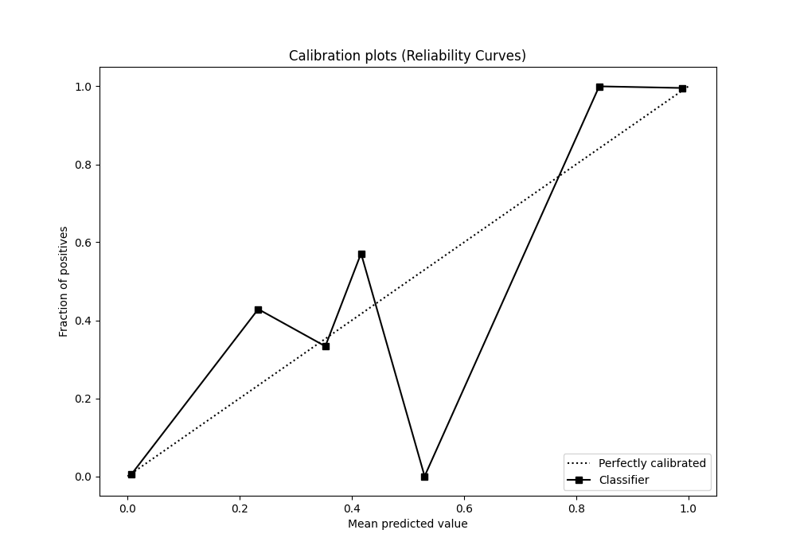
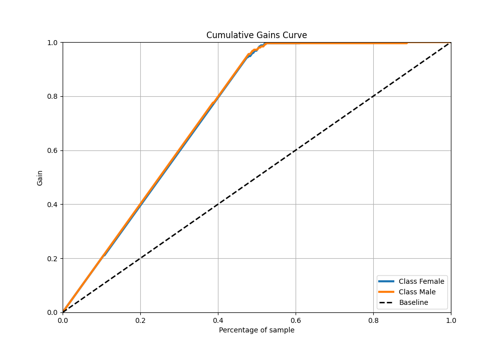
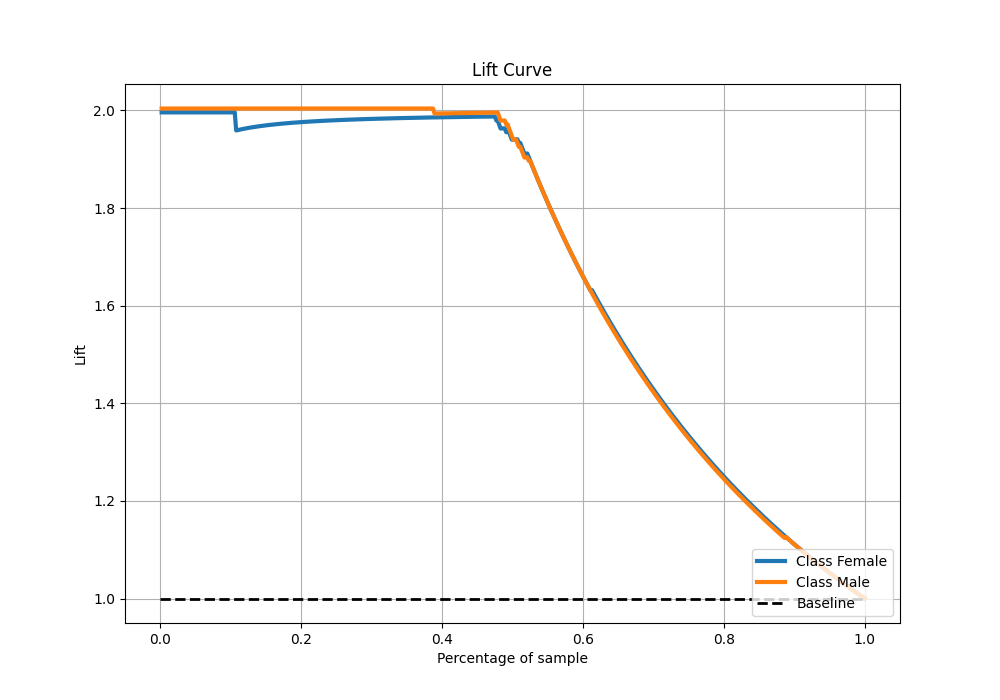

# Summary of 25_CatBoost

[<< Go back](../README.md)

## CatBoost
- **n_jobs**: -1
- **learning_rate**: 0.05
- **depth**: 8
- **rsm**: 0.8
- **loss_function**: Logloss
- **eval_metric**: Logloss
- **explain_level**: 0

## Validation
 - **validation_type**: split
 - **train_ratio**: 0.9
 - **shuffle**: True
 - **stratify**: True

## Optimized metric
logloss

## Training time

3.0 seconds

## Metric details
|           |     score |     threshold |
|:----------|----------:|--------------:|
| logloss   | 0.0656047 | nan           |
| auc       | 0.994892  | nan           |
| f1        | 0.977778  |   0.408523    |
| accuracy  | 0.978044  |   0.408523    |
| precision | 1         |   0.983193    |
| recall    | 1         |   0.000685323 |
| mcc       | 0.956276  |   0.408523    |

## Metric details with threshold from accuracy metric
|           |     score |   threshold |
|:----------|----------:|------------:|
| logloss   | 0.0656047 |  nan        |
| auc       | 0.994892  |  nan        |
| f1        | 0.977778  |    0.408523 |
| accuracy  | 0.978044  |    0.408523 |
| precision | 0.987755  |    0.408523 |
| recall    | 0.968     |    0.408523 |
| mcc       | 0.956276  |    0.408523 |

## Confusion matrix (at threshold=0.408523)
|                   |   Predicted as Female |   Predicted as Male |
|:------------------|----------------------:|--------------------:|
| Labeled as Female |                   248 |                   3 |
| Labeled as Male   |                     8 |                 242 |

## Learning curves

## Confusion Matrix

## Normalized Confusion Matrix

## ROC Curve

## Kolmogorov-Smirnov Statistic

## Precision-Recall Curve

## Calibration Curve

## Cumulative Gains Curve

## Lift Curve

[<< Go back](../README.md)
