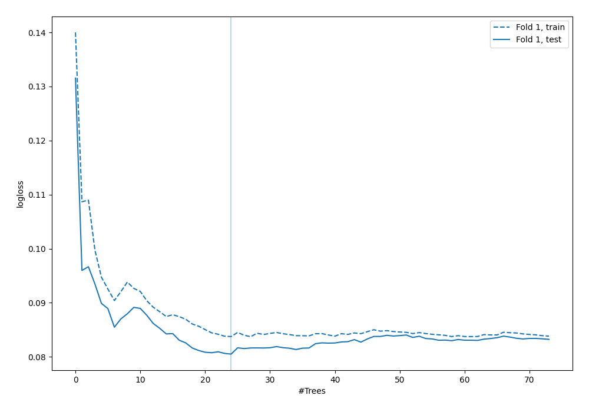
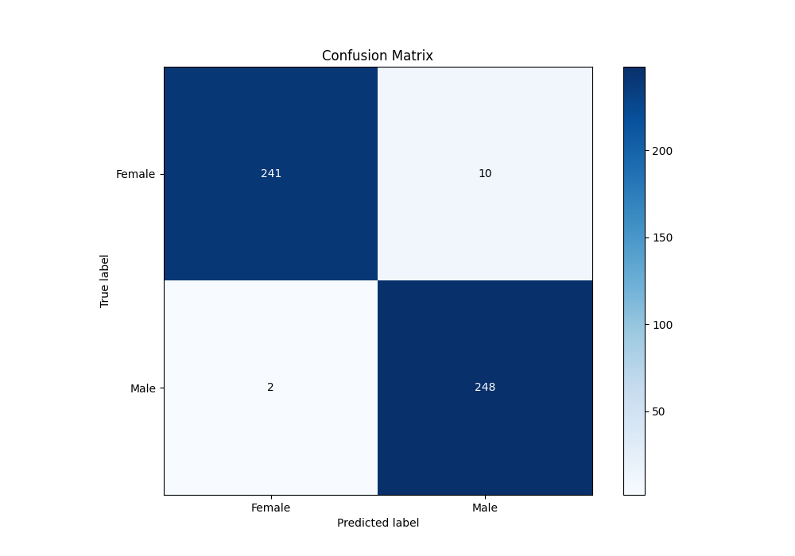
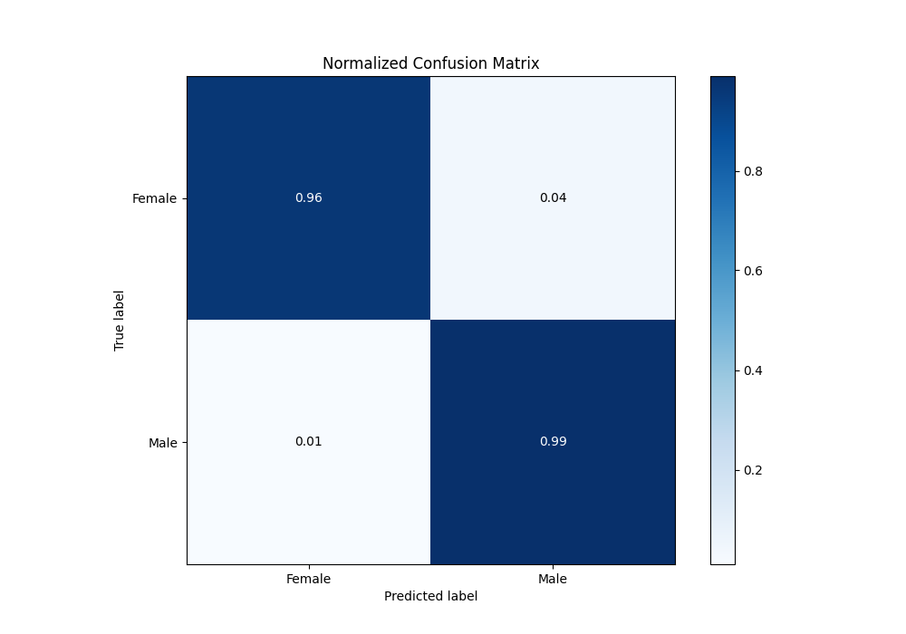
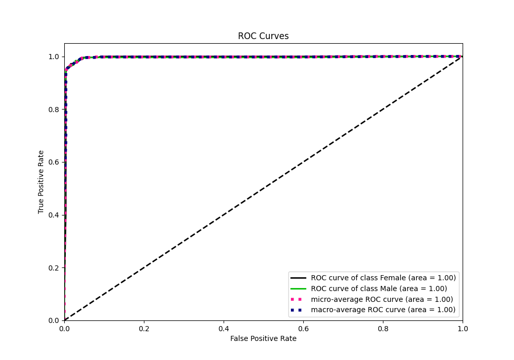
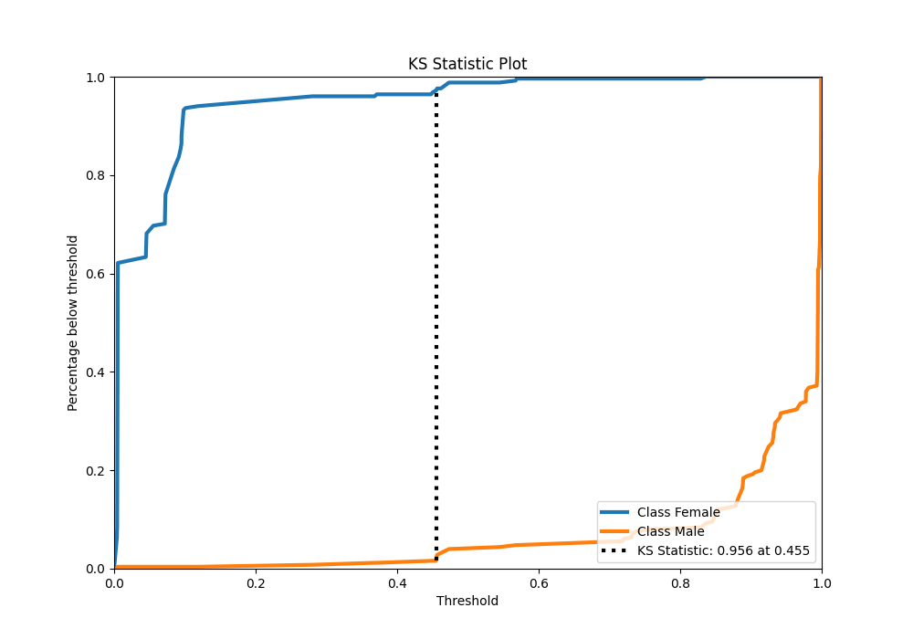
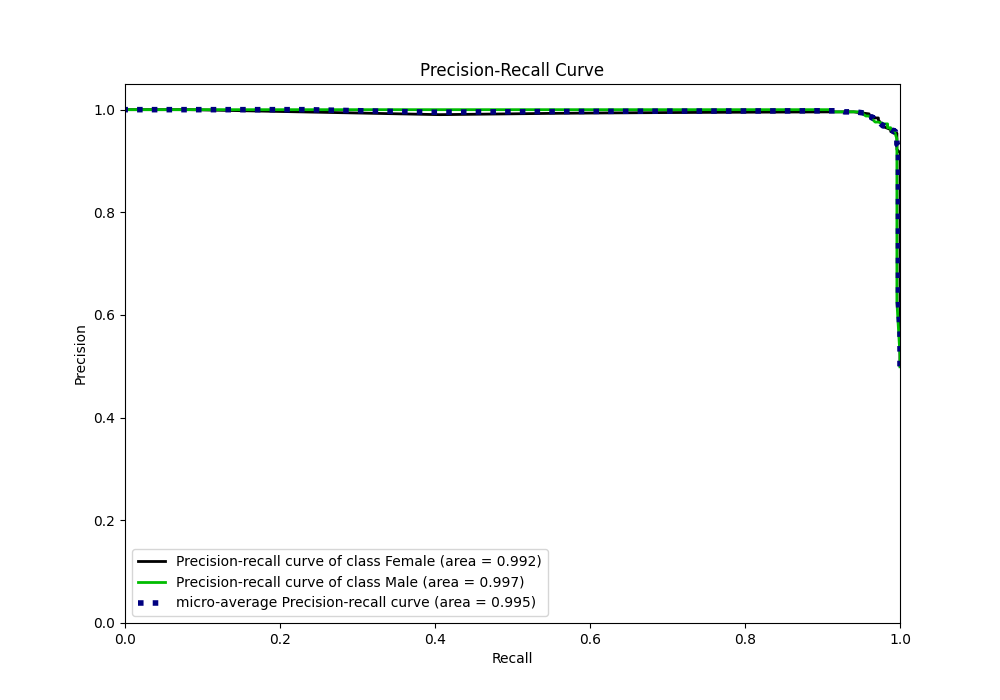
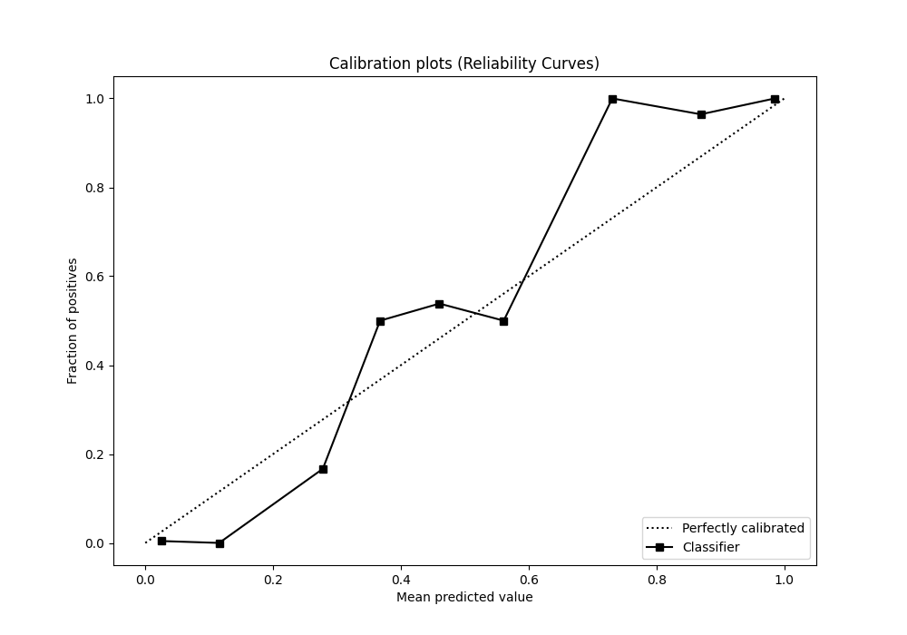
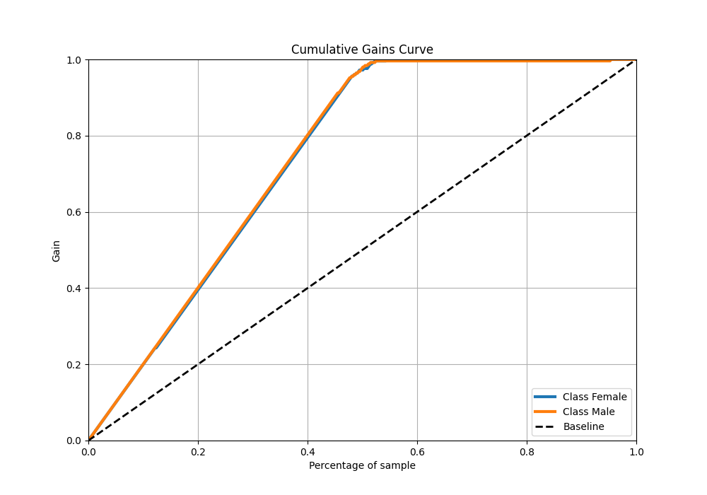
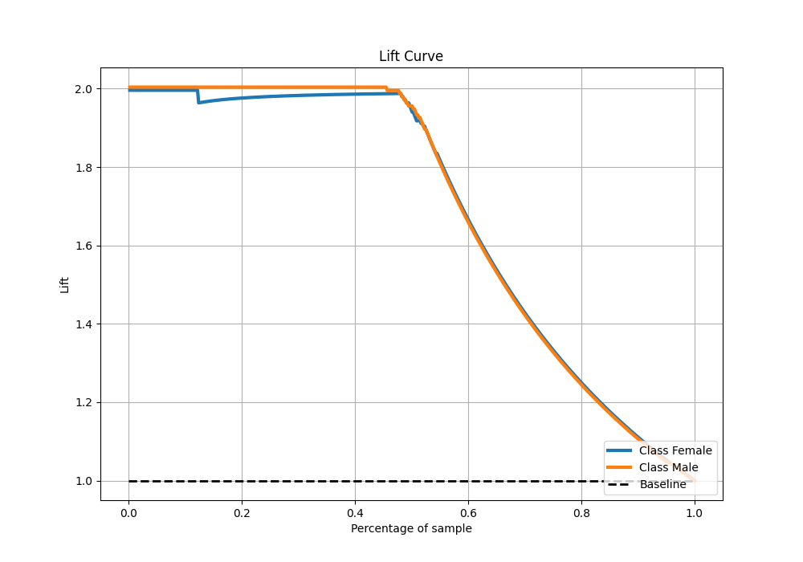

# Summary of 34_RandomForest

[<< Go back](../README.md)

## Random Forest
- **n_jobs**: -1
- **criterion**: gini
- **max_features**: 0.5
- **min_samples_split**: 20
- **max_depth**: 4
- **eval_metric_name**: logloss
- **explain_level**: 0

## Validation
 - **validation_type**: split
 - **train_ratio**: 0.9
 - **shuffle**: True
 - **stratify**: True

## Optimized metric
logloss

## Training time

2.6 seconds

## Metric details
|           |    score |    threshold |
|:----------|---------:|-------------:|
| logloss   | 0.080509 | nan          |
| auc       | 0.995673 | nan          |
| f1        | 0.976378 |   0.280354   |
| accuracy  | 0.976048 |   0.280354   |
| precision | 1        |   0.849862   |
| recall    | 1        |   0.00354599 |
| mcc       | 0.952585 |   0.280354   |

## Metric details with threshold from accuracy metric
|           |    score |   threshold |
|:----------|---------:|------------:|
| logloss   | 0.080509 |  nan        |
| auc       | 0.995673 |  nan        |
| f1        | 0.976378 |    0.280354 |
| accuracy  | 0.976048 |    0.280354 |
| precision | 0.96124  |    0.280354 |
| recall    | 0.992    |    0.280354 |
| mcc       | 0.952585 |    0.280354 |

## Confusion matrix (at threshold=0.280354)
|                   |   Predicted as Female |   Predicted as Male |
|:------------------|----------------------:|--------------------:|
| Labeled as Female |                   241 |                  10 |
| Labeled as Male   |                     2 |                 248 |

## Learning curves

## Confusion Matrix

## Normalized Confusion Matrix

## ROC Curve

## Kolmogorov-Smirnov Statistic

## Precision-Recall Curve

## Calibration Curve

## Cumulative Gains Curve

## Lift Curve

[<< Go back](../README.md)
