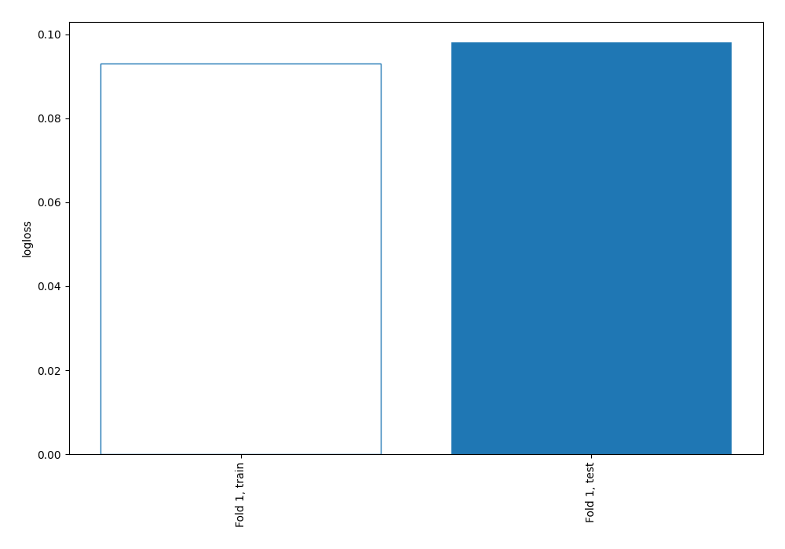
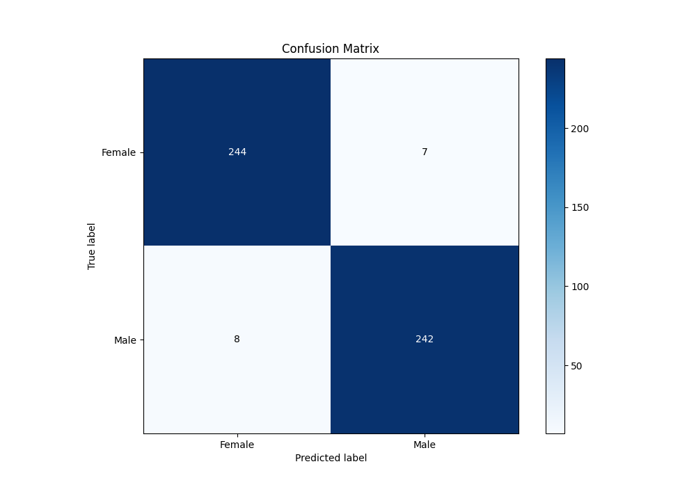
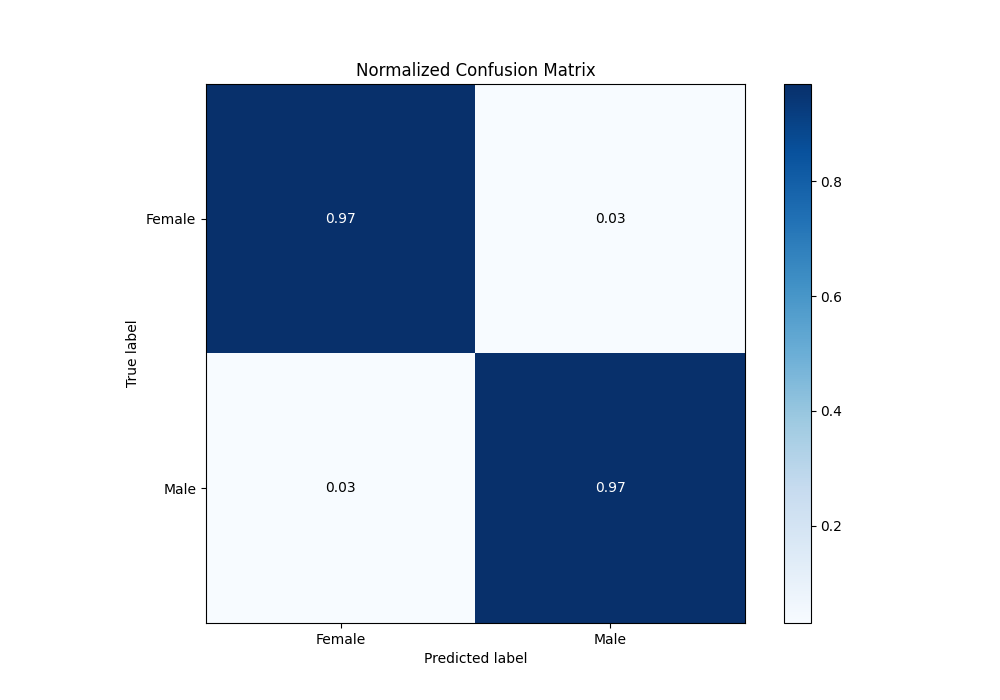
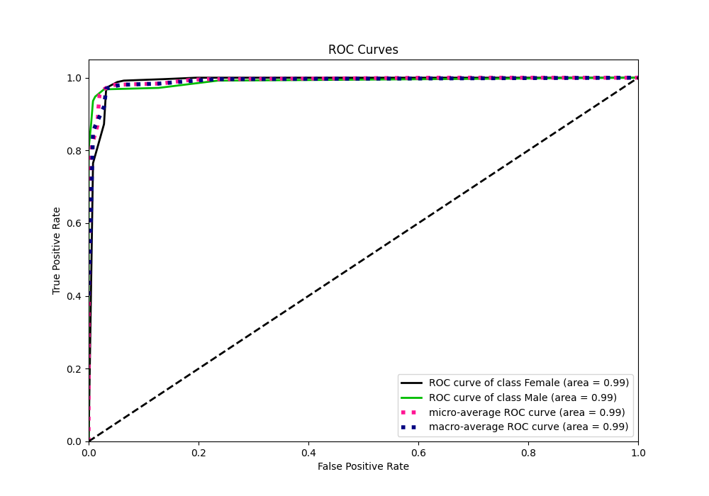
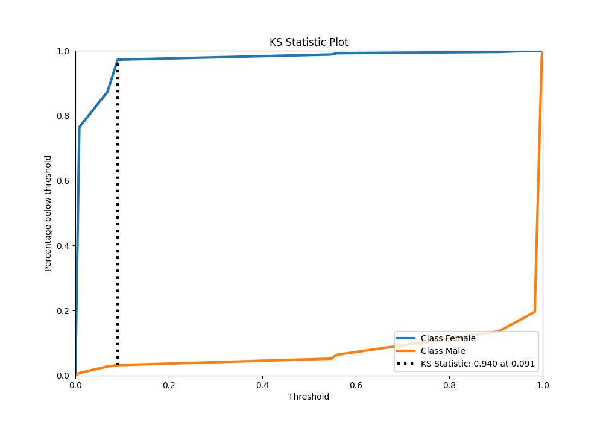
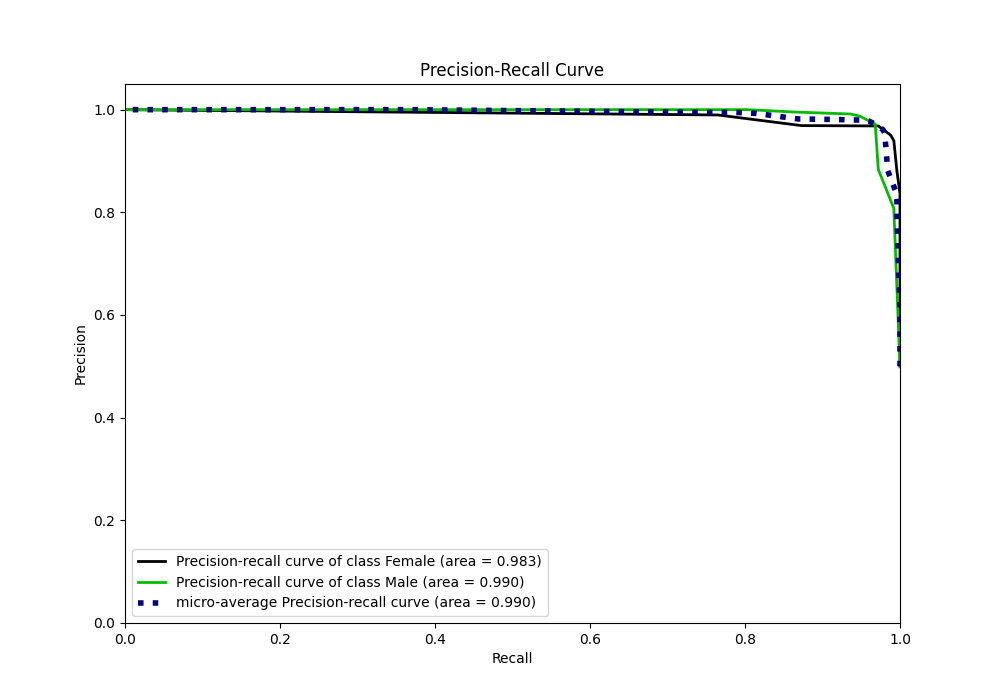
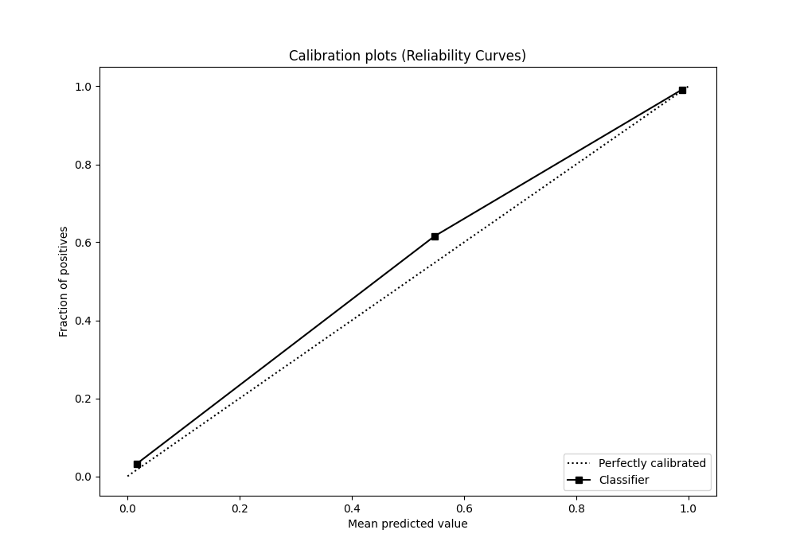
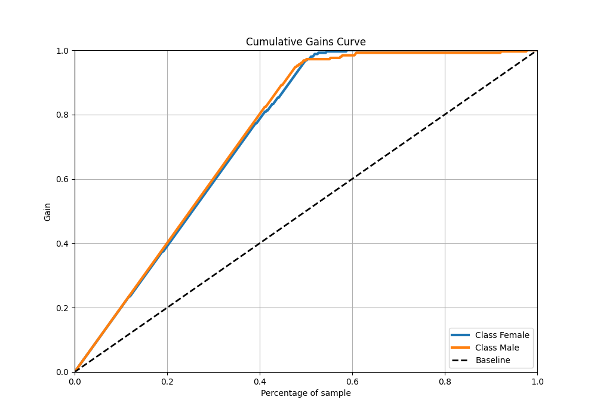
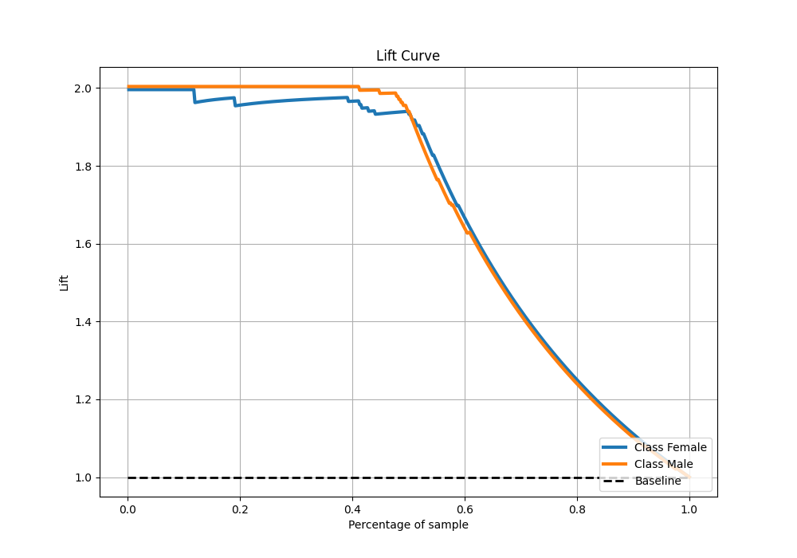

# Summary of 3_DecisionTree

[<< Go back](../README.md)

## Decision Tree
- **n_jobs**: -1
- **criterion**: gini
- **max_depth**: 4
- **explain_level**: 0

## Validation
 - **validation_type**: split
 - **train_ratio**: 0.9
 - **shuffle**: True
 - **stratify**: True

## Optimized metric
logloss

## Training time

1.7 seconds

## Metric details
|           |     score |    threshold |
|:----------|----------:|-------------:|
| logloss   | 0.0980341 | nan          |
| auc       | 0.990056  | nan          |
| f1        | 0.96994   |   0.0905172  |
| accuracy  | 0.97006   |   0.0905172  |
| precision | 1         |   0.983051   |
| recall    | 1         |   0.00764873 |
| mcc       | 0.940127  |   0.0905172  |

## Metric details with threshold from accuracy metric
|           |     score |   threshold |
|:----------|----------:|------------:|
| logloss   | 0.0980341 | nan         |
| auc       | 0.990056  | nan         |
| f1        | 0.96994   |   0.0905172 |
| accuracy  | 0.97006   |   0.0905172 |
| precision | 0.971888  |   0.0905172 |
| recall    | 0.968     |   0.0905172 |
| mcc       | 0.940127  |   0.0905172 |

## Confusion matrix (at threshold=0.090517)
|                   |   Predicted as Female |   Predicted as Male |
|:------------------|----------------------:|--------------------:|
| Labeled as Female |                   244 |                   7 |
| Labeled as Male   |                     8 |                 242 |

## Learning curves

## Confusion Matrix

## Normalized Confusion Matrix

## ROC Curve

## Kolmogorov-Smirnov Statistic

## Precision-Recall Curve

## Calibration Curve

## Cumulative Gains Curve

## Lift Curve

[<< Go back](../README.md)
