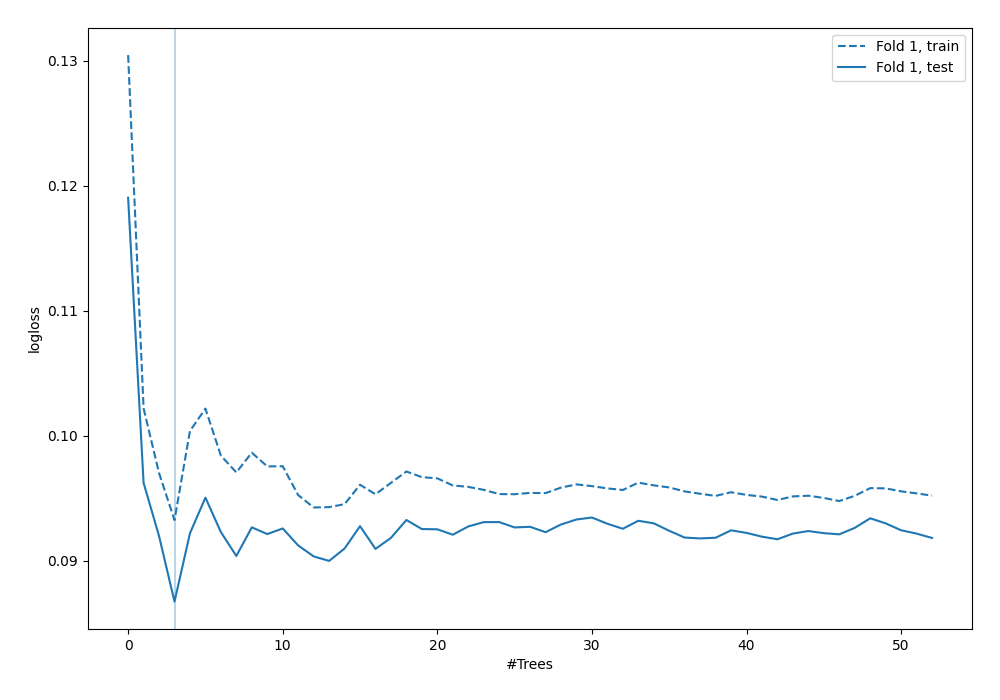
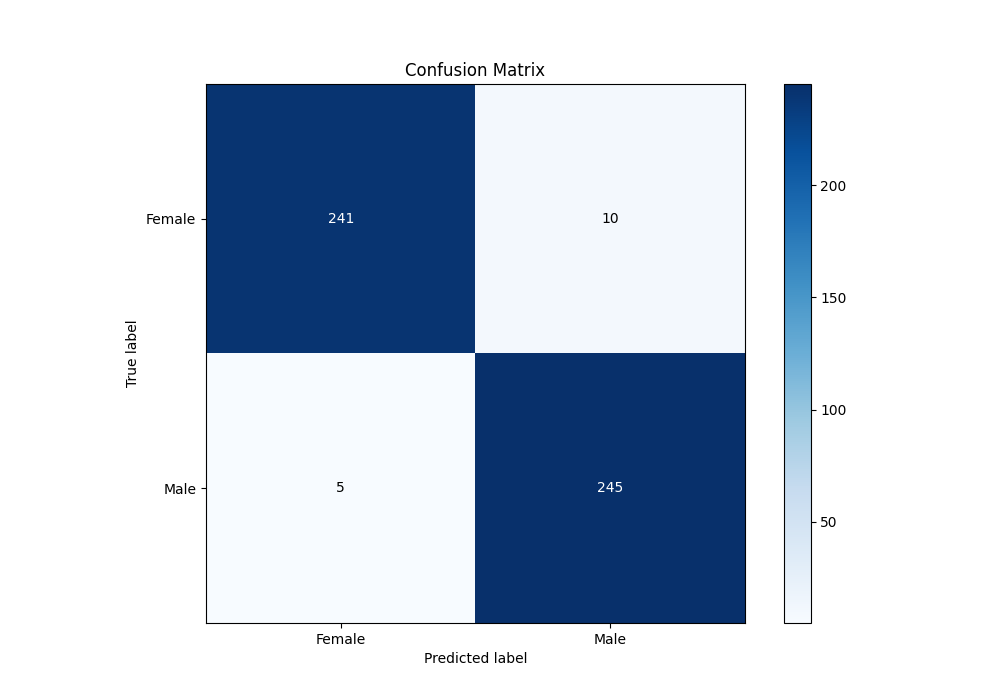
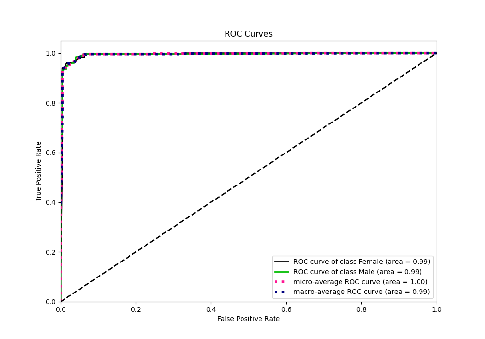
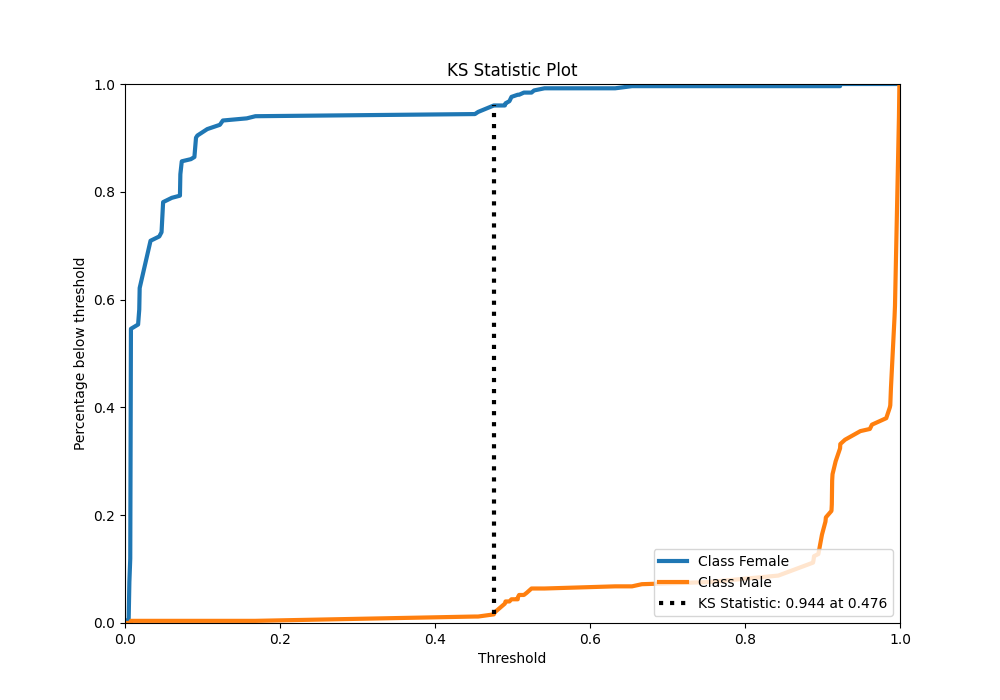
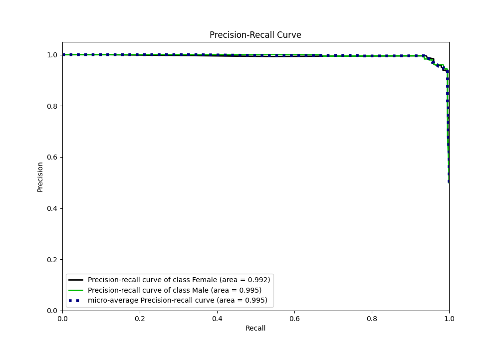
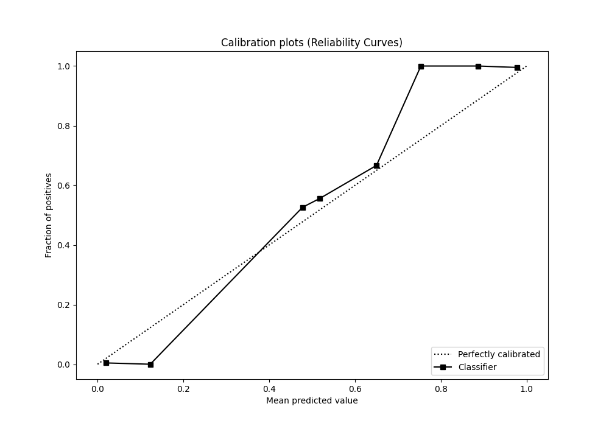
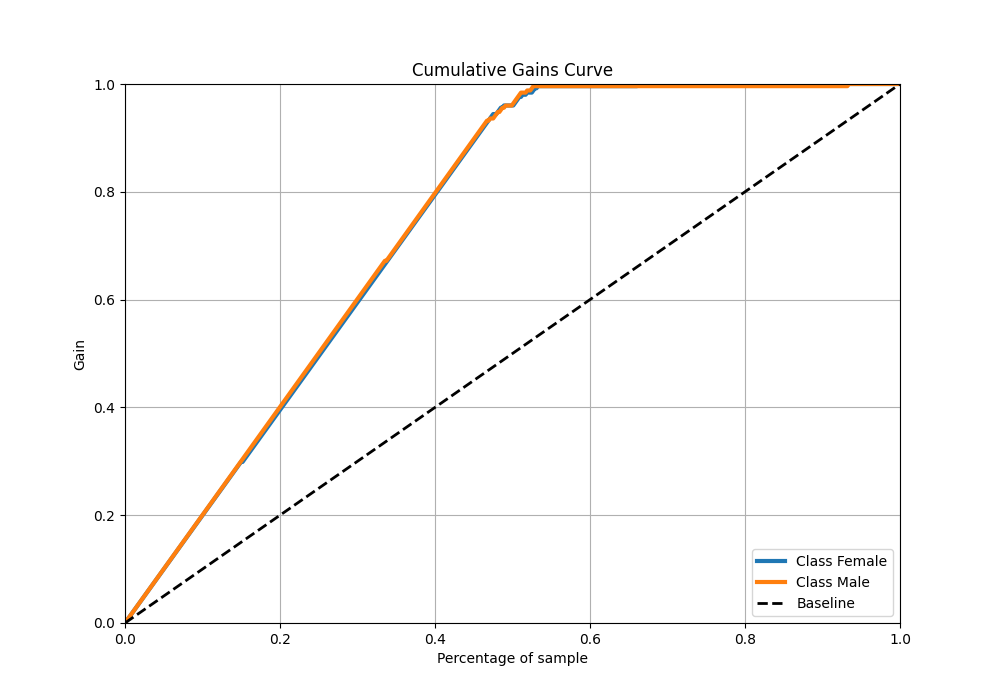
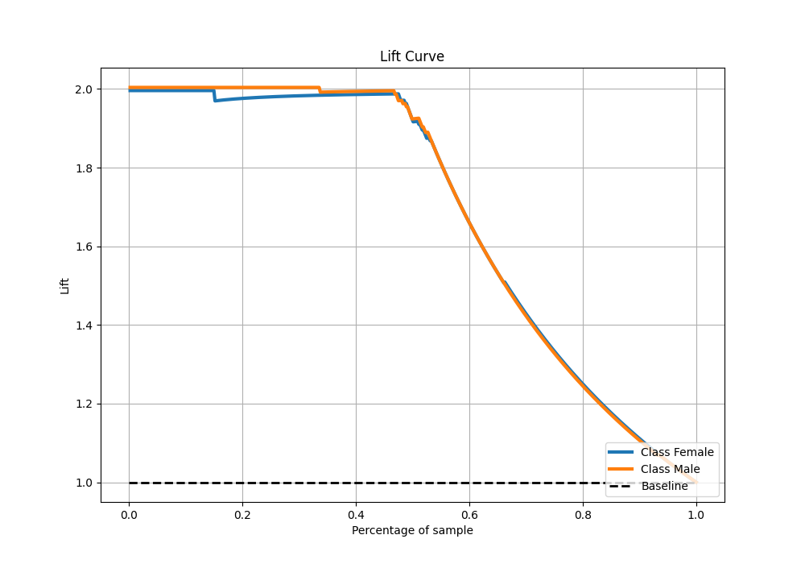

# Summary of 43_ExtraTrees

[<< Go back](../README.md)

## Extra Trees Classifier (Extra Trees)
- **n_jobs**: -1
- **criterion**: gini
- **max_features**: 0.5
- **min_samples_split**: 20
- **max_depth**: 4
- **eval_metric_name**: logloss
- **explain_level**: 0

## Validation
 - **validation_type**: split
 - **train_ratio**: 0.9
 - **shuffle**: True
 - **stratify**: True

## Optimized metric
logloss

## Training time

2.4 seconds

## Metric details
|           |     score |   threshold |
|:----------|----------:|------------:|
| logloss   | 0.0867141 | nan         |
| auc       | 0.994207  | nan         |
| f1        | 0.970297  |   0.478829  |
| accuracy  | 0.97006   |   0.478829  |
| precision | 1         |   0.938946  |
| recall    | 1         |   0.0042685 |
| mcc       | 0.940309  |   0.478829  |

## Metric details with threshold from accuracy metric
|           |     score |   threshold |
|:----------|----------:|------------:|
| logloss   | 0.0867141 |  nan        |
| auc       | 0.994207  |  nan        |
| f1        | 0.970297  |    0.478829 |
| accuracy  | 0.97006   |    0.478829 |
| precision | 0.960784  |    0.478829 |
| recall    | 0.98      |    0.478829 |
| mcc       | 0.940309  |    0.478829 |

## Confusion matrix (at threshold=0.478829)
|                   |   Predicted as Female |   Predicted as Male |
|:------------------|----------------------:|--------------------:|
| Labeled as Female |                   241 |                  10 |
| Labeled as Male   |                     5 |                 245 |

## Learning curves

## Confusion Matrix

## Normalized Confusion Matrix

## ROC Curve

## Kolmogorov-Smirnov Statistic

## Precision-Recall Curve

## Calibration Curve

## Cumulative Gains Curve

## Lift Curve

[<< Go back](../README.md)
