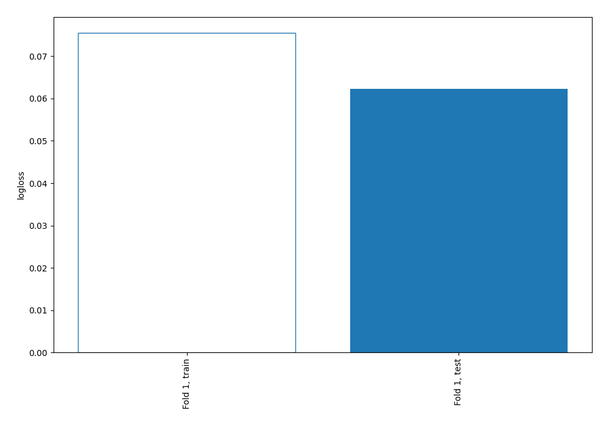
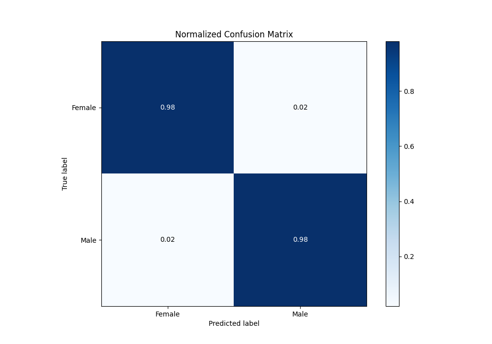
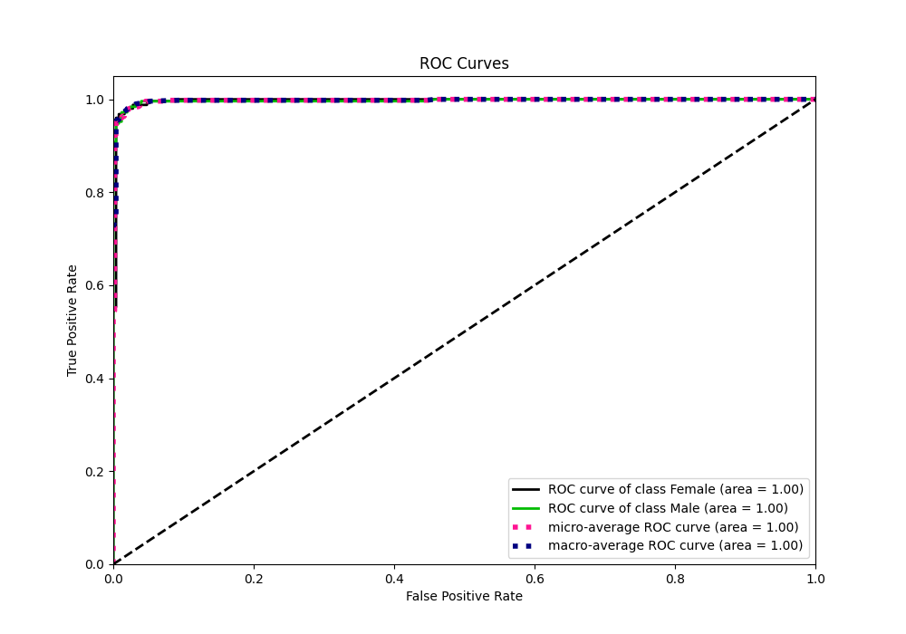
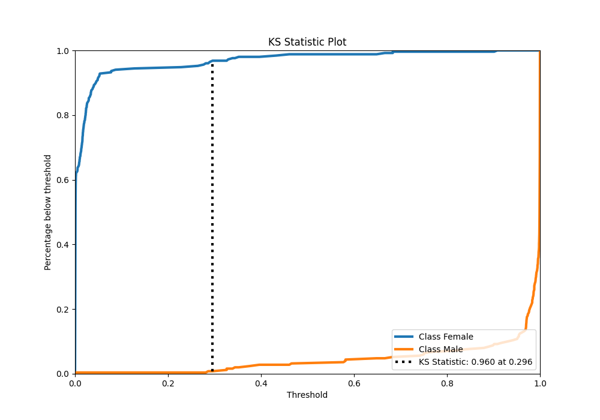
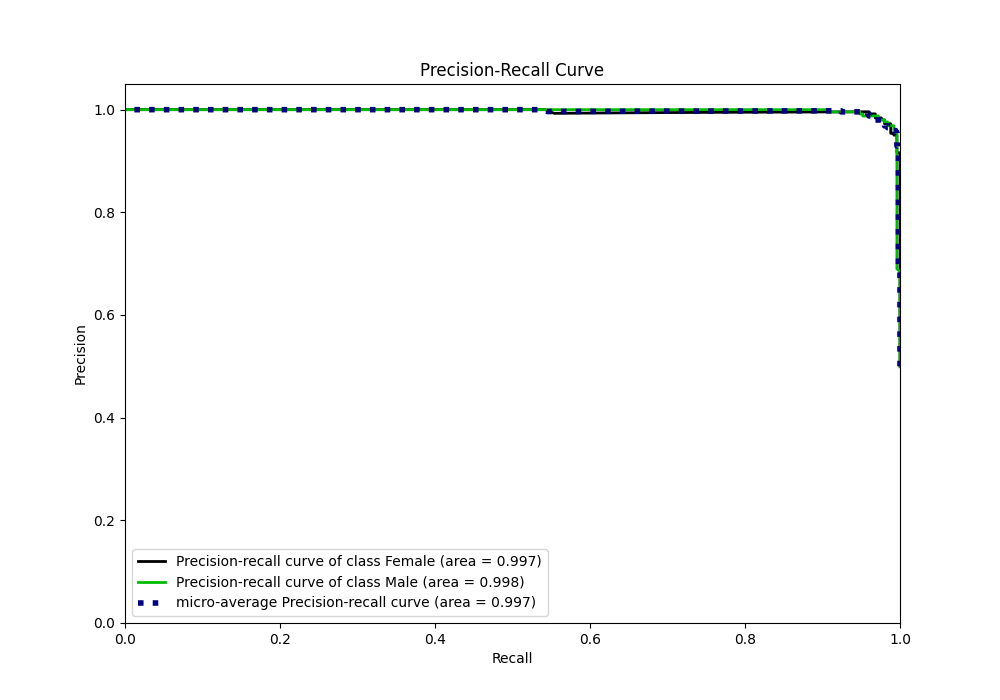
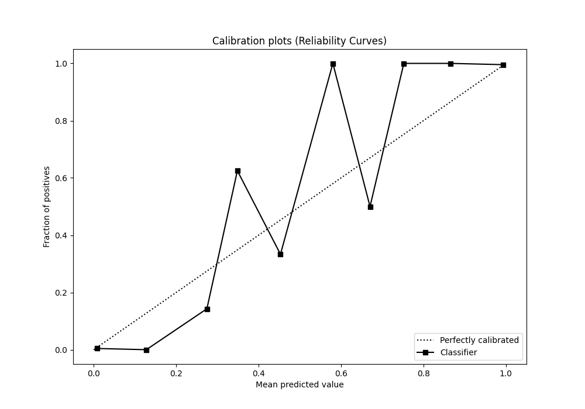
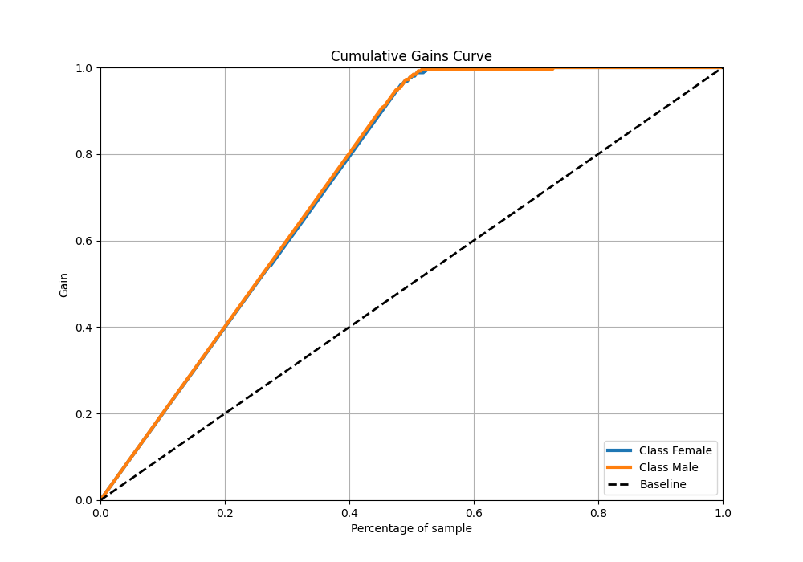
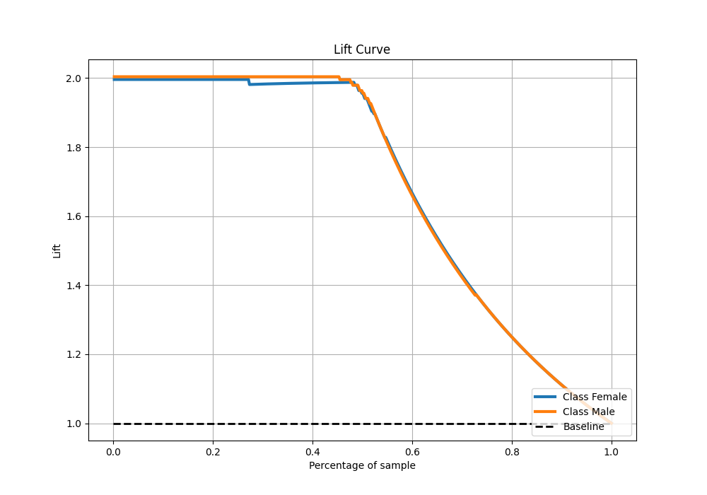

# Summary of 4_Linear

[<< Go back](../README.md)

## Logistic Regression (Linear)
- **n_jobs**: -1
- **explain_level**: 0

## Validation
 - **validation_type**: split
 - **train_ratio**: 0.9
 - **shuffle**: True
 - **stratify**: True

## Optimized metric
logloss

## Training time

4.3 seconds

## Metric details
|           |     score |     threshold |
|:----------|----------:|--------------:|
| logloss   | 0.0622806 | nan           |
| auc       | 0.997092  | nan           |
| f1        | 0.98      |   0.363956    |
| accuracy  | 0.98004   |   0.363956    |
| precision | 1         |   0.936192    |
| recall    | 1         |   0.000105837 |
| mcc       | 0.96008   |   0.363956    |

## Metric details with threshold from accuracy metric
|           |     score |   threshold |
|:----------|----------:|------------:|
| logloss   | 0.0622806 |  nan        |
| auc       | 0.997092  |  nan        |
| f1        | 0.98      |    0.363956 |
| accuracy  | 0.98004   |    0.363956 |
| precision | 0.98      |    0.363956 |
| recall    | 0.98      |    0.363956 |
| mcc       | 0.96008   |    0.363956 |

## Confusion matrix (at threshold=0.363956)
|                   |   Predicted as Female |   Predicted as Male |
|:------------------|----------------------:|--------------------:|
| Labeled as Female |                   246 |                   5 |
| Labeled as Male   |                     5 |                 245 |

## Learning curves

## Confusion Matrix

## Normalized Confusion Matrix

## ROC Curve

## Kolmogorov-Smirnov Statistic

## Precision-Recall Curve

## Calibration Curve

## Cumulative Gains Curve

## Lift Curve

[<< Go back](../README.md)
