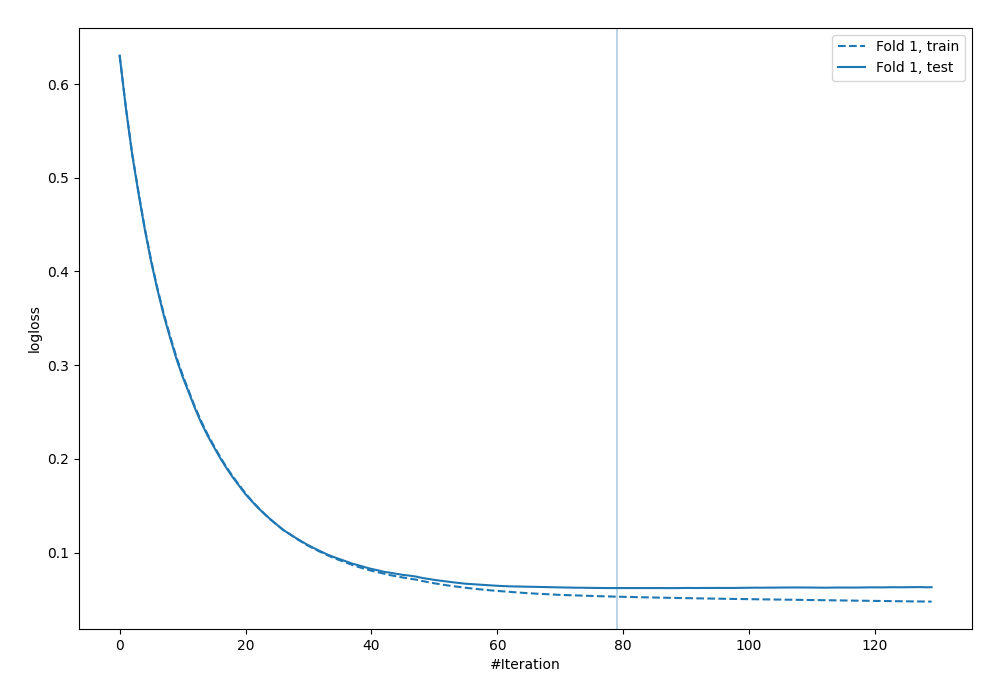
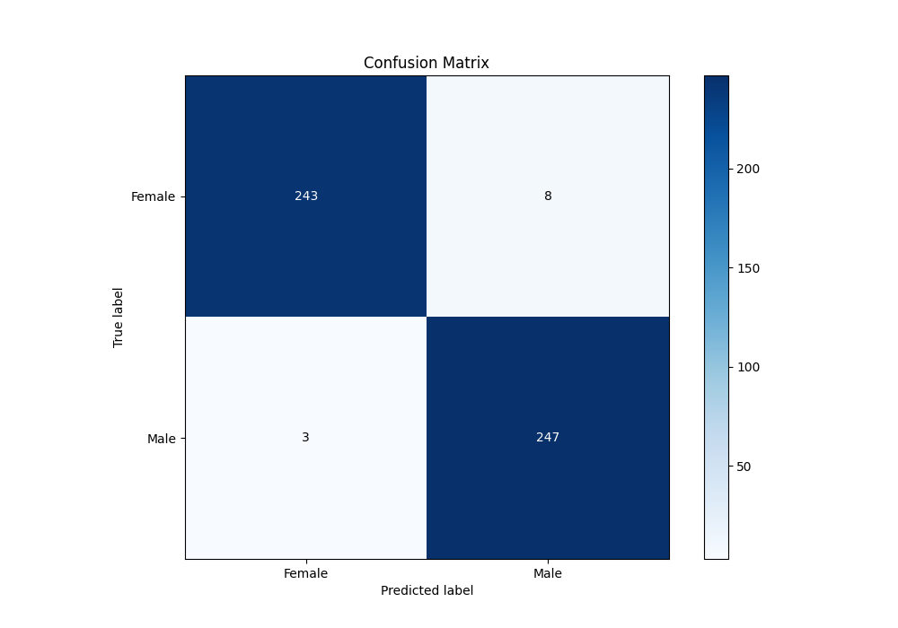
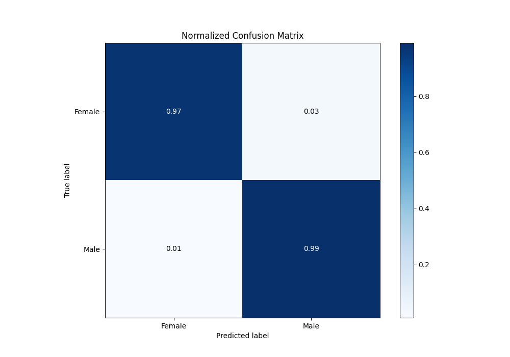
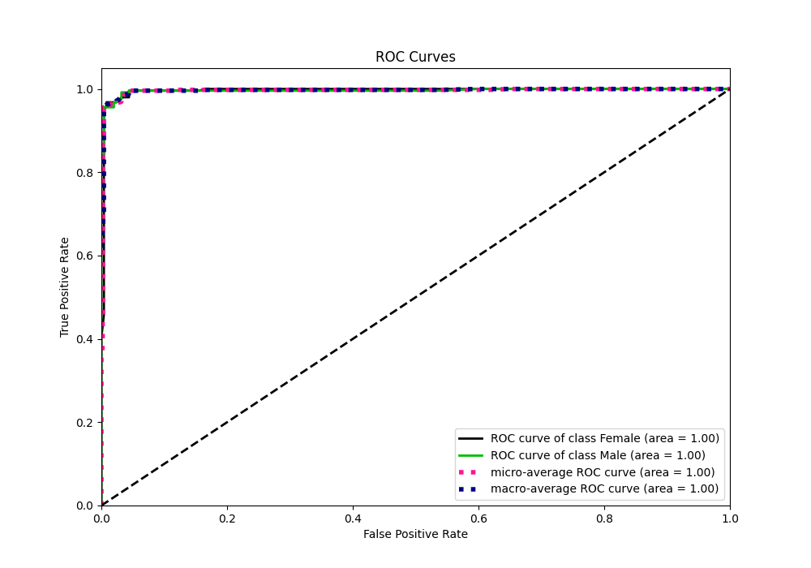
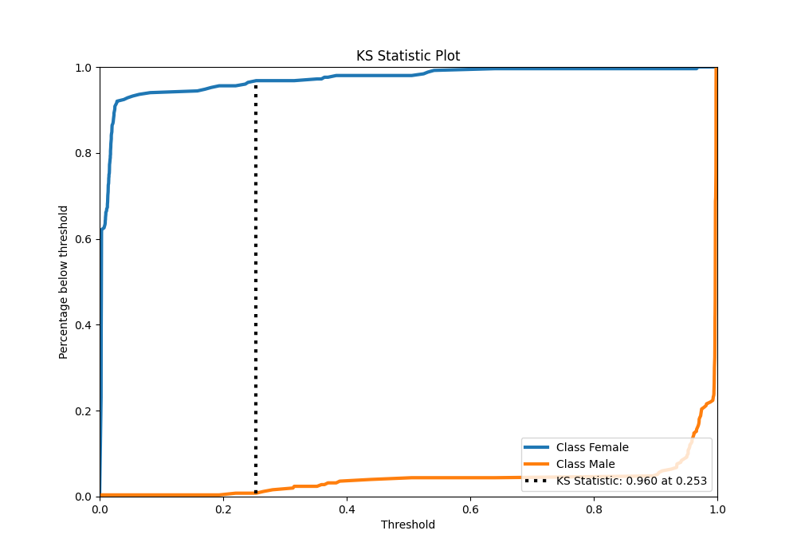
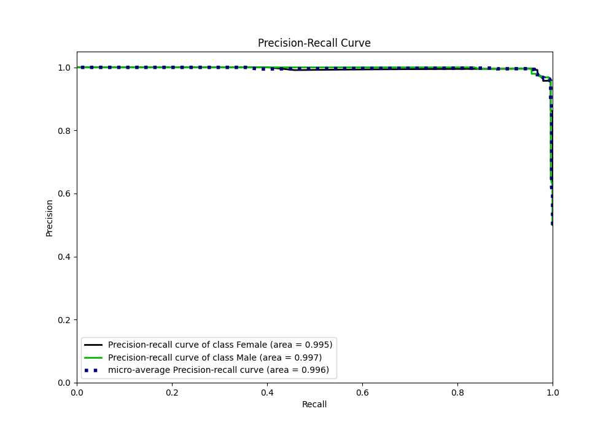
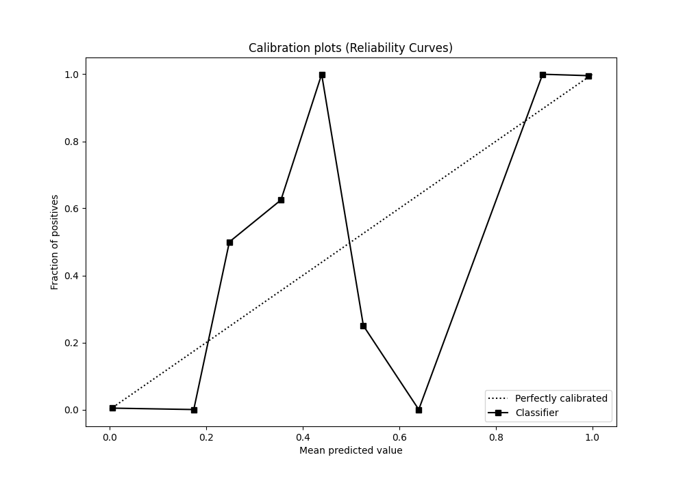
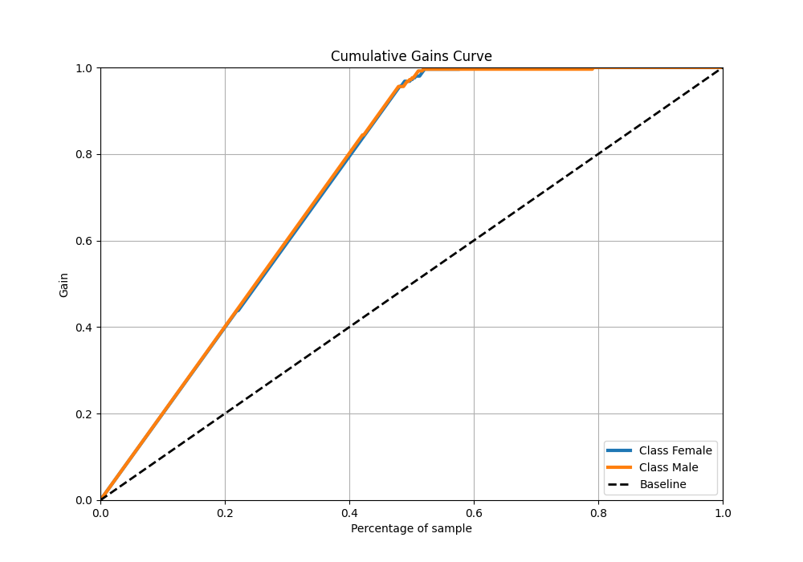
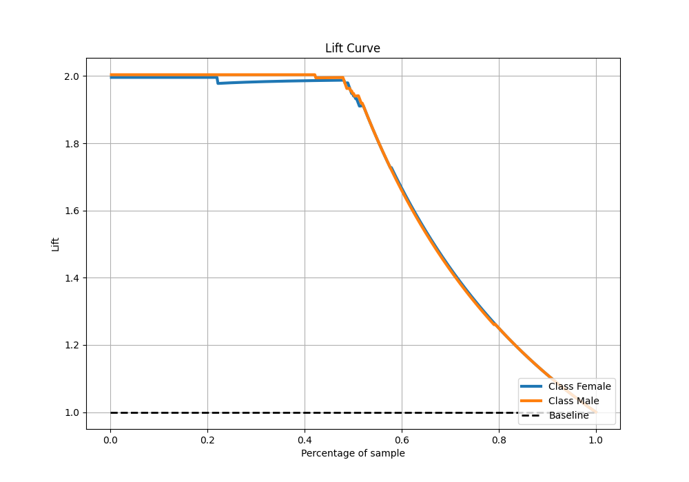

# Summary of 53_Xgboost

[<< Go back](../README.md)

## Extreme Gradient Boosting (Xgboost)
- **n_jobs**: -1
- **objective**: binary:logistic
- **eta**: 0.075
- **max_depth**: 8
- **min_child_weight**: 5
- **subsample**: 1.0
- **colsample_bytree**: 0.9
- **eval_metric**: logloss
- **explain_level**: 0

## Validation
 - **validation_type**: split
 - **train_ratio**: 0.9
 - **shuffle**: True
 - **stratify**: True

## Optimized metric
logloss

## Training time

1.9 seconds

## Metric details
|           |     score |   threshold |
|:----------|----------:|------------:|
| logloss   | 0.0620971 | nan         |
| auc       | 0.996127  | nan         |
| f1        | 0.978218  |   0.27259   |
| accuracy  | 0.978044  |   0.27259   |
| precision | 1         |   0.968817  |
| recall    | 1         |   0.0020932 |
| mcc       | 0.95628   |   0.27259   |

## Metric details with threshold from accuracy metric
|           |     score |   threshold |
|:----------|----------:|------------:|
| logloss   | 0.0620971 |   nan       |
| auc       | 0.996127  |   nan       |
| f1        | 0.978218  |     0.27259 |
| accuracy  | 0.978044  |     0.27259 |
| precision | 0.968627  |     0.27259 |
| recall    | 0.988     |     0.27259 |
| mcc       | 0.95628   |     0.27259 |

## Confusion matrix (at threshold=0.27259)
|                   |   Predicted as Female |   Predicted as Male |
|:------------------|----------------------:|--------------------:|
| Labeled as Female |                   243 |                   8 |
| Labeled as Male   |                     3 |                 247 |

## Learning curves

## Confusion Matrix

## Normalized Confusion Matrix

## ROC Curve

## Kolmogorov-Smirnov Statistic

## Precision-Recall Curve

## Calibration Curve

## Cumulative Gains Curve

## Lift Curve

[<< Go back](../README.md)
