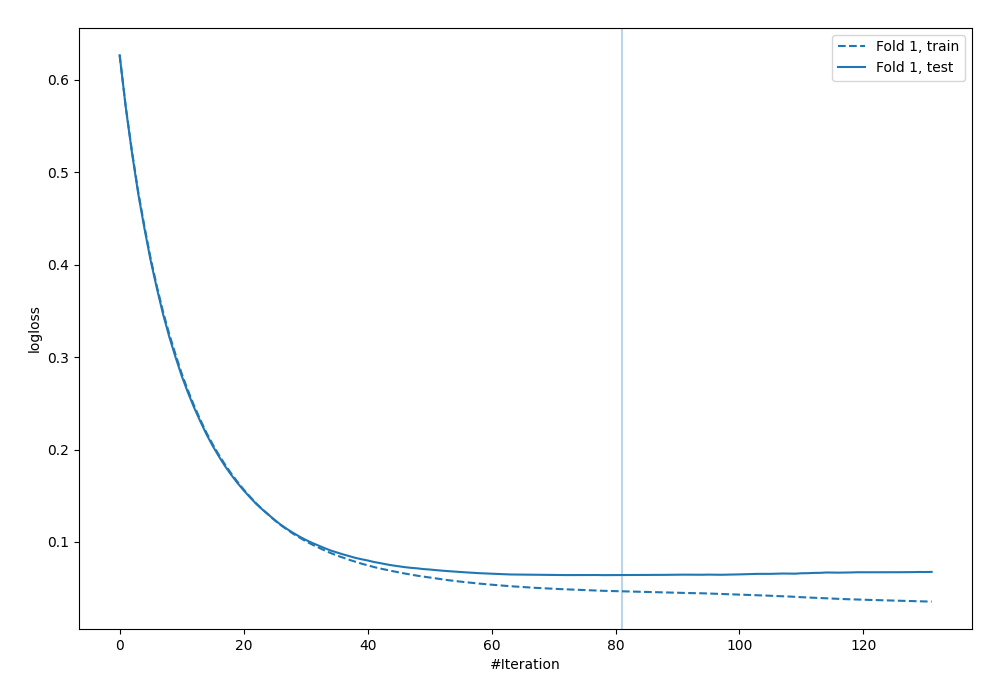
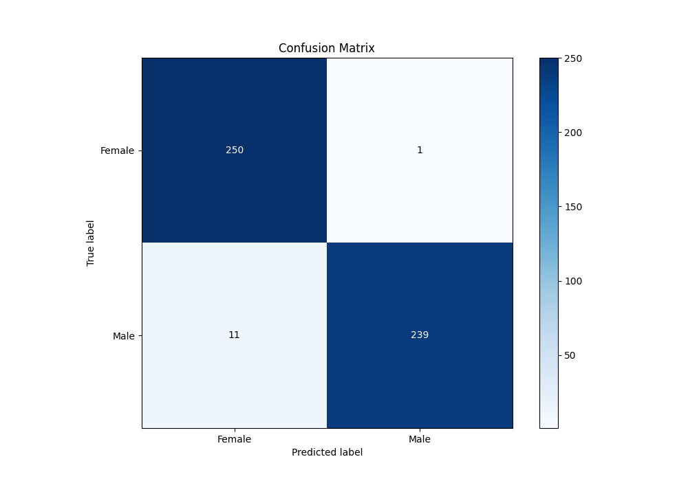
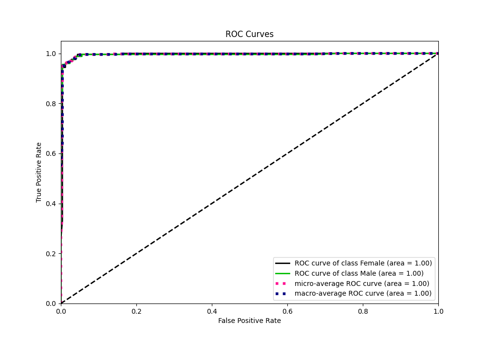
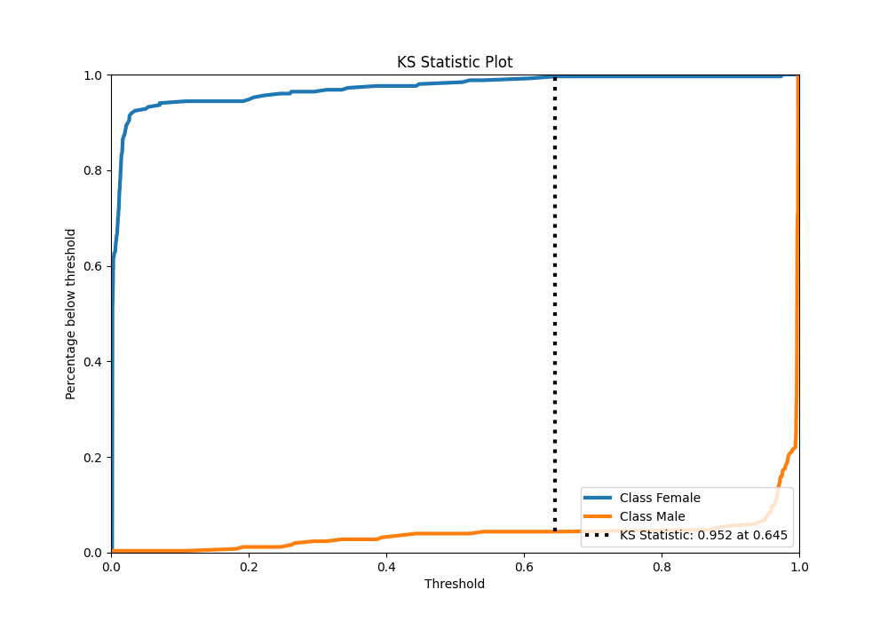
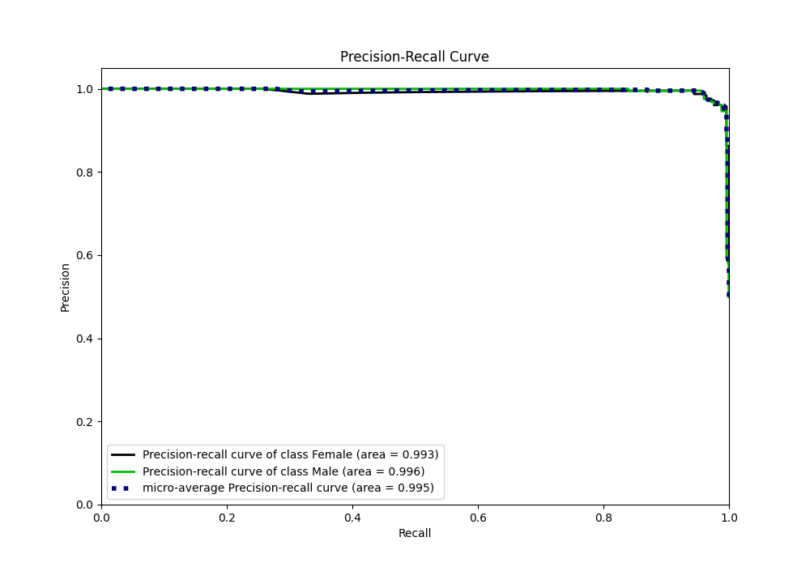
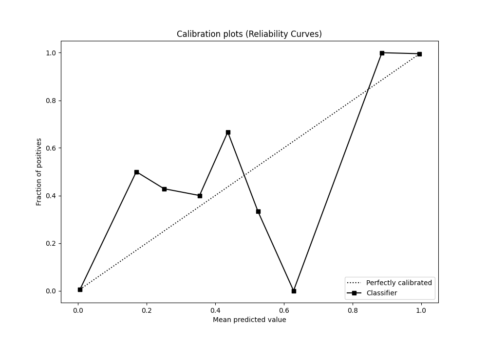
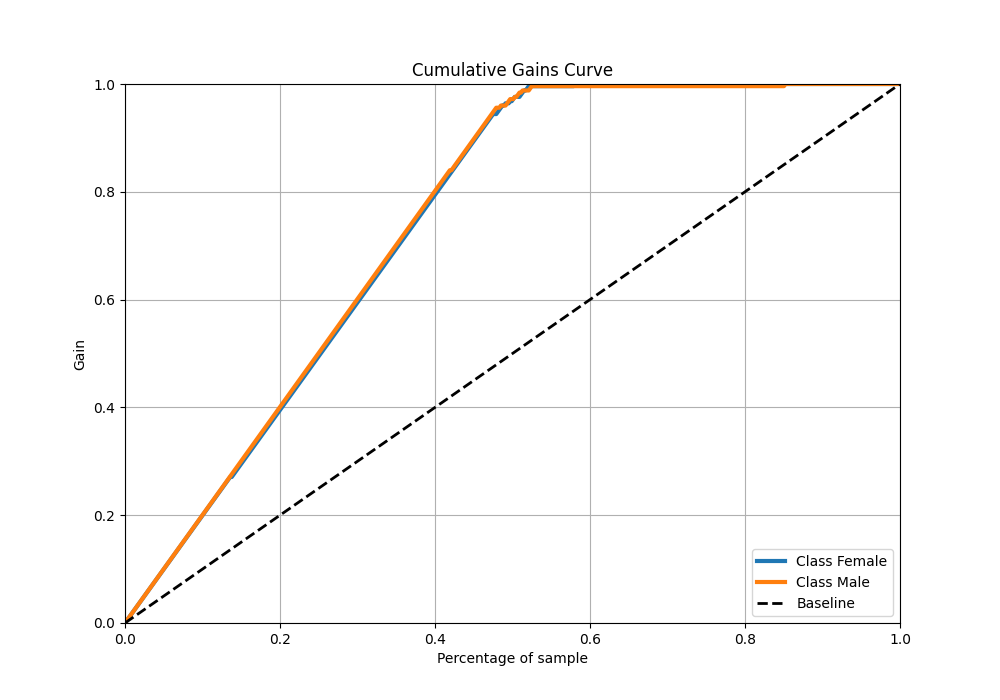
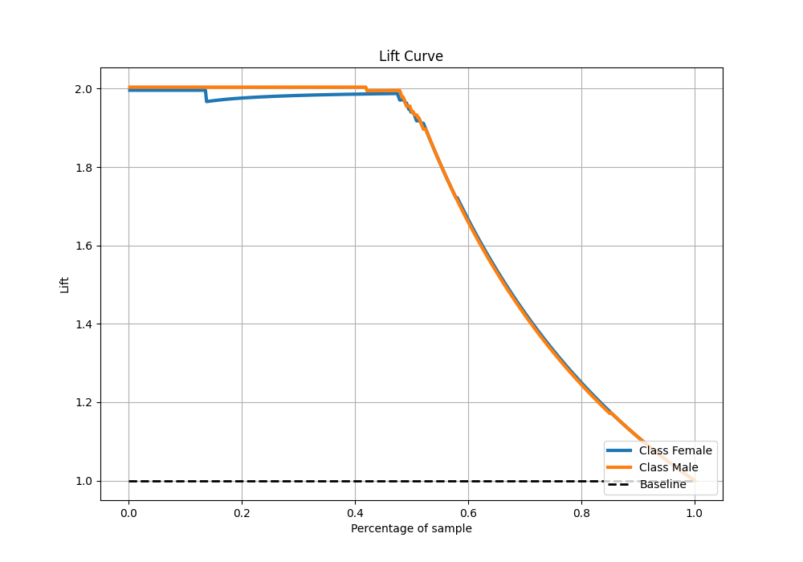

# Summary of 54_Xgboost

[<< Go back](../README.md)

## Extreme Gradient Boosting (Xgboost)
- **n_jobs**: -1
- **objective**: binary:logistic
- **eta**: 0.075
- **max_depth**: 6
- **min_child_weight**: 1
- **subsample**: 1.0
- **colsample_bytree**: 0.9
- **eval_metric**: logloss
- **explain_level**: 0

## Validation
 - **validation_type**: split
 - **train_ratio**: 0.9
 - **shuffle**: True
 - **stratify**: True

## Optimized metric
logloss

## Training time

2.0 seconds

## Metric details
|           |    score |    threshold |
|:----------|---------:|-------------:|
| logloss   | 0.064017 | nan          |
| auc       | 0.995363 | nan          |
| f1        | 0.97551  |   0.759623   |
| accuracy  | 0.976048 |   0.759623   |
| precision | 1        |   0.975163   |
| recall    | 1        |   0.00150861 |
| mcc       | 0.952851 |   0.759623   |

## Metric details with threshold from accuracy metric
|           |    score |   threshold |
|:----------|---------:|------------:|
| logloss   | 0.064017 |  nan        |
| auc       | 0.995363 |  nan        |
| f1        | 0.97551  |    0.759623 |
| accuracy  | 0.976048 |    0.759623 |
| precision | 0.995833 |    0.759623 |
| recall    | 0.956    |    0.759623 |
| mcc       | 0.952851 |    0.759623 |

## Confusion matrix (at threshold=0.759623)
|                   |   Predicted as Female |   Predicted as Male |
|:------------------|----------------------:|--------------------:|
| Labeled as Female |                   250 |                   1 |
| Labeled as Male   |                    11 |                 239 |

## Learning curves

## Confusion Matrix

## Normalized Confusion Matrix

## ROC Curve

## Kolmogorov-Smirnov Statistic

## Precision-Recall Curve

## Calibration Curve

## Cumulative Gains Curve

## Lift Curve

[<< Go back](../README.md)
