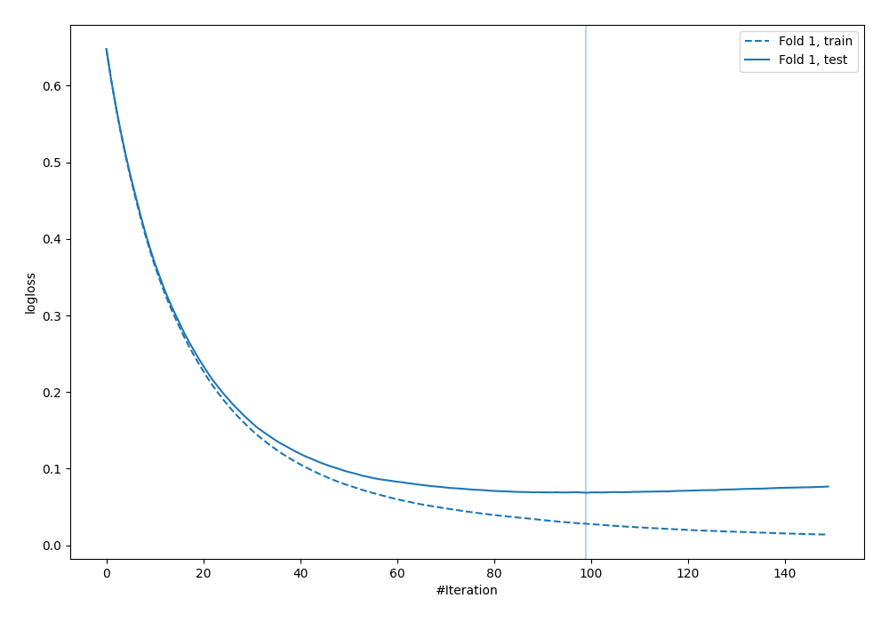
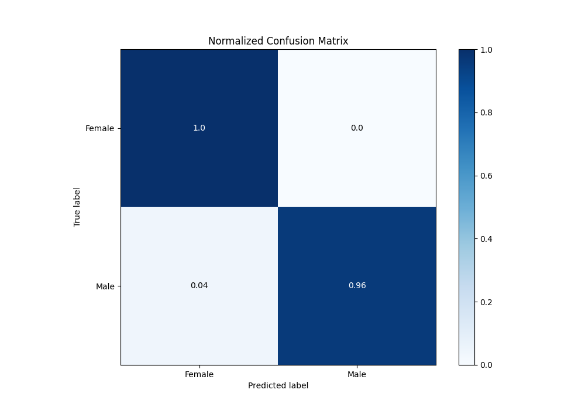
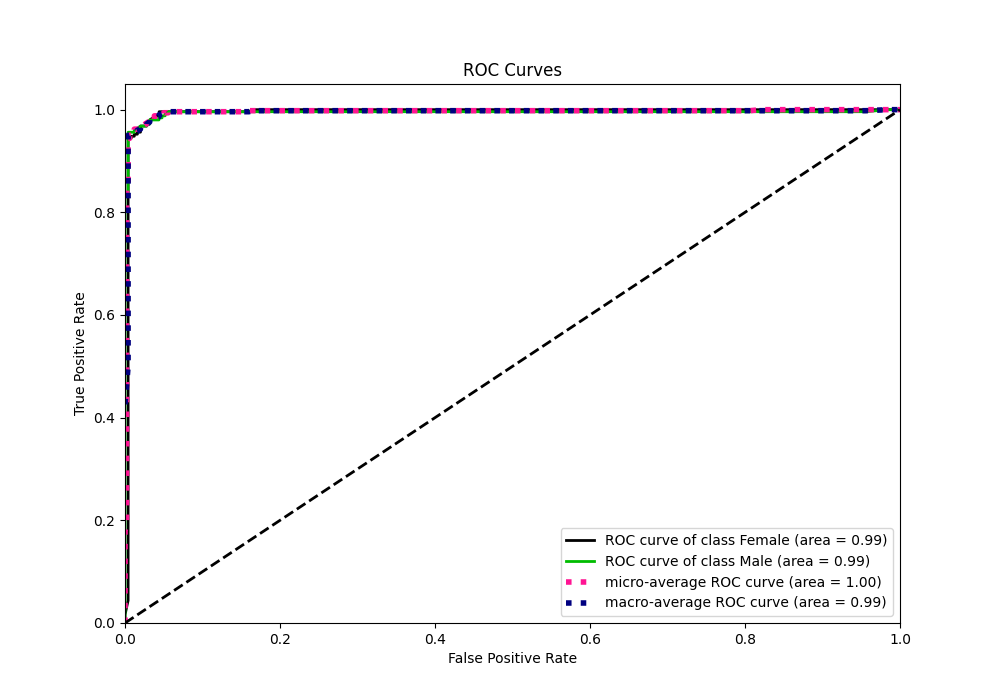
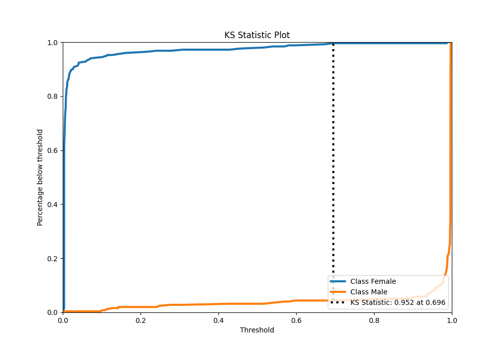
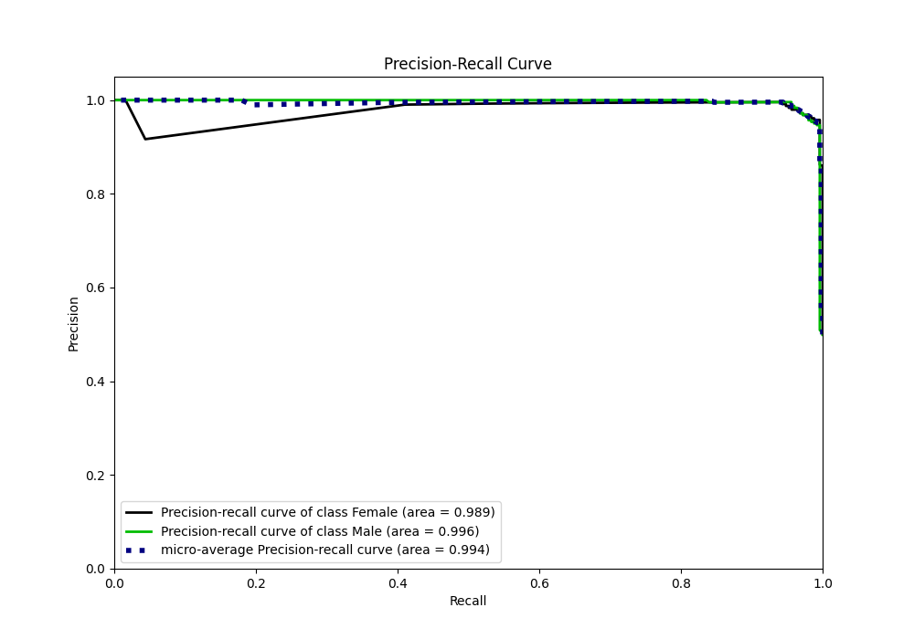
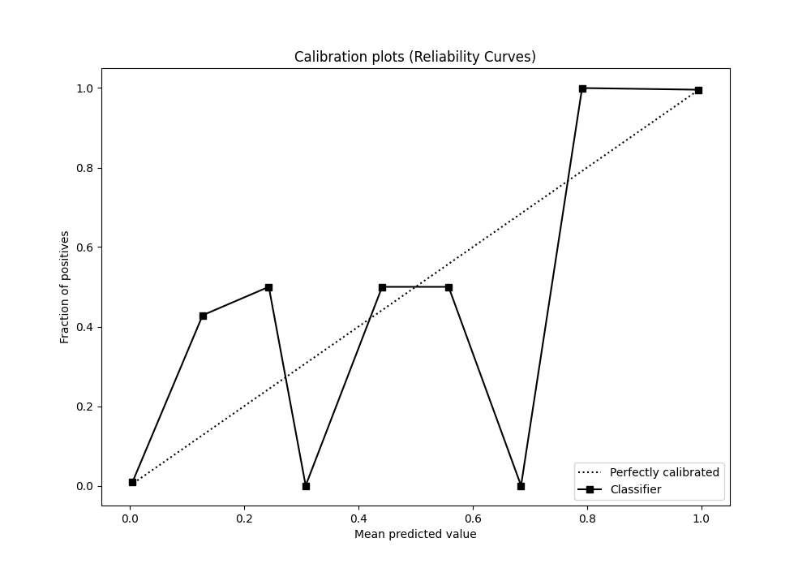
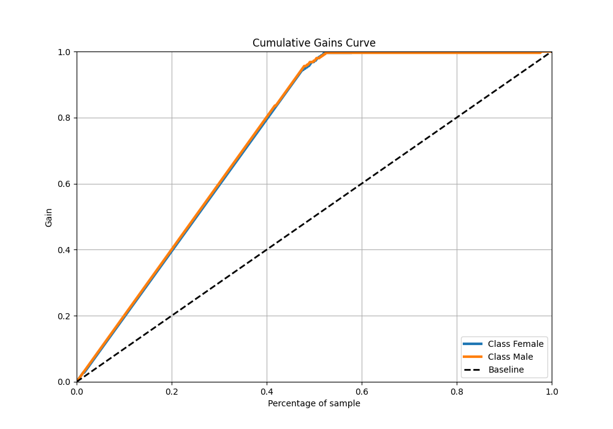
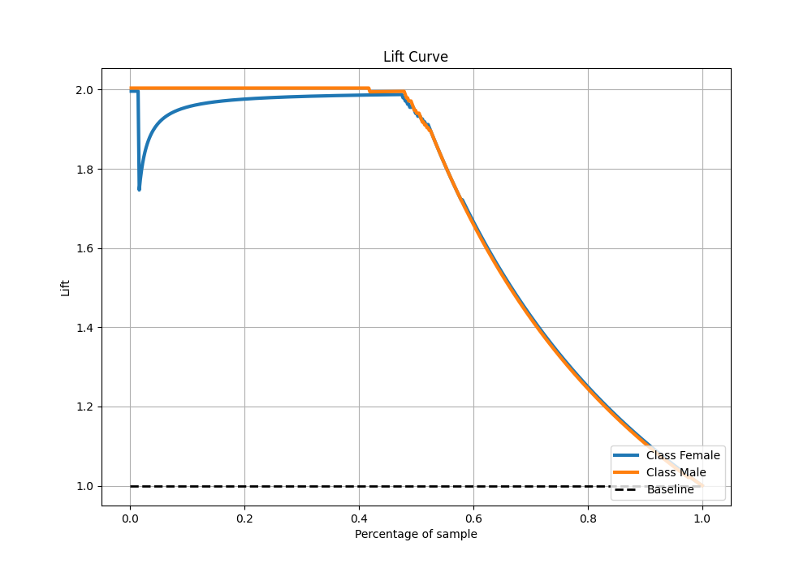

# Summary of 5_Default_LightGBM

[<< Go back](../README.md)

## LightGBM
- **n_jobs**: -1
- **objective**: binary
- **num_leaves**: 63
- **learning_rate**: 0.05
- **feature_fraction**: 0.9
- **bagging_fraction**: 0.9
- **min_data_in_leaf**: 10
- **metric**: binary_logloss
- **custom_eval_metric_name**: None
- **explain_level**: 0

## Validation
 - **validation_type**: split
 - **train_ratio**: 0.9
 - **shuffle**: True
 - **stratify**: True

## Optimized metric
logloss

## Training time

2.0 seconds

## Metric details
|           |     score |   threshold |
|:----------|----------:|------------:|
| logloss   | 0.0686381 | nan         |
| auc       | 0.994303  | nan         |
| f1        | 0.97551   |   0.742941  |
| accuracy  | 0.976048  |   0.742941  |
| precision | 1         |   0.987025  |
| recall    | 1         |   0.0031156 |
| mcc       | 0.952851  |   0.742941  |

## Metric details with threshold from accuracy metric
|           |     score |   threshold |
|:----------|----------:|------------:|
| logloss   | 0.0686381 |  nan        |
| auc       | 0.994303  |  nan        |
| f1        | 0.97551   |    0.742941 |
| accuracy  | 0.976048  |    0.742941 |
| precision | 0.995833  |    0.742941 |
| recall    | 0.956     |    0.742941 |
| mcc       | 0.952851  |    0.742941 |

## Confusion matrix (at threshold=0.742941)
|                   |   Predicted as Female |   Predicted as Male |
|:------------------|----------------------:|--------------------:|
| Labeled as Female |                   250 |                   1 |
| Labeled as Male   |                    11 |                 239 |

## Learning curves

## Confusion Matrix

## Normalized Confusion Matrix

## ROC Curve

## Kolmogorov-Smirnov Statistic

## Precision-Recall Curve

## Calibration Curve

## Cumulative Gains Curve

## Lift Curve

[<< Go back](../README.md)
