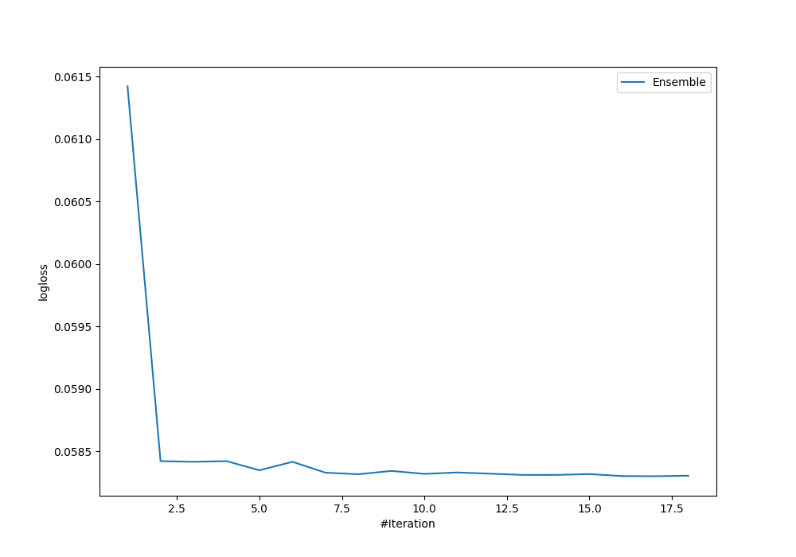
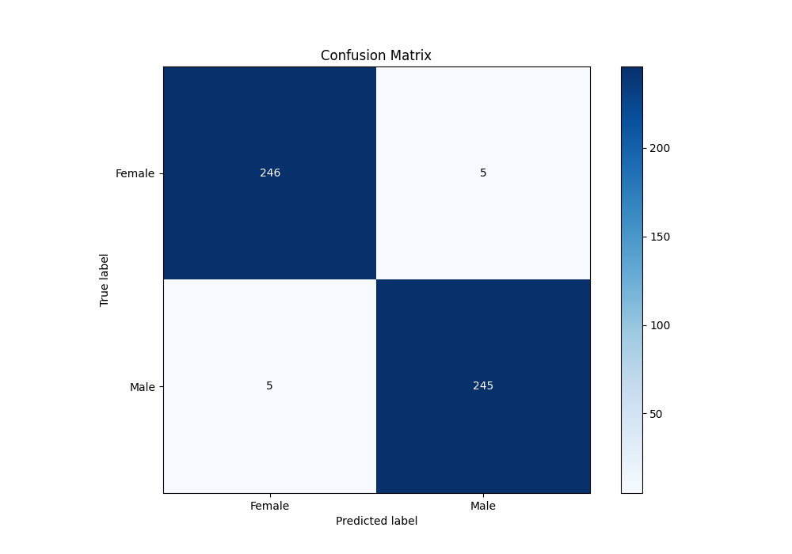
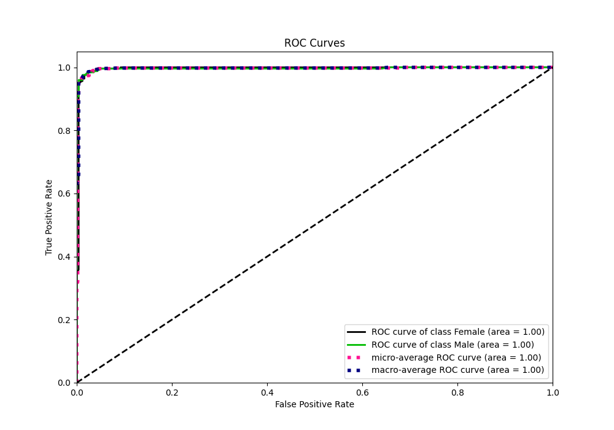
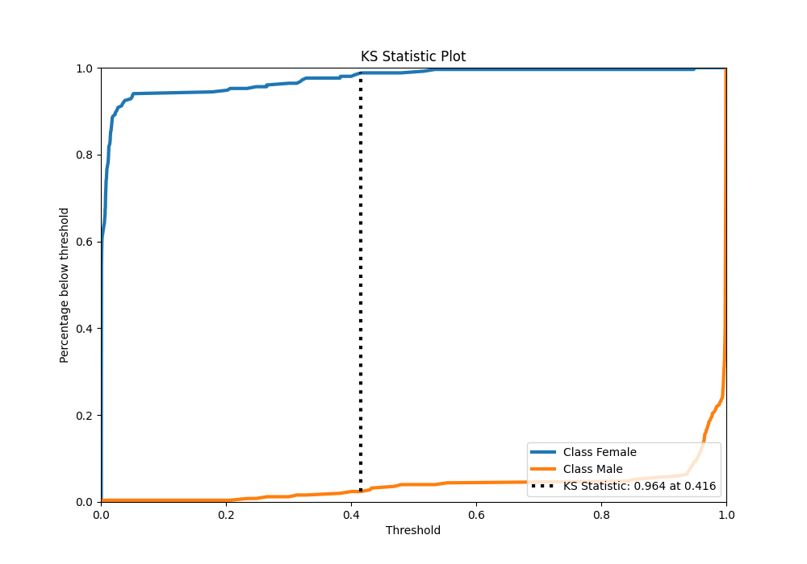
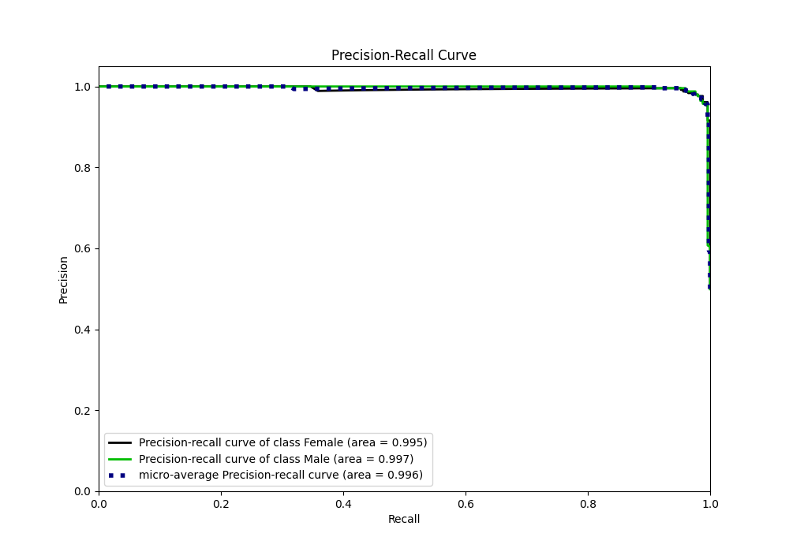
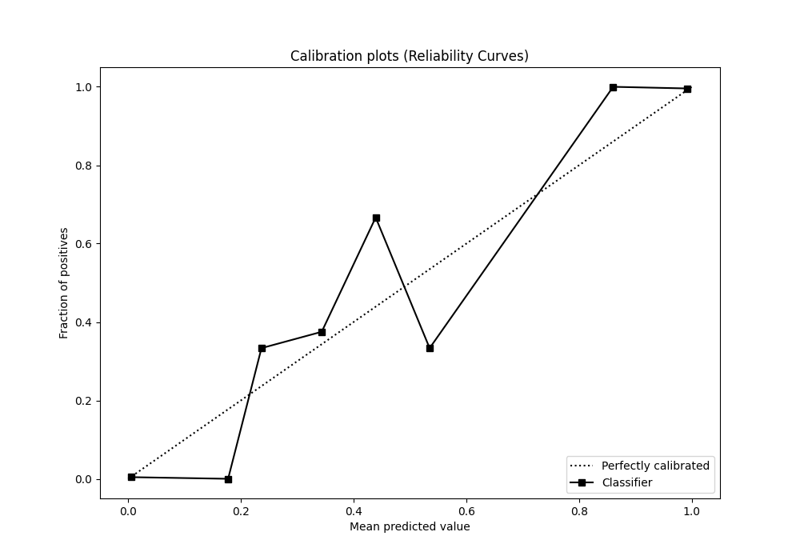
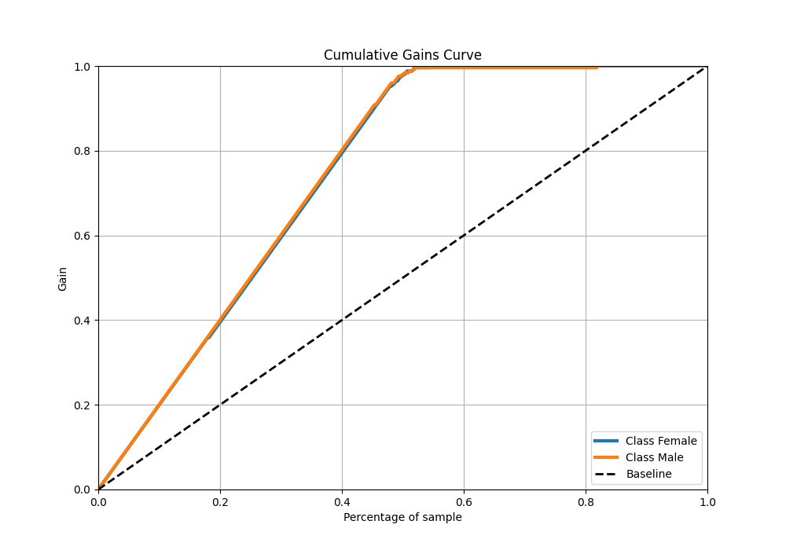
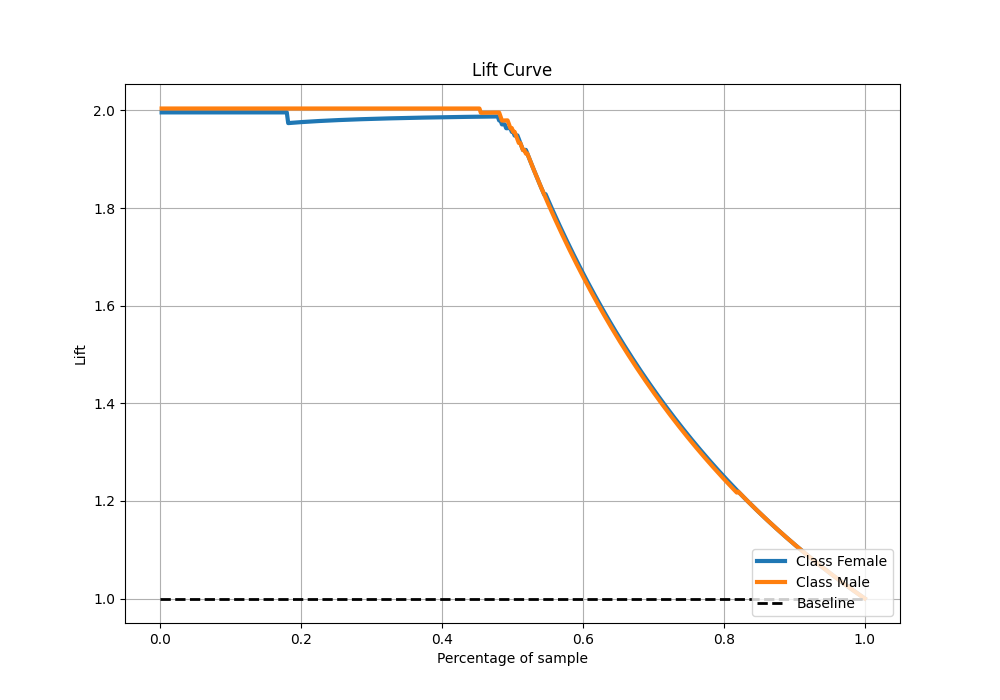

# Summary of Ensemble

[<< Go back](../README.md)

## Ensemble structure
| Model                   |   Weight |
|:------------------------|---------:|
| 4_Linear_KMeansFeatures |       10 |
| 52_NeuralNetwork        |        1 |
| 53_Xgboost              |        3 |
| 57_Xgboost              |        3 |

## Metric details
|           |     score |     threshold |
|:----------|----------:|--------------:|
| logloss   | 0.0583023 | nan           |
| auc       | 0.996327  | nan           |
| f1        | 0.98      |   0.391602    |
| accuracy  | 0.98004   |   0.391602    |
| precision | 1         |   0.954053    |
| recall    | 1         |   0.000555552 |
| mcc       | 0.96008   |   0.391602    |

## Metric details with threshold from accuracy metric
|           |     score |   threshold |
|:----------|----------:|------------:|
| logloss   | 0.0583023 |  nan        |
| auc       | 0.996327  |  nan        |
| f1        | 0.98      |    0.391602 |
| accuracy  | 0.98004   |    0.391602 |
| precision | 0.98      |    0.391602 |
| recall    | 0.98      |    0.391602 |
| mcc       | 0.96008   |    0.391602 |

## Confusion matrix (at threshold=0.391602)
|                   |   Predicted as Female |   Predicted as Male |
|:------------------|----------------------:|--------------------:|
| Labeled as Female |                   246 |                   5 |
| Labeled as Male   |                     5 |                 245 |

## Learning curves

## Confusion Matrix

## Normalized Confusion Matrix

## ROC Curve

## Kolmogorov-Smirnov Statistic

## Precision-Recall Curve

## Calibration Curve

## Cumulative Gains Curve

## Lift Curve

[<< Go back](../README.md)
