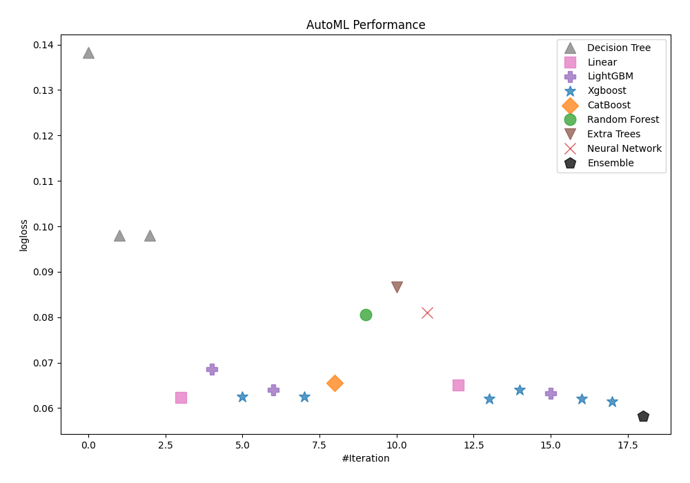
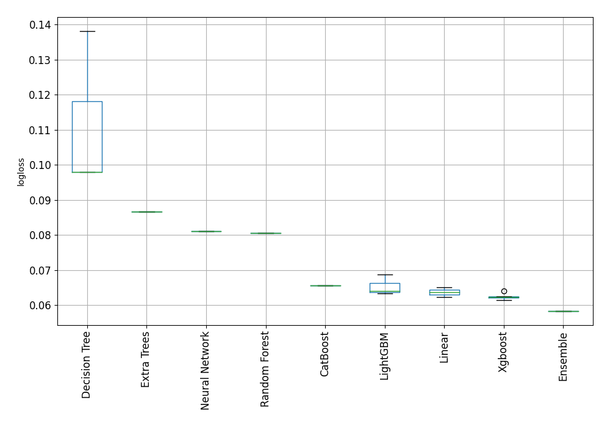
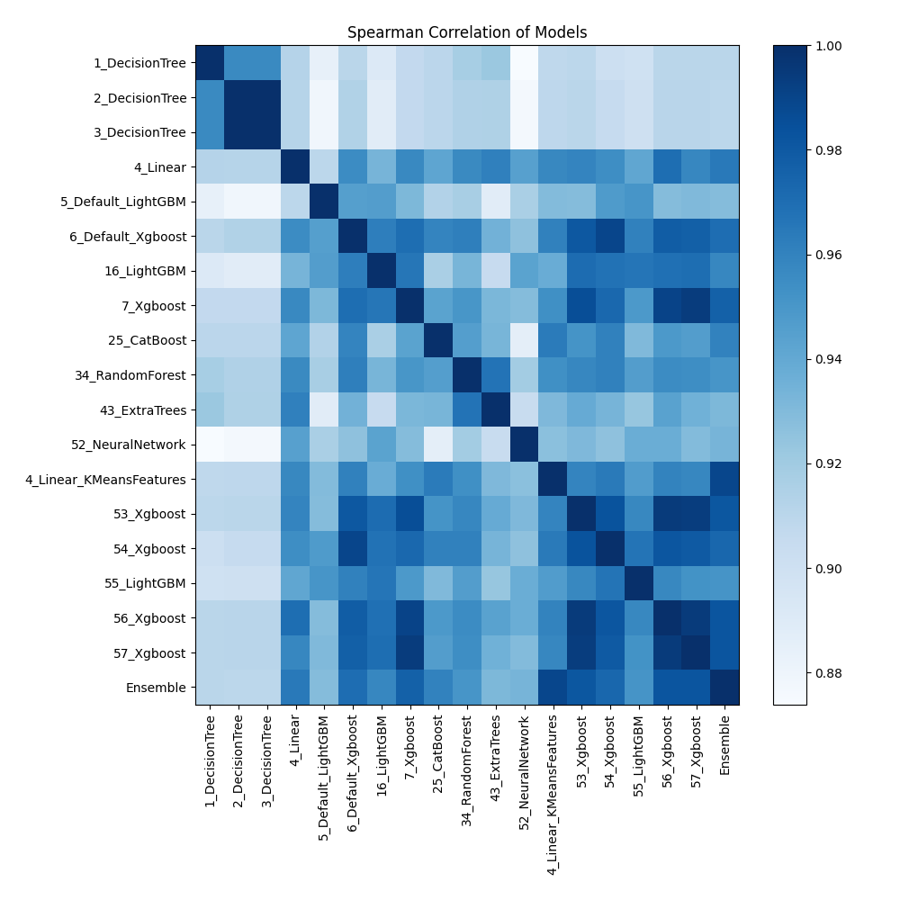

# AutoML Leaderboard

| Best model   | name                                                         | model_type     | metric_type   |   metric_value |   train_time |
|:-------------|:-------------------------------------------------------------|:---------------|:--------------|---------------:|-------------:|
|              | [1_DecisionTree](1_DecisionTree/README.md)                   | Decision Tree  | logloss       |      0.138197  |         2    |
|              | [2_DecisionTree](2_DecisionTree/README.md)                   | Decision Tree  | logloss       |      0.0980341 |         2.41 |
|              | [3_DecisionTree](3_DecisionTree/README.md)                   | Decision Tree  | logloss       |      0.0980341 |         2.4  |
|              | [4_Linear](4_Linear/README.md)                               | Linear         | logloss       |      0.0622806 |         5    |
|              | [5_Default_LightGBM](5_Default_LightGBM/README.md)           | LightGBM       | logloss       |      0.0686381 |         2.78 |
|              | [6_Default_Xgboost](6_Default_Xgboost/README.md)             | Xgboost        | logloss       |      0.0625259 |         2.73 |
|              | [16_LightGBM](16_LightGBM/README.md)                         | LightGBM       | logloss       |      0.0640007 |         2.65 |
|              | [7_Xgboost](7_Xgboost/README.md)                             | Xgboost        | logloss       |      0.0624359 |         3.17 |
|              | [25_CatBoost](25_CatBoost/README.md)                         | CatBoost       | logloss       |      0.0656047 |         3.81 |
|              | [34_RandomForest](34_RandomForest/README.md)                 | Random Forest  | logloss       |      0.080509  |         3.44 |
|              | [43_ExtraTrees](43_ExtraTrees/README.md)                     | Extra Trees    | logloss       |      0.0867141 |         3.28 |
|              | [52_NeuralNetwork](52_NeuralNetwork/README.md)               | Neural Network | logloss       |      0.0810005 |         3.63 |
|              | [4_Linear_KMeansFeatures](4_Linear_KMeansFeatures/README.md) | Linear         | logloss       |      0.0651124 |         4.59 |
|              | [53_Xgboost](53_Xgboost/README.md)                           | Xgboost        | logloss       |      0.0620971 |         2.71 |
|              | [54_Xgboost](54_Xgboost/README.md)                           | Xgboost        | logloss       |      0.064017  |         2.81 |
|              | [55_LightGBM](55_LightGBM/README.md)                         | LightGBM       | logloss       |      0.0632427 |         2.81 |
|              | [56_Xgboost](56_Xgboost/README.md)                           | Xgboost        | logloss       |      0.0619858 |         2.82 |
|              | [57_Xgboost](57_Xgboost/README.md)                           | Xgboost        | logloss       |      0.0614234 |         2.9  |
| **the best** | [Ensemble](Ensemble/README.md)                               | Ensemble       | logloss       |      0.0583023 |         2.89 |

### AutoML Performance

### AutoML Performance Boxplot

### Spearman Correlation of Models

