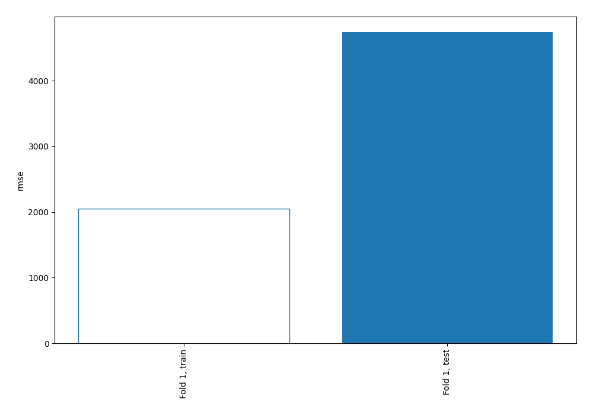
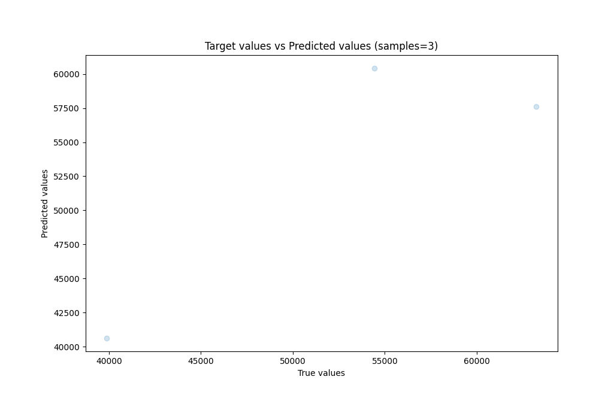
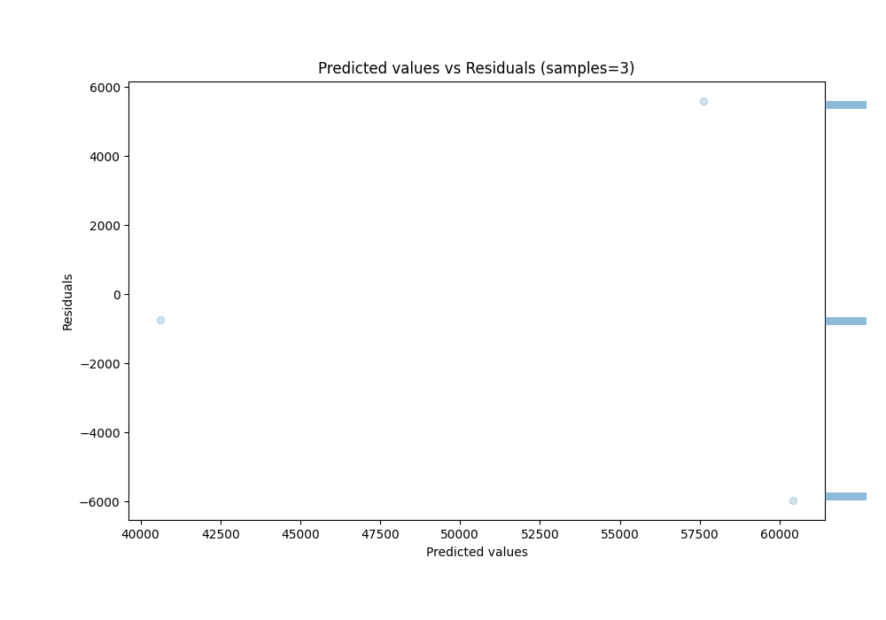

# Summary of 2_DecisionTree

[<< Go back](../README.md)

## Decision Tree
- **n_jobs**: -1
- **criterion**: squared_error
- **max_depth**: 4
- **explain_level**: 0

## Validation
 - **validation_type**: split
 - **train_ratio**: 0.9
 - **shuffle**: True

## Optimized metric
rmse

## Training time

0.7 seconds

### Metric details:
| Metric   |          Score |
|:---------|---------------:|
| MAE      | 4098.64        |
| MSE      |    2.24727e+07 |
| RMSE     | 4740.54        |
| R2       |    0.757178    |
| MAPE     |    0.0721759   |

## Learning curves

## True vs Predicted

## Predicted vs Residuals

[<< Go back](../README.md)
