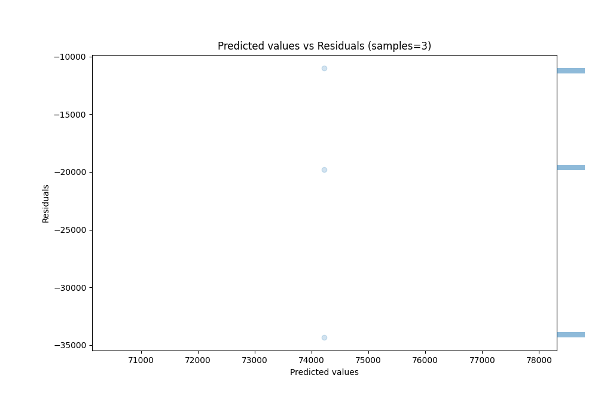

# Summary of 36_RandomForest

[<< Go back](../README.md)

## Random Forest
- **n_jobs**: -1
- **criterion**: squared_error
- **max_features**: 0.5
- **min_samples_split**: 20
- **max_depth**: 4
- **eval_metric_name**: rmse
- **explain_level**: 0

## Validation
 - **validation_type**: split
 - **train_ratio**: 0.9
 - **shuffle**: True

## Optimized metric
rmse

## Training time

1.6 seconds

### Metric details:
| Metric   |           Score |
|:---------|----------------:|
| MAE      | 21705.5         |
| MSE      |     5.63678e+08 |
| RMSE     | 23741.9         |
| R2       |    -5.09065     |
| MAPE     |     0.466008    |

## Learning curves

## True vs Predicted

## Predicted vs Residuals

[<< Go back](../README.md)
