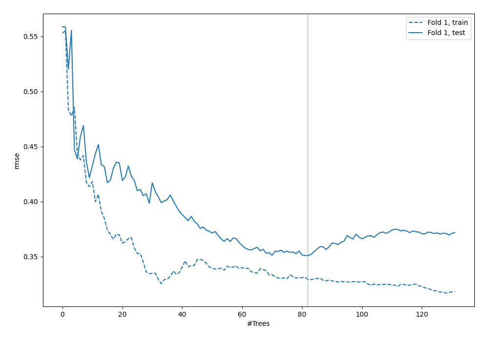
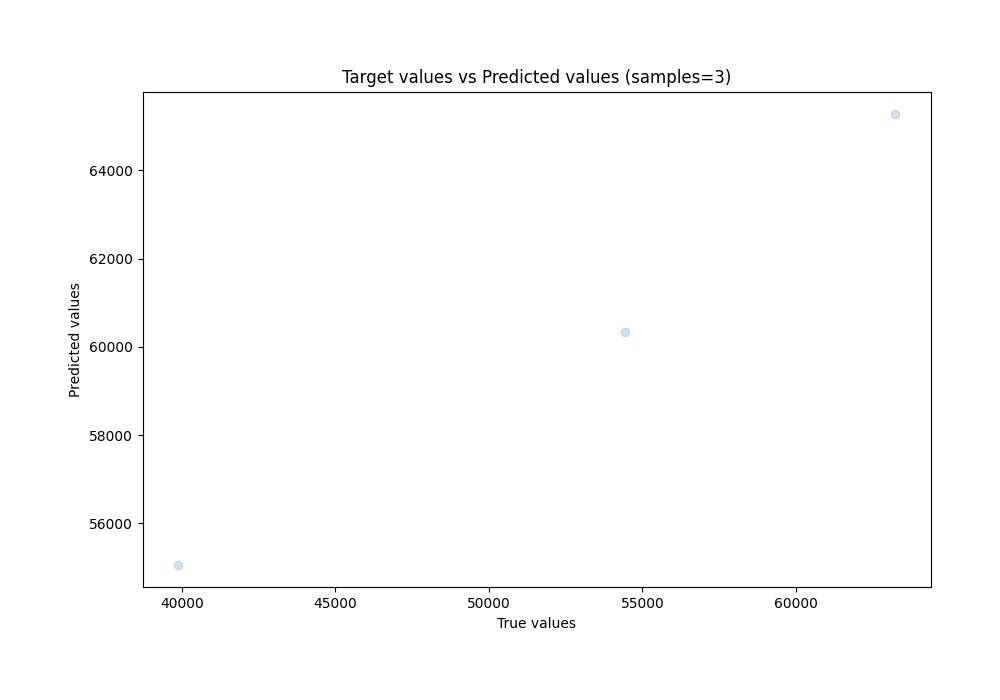
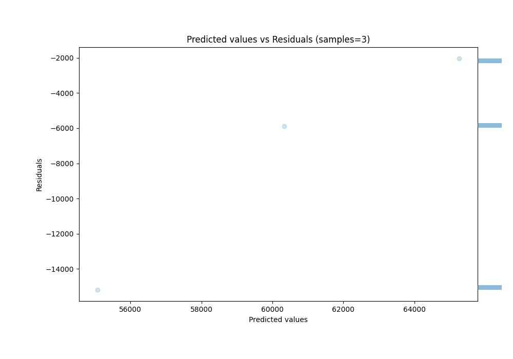

# Summary of 45_ExtraTrees

[<< Go back](../README.md)

## Extra Trees Regressor (Extra Trees)
- **n_jobs**: -1
- **criterion**: squared_error
- **max_features**: 0.5
- **min_samples_split**: 20
- **max_depth**: 4
- **eval_metric_name**: rmse
- **explain_level**: 0

## Validation
 - **validation_type**: split
 - **train_ratio**: 0.9
 - **shuffle**: True

## Optimized metric
rmse

## Training time

2.0 seconds

### Metric details:
| Metric   |          Score |
|:---------|---------------:|
| MAE      | 7705.66        |
| MSE      |    8.97264e+07 |
| RMSE     | 9472.4         |
| R2       |    0.0304897   |
| MAPE     |    0.173684    |

## Learning curves

## True vs Predicted

## Predicted vs Residuals

[<< Go back](../README.md)
