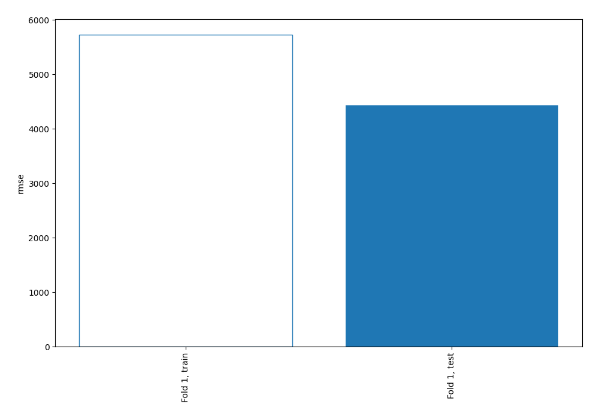
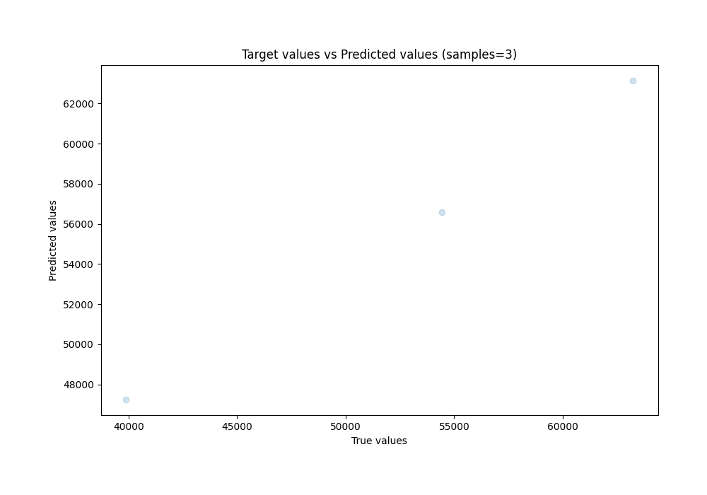
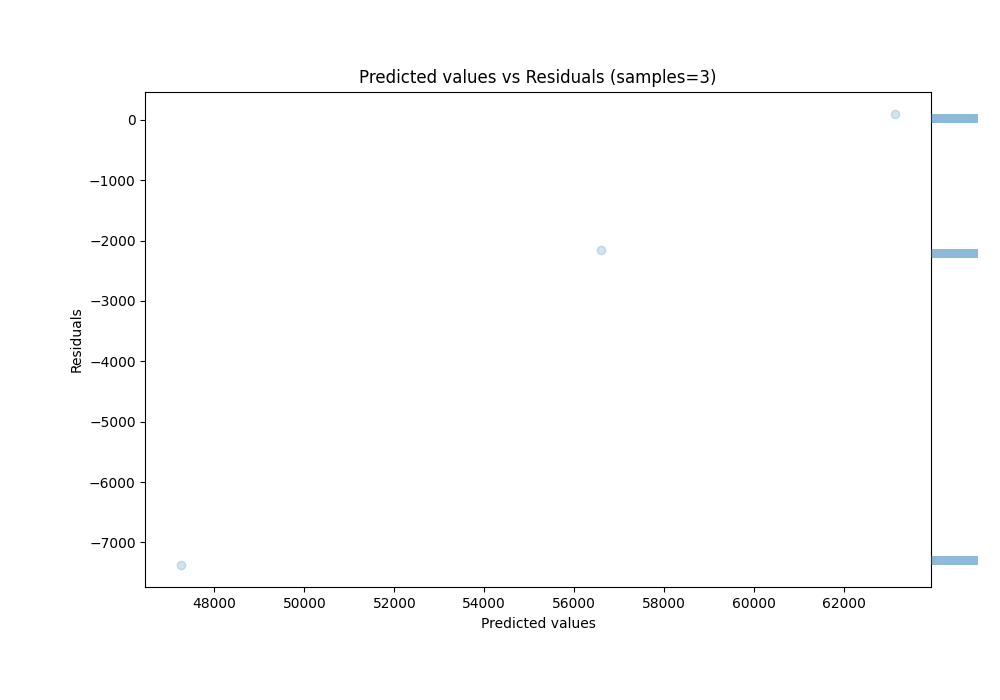

# Summary of 4_Linear

[<< Go back](../README.md)

## Linear Regression (Linear)
- **n_jobs**: -1
- **explain_level**: 0

## Validation
 - **validation_type**: split
 - **train_ratio**: 0.9
 - **shuffle**: True

## Optimized metric
rmse

## Training time

0.8 seconds

### Metric details:
| Metric   |         Score |
|:---------|--------------:|
| MAE      | 3203.36       |
| MSE      |    1.9648e+07 |
| RMSE     | 4432.6        |
| R2       |    0.7877     |
| MAPE     |    0.0752219  |

## Learning curves

## True vs Predicted

## Predicted vs Residuals

[<< Go back](../README.md)
