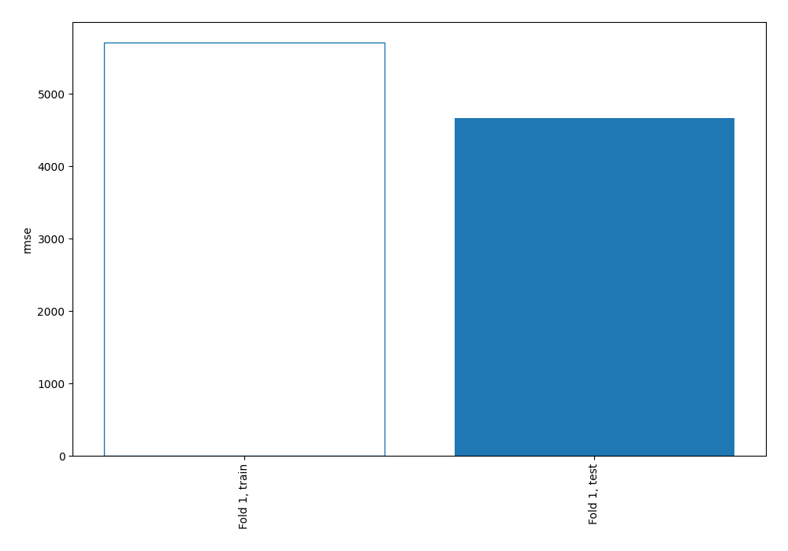
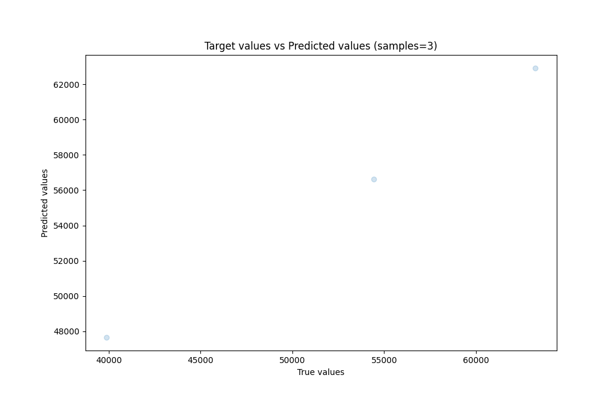
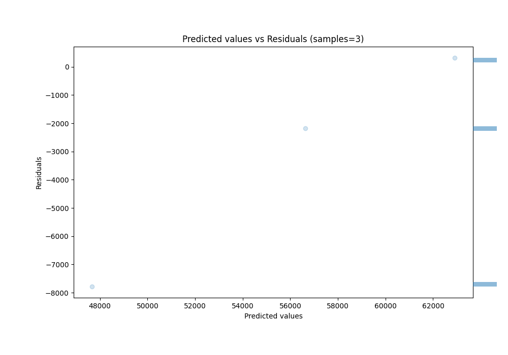

# Summary of 4_Linear_KMeansFeatures

[<< Go back](../README.md)

## Linear Regression (Linear)
- **n_jobs**: -1
- **explain_level**: 0

## Validation
 - **validation_type**: split
 - **train_ratio**: 0.9
 - **shuffle**: True

## Optimized metric
rmse

## Training time

1.0 seconds

### Metric details:
| Metric   |          Score |
|:---------|---------------:|
| MAE      | 3425.3         |
| MSE      |    2.17854e+07 |
| RMSE     | 4667.48        |
| R2       |    0.764605    |
| MAPE     |    0.0800183   |

## Learning curves

## True vs Predicted

## Predicted vs Residuals

[<< Go back](../README.md)
