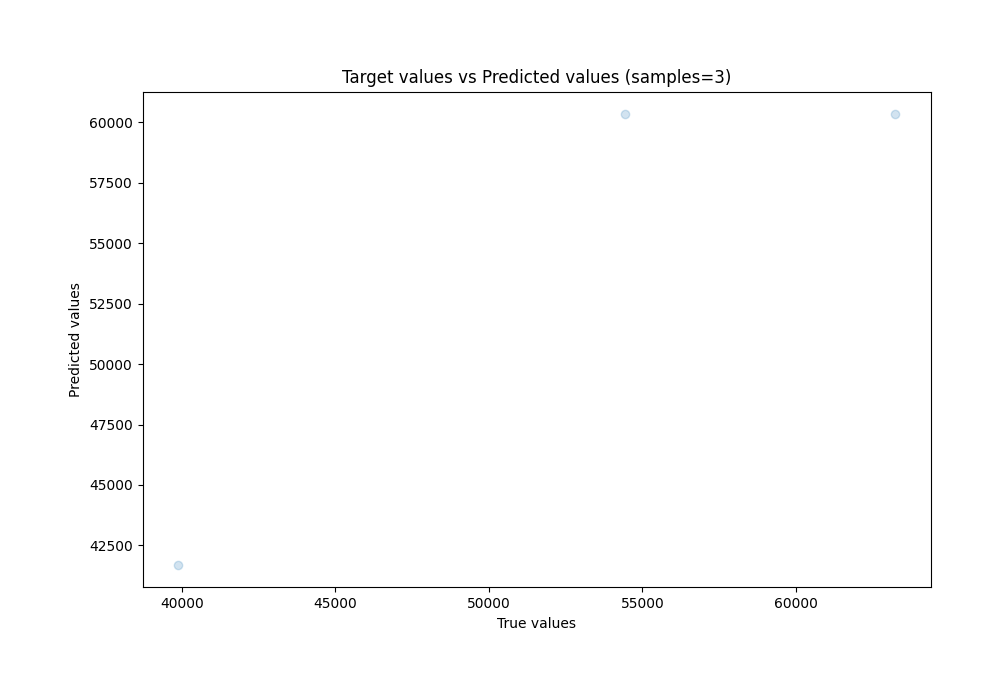
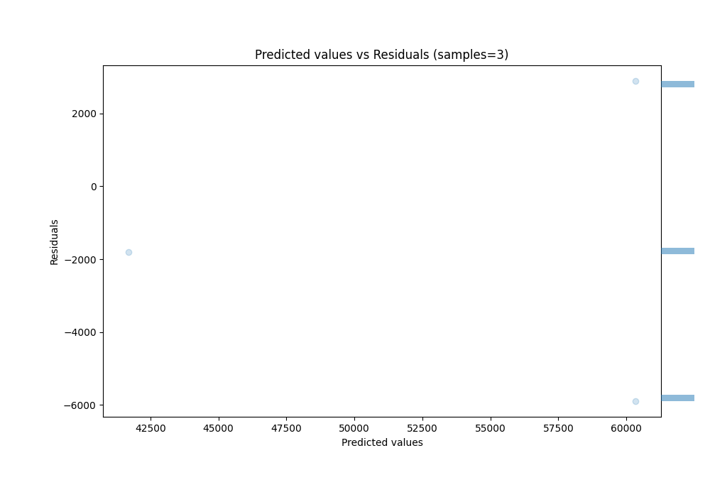

# Summary of 59_DecisionTree

[<< Go back](../README.md)

## Decision Tree
- **n_jobs**: -1
- **criterion**: friedman_mse
- **max_depth**: 2
- **explain_level**: 0

## Validation
 - **validation_type**: split
 - **train_ratio**: 0.9
 - **shuffle**: True

## Optimized metric
rmse

## Training time

0.8 seconds

### Metric details:
| Metric   |          Score |
|:---------|---------------:|
| MAE      | 3527.67        |
| MSE      |    1.54238e+07 |
| RMSE     | 3927.32        |
| R2       |    0.833343    |
| MAPE     |    0.0663856   |

## Learning curves

## True vs Predicted

## Predicted vs Residuals

[<< Go back](../README.md)
