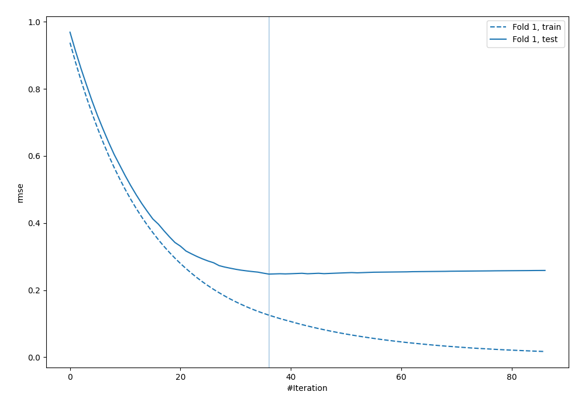
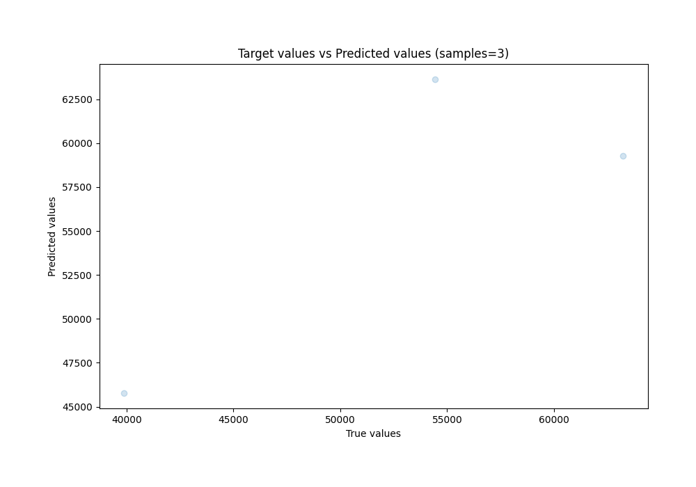
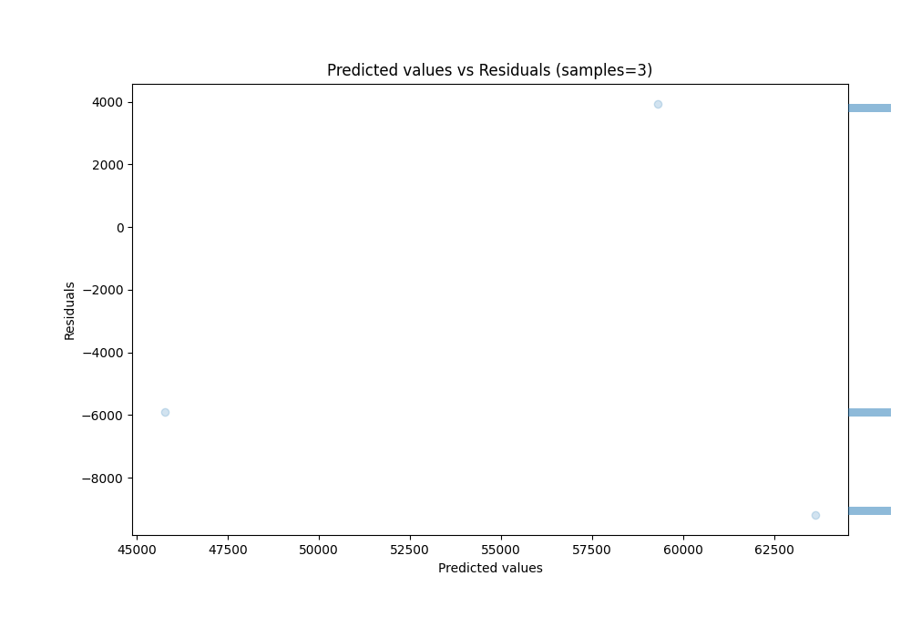

# Summary of 6_Default_Xgboost

[<< Go back](../README.md)

## Extreme Gradient Boosting (Xgboost)
- **n_jobs**: -1
- **objective**: reg:squarederror
- **eta**: 0.075
- **max_depth**: 6
- **min_child_weight**: 1
- **subsample**: 1.0
- **colsample_bytree**: 1.0
- **eval_metric**: rmse
- **explain_level**: 0

## Validation
 - **validation_type**: split
 - **train_ratio**: 0.9
 - **shuffle**: True

## Optimized metric
rmse

## Training time

1.0 seconds

### Metric details:
| Metric   |          Score |
|:---------|---------------:|
| MAE      | 6332.07        |
| MSE      |    4.47916e+07 |
| RMSE     | 6692.65        |
| R2       |    0.516019    |
| MAPE     |    0.126133    |

## Learning curves

## True vs Predicted

## Predicted vs Residuals

[<< Go back](../README.md)
