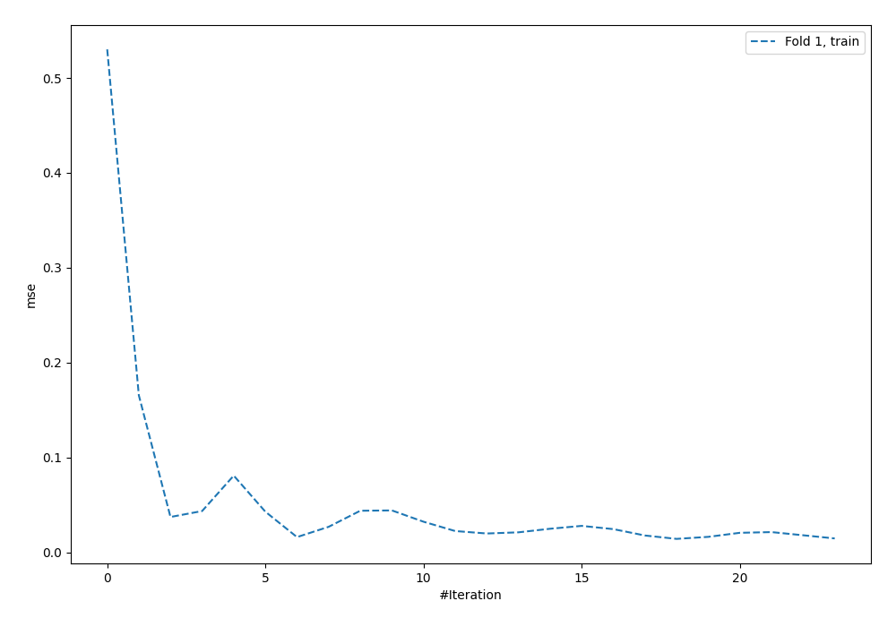
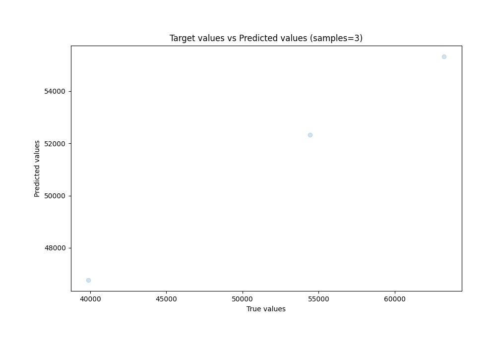
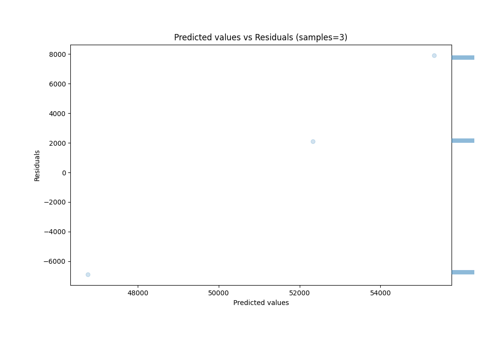

# Summary of 8_Default_NeuralNetwork

[<< Go back](../README.md)

## Neural Network
- **n_jobs**: -1
- **dense_1_size**: 32
- **dense_2_size**: 16
- **learning_rate**: 0.05
- **explain_level**: 0

## Validation
 - **validation_type**: split
 - **train_ratio**: 0.9
 - **shuffle**: True

## Optimized metric
rmse

## Training time

0.8 seconds

### Metric details:
| Metric   |          Score |
|:---------|---------------:|
| MAE      | 5628.73        |
| MSE      |    3.80383e+07 |
| RMSE     | 6167.52        |
| R2       |    0.588989    |
| MAPE     |    0.112043    |

## Learning curves

## True vs Predicted

## Predicted vs Residuals

[<< Go back](../README.md)
