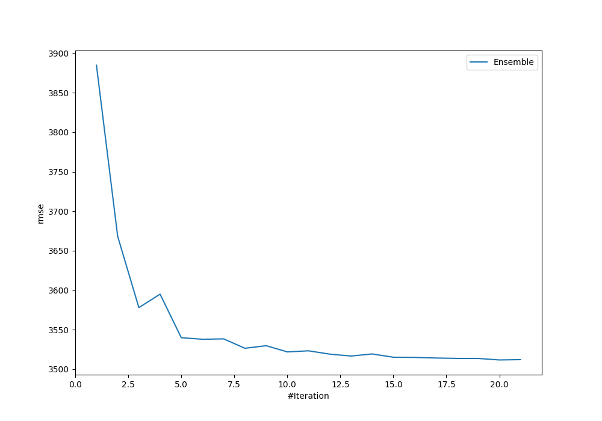
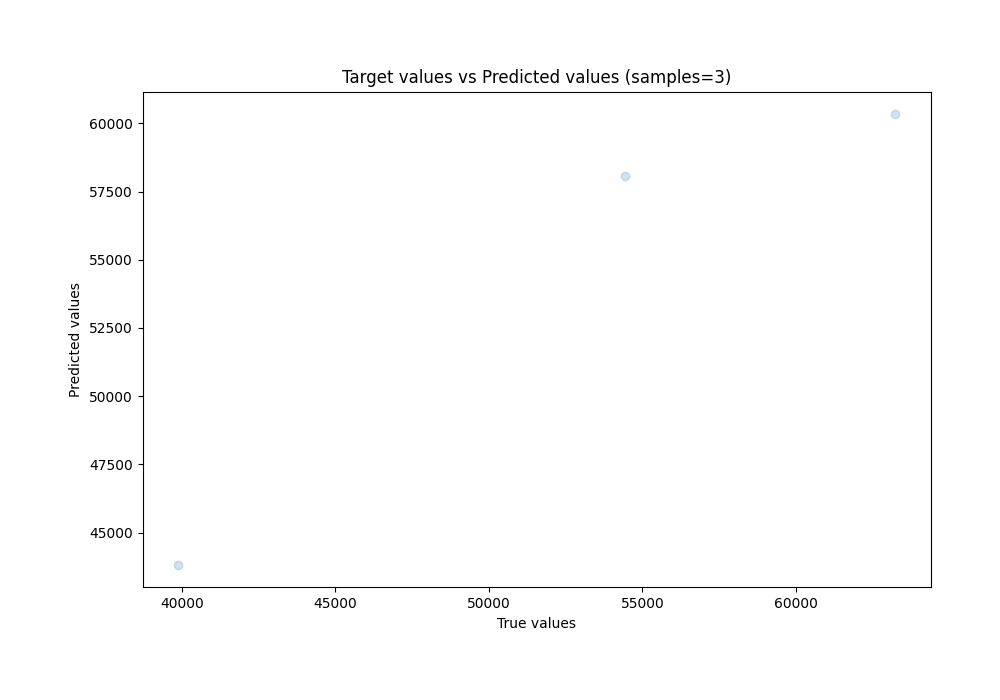
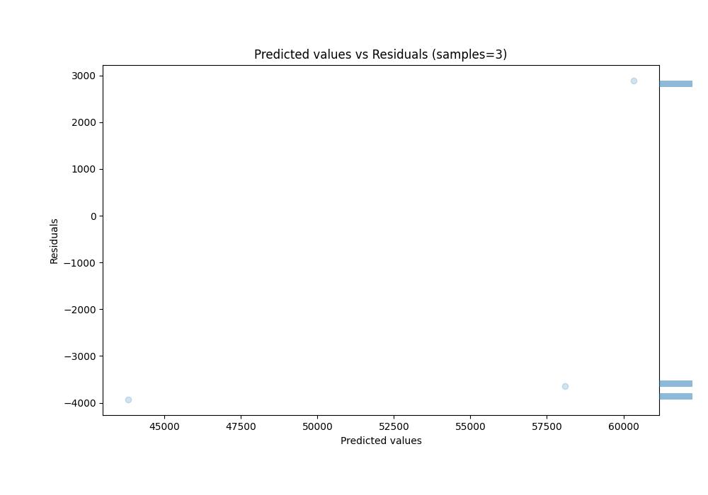

# Summary of Ensemble

[<< Go back](../README.md)

## Ensemble structure
| Model            |   Weight |
|:-----------------|---------:|
| 1_DecisionTree   |        1 |
| 4_Linear         |        3 |
| 54_NeuralNetwork |        5 |
| 58_DecisionTree  |       11 |

### Metric details:
| Metric   |          Score |
|:---------|---------------:|
| MAE      | 3484.22        |
| MSE      |    1.23326e+07 |
| RMSE     | 3511.79        |
| R2       |    0.866744    |
| MAPE     |    0.070315    |

## Learning curves

## True vs Predicted

## Predicted vs Residuals

[<< Go back](../README.md)
