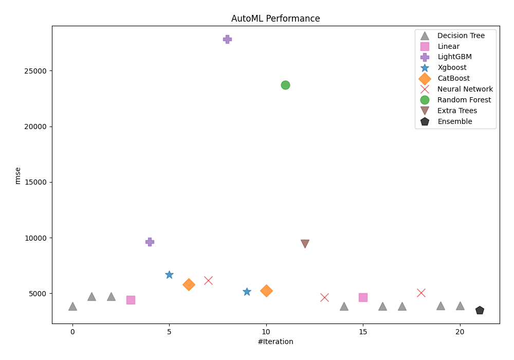
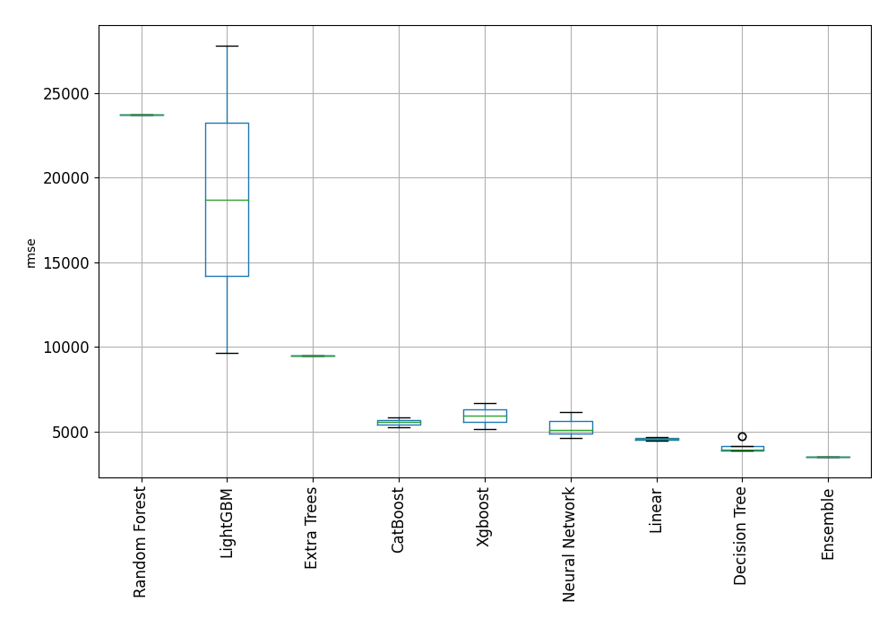
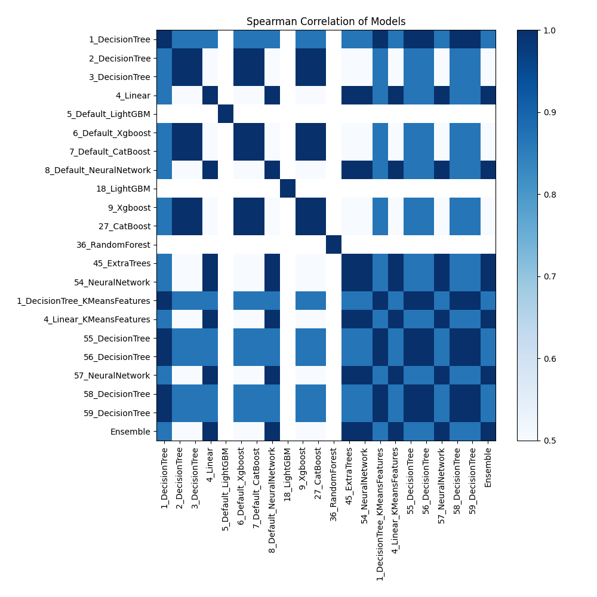

# AutoML Leaderboard

| Best model   | name                                                                     | model_type     | metric_type   |   metric_value |   train_time |
|:-------------|:-------------------------------------------------------------------------|:---------------|:--------------|---------------:|-------------:|
|              | [1_DecisionTree](1_DecisionTree/README.md)                               | Decision Tree  | rmse          |        3884.73 |         1.51 |
|              | [2_DecisionTree](2_DecisionTree/README.md)                               | Decision Tree  | rmse          |        4740.54 |         1.47 |
|              | [3_DecisionTree](3_DecisionTree/README.md)                               | Decision Tree  | rmse          |        4740.54 |         1.64 |
|              | [4_Linear](4_Linear/README.md)                                           | Linear         | rmse          |        4432.6  |         1.7  |
|              | [5_Default_LightGBM](5_Default_LightGBM/README.md)                       | LightGBM       | rmse          |        9620.2  |         1.51 |
|              | [6_Default_Xgboost](6_Default_Xgboost/README.md)                         | Xgboost        | rmse          |        6692.65 |         1.98 |
|              | [7_Default_CatBoost](7_Default_CatBoost/README.md)                       | CatBoost       | rmse          |        5815.15 |         2.05 |
|              | [8_Default_NeuralNetwork](8_Default_NeuralNetwork/README.md)             | Neural Network | rmse          |        6167.52 |         1.64 |
|              | [18_LightGBM](18_LightGBM/README.md)                                     | LightGBM       | rmse          |       27811.3  |         1.64 |
|              | [9_Xgboost](9_Xgboost/README.md)                                         | Xgboost        | rmse          |        5155.63 |         2.11 |
|              | [27_CatBoost](27_CatBoost/README.md)                                     | CatBoost       | rmse          |        5271.91 |         2.08 |
|              | [36_RandomForest](36_RandomForest/README.md)                             | Random Forest  | rmse          |       23741.9  |         2.55 |
|              | [45_ExtraTrees](45_ExtraTrees/README.md)                                 | Extra Trees    | rmse          |        9472.4  |         2.94 |
|              | [54_NeuralNetwork](54_NeuralNetwork/README.md)                           | Neural Network | rmse          |        4626.78 |         1.73 |
|              | [1_DecisionTree_KMeansFeatures](1_DecisionTree_KMeansFeatures/README.md) | Decision Tree  | rmse          |        3884.73 |         1.8  |
|              | [4_Linear_KMeansFeatures](4_Linear_KMeansFeatures/README.md)             | Linear         | rmse          |        4667.48 |         1.83 |
|              | [55_DecisionTree](55_DecisionTree/README.md)                             | Decision Tree  | rmse          |        3884.73 |         1.65 |
|              | [56_DecisionTree](56_DecisionTree/README.md)                             | Decision Tree  | rmse          |        3884.73 |         1.86 |
|              | [57_NeuralNetwork](57_NeuralNetwork/README.md)                           | Neural Network | rmse          |        5077.9  |         2.01 |
|              | [58_DecisionTree](58_DecisionTree/README.md)                             | Decision Tree  | rmse          |        3927.32 |         1.67 |
|              | [59_DecisionTree](59_DecisionTree/README.md)                             | Decision Tree  | rmse          |        3927.32 |         1.69 |
| **the best** | [Ensemble](Ensemble/README.md)                                           | Ensemble       | rmse          |        3511.79 |         2.47 |

### AutoML Performance

### AutoML Performance Boxplot

### Spearman Correlation of Models

